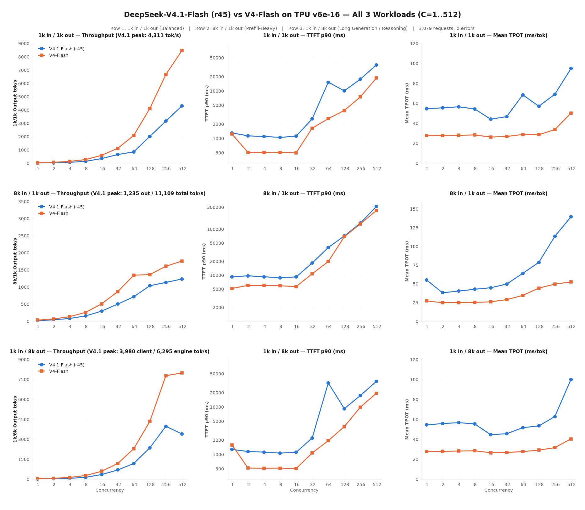
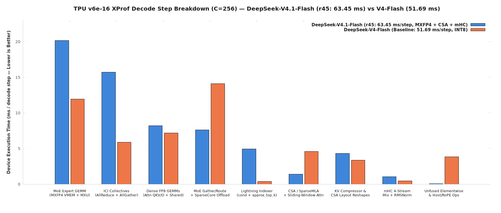

# DeepSeek-V4-Flash & DeepSeek-V4.1-Flash on Google Cloud TPU v6e (Trillium)

Production deployment manifests, custom Pallas/SparseCore TPU kernels, full three-workload concurrency sweeps (`1k/1k`, `8k/1k`, `1k/8k` across `C=1..512`), GPQA Diamond evaluations, and kernel optimization technical notes for both **DeepSeek-V4-Flash (`284B` total / `13B` active, `256` experts)** and **DeepSeek-V4.1-Flash (`552B` total / `16B` active, `384` experts)** on a single **16-chip TPU v6e slice (`4×4` optical torus)**.

---

## 1. Executive Summary: Two Models on One 16-Chip TPU v6e Slice

| Metric / Feature | [`DeepSeek-V4-Flash` (`284B`)](./models/DeepSeekV4-Flash-v6e16/README.md) | [`DeepSeek-V4.1-Flash` (`552B`)](./models/DeepSeekV4.1-Flash-v6e16/README.md) |
|---|---|---|
| **Architecture** | `284B` total / `13B` active, `256` routed experts (`top_k=8`), CSA + HCA | `552B` total / `16B` active, `384` routed experts (`top_k=6`), Ratio-2 CSA2 + SWA + 4-stream `mHC` + Host-Offloaded Engram (`1` & `14`) |
| **Quantization on TPU v6e** | **INT8 MoE** (native v6e INT8 MXU) + **FP8** Dense & KV Cache | **MXFP4 MoE** (`4.25 bits/w` in HBM, 3-op bitwise IEEE-754 `bf16` dequant in `gmm_v2`) + **FP8** Dense & KV Cache |
| **Resident HBM Weight Footprint** | **197.1 GiB** across 16 chips (`12.3 GiB/chip`) | **378.78 GiB** across 16 chips (`23.7 GiB/chip`) + **94.42 GiB/rank** Engram pinned in host DRAM |
| **`1k/1k` Balanced Peak Output** | **8,463.7 out tok/s** (`@ C=512`; `529.0 tok/s/chip`) | **5,137.3 out tok/s** (`2K` ctx) / **4,758.5 out tok/s** (`16K` ctx `@ C=190` [Fused MoE](./models/DeepSeekV4.1-Flash-v6e16/fused-kernels-recipe/README.md); **8,140.0 tok/s** steady-state decode) |
| **`8k/1k` Prefill-Heavy Peak (`C=512`)** | **1,758.5 out tok/s** (`17,585.3` total tok/s) | **1,234.6 out tok/s** (`11,109.1` total tok/s; **14,704.2 tok/s** peak engine prefill) |
| **`1k/8k` Reasoning Peak (`9,216` tok/req)** | **8,067.9 out tok/s** (`@ C=512`, `40.32 ms` TPOT) | **3,980.0 out tok/s** (`@ C=256`, `62.9 ms` TPOT; **6,294.9 tok/s** steady-state decode `@ C=512`) |
| **Low-Latency Single-Stream (`C=1`)** | `35.3 out tok/s` (`27.7 ms` TPOT) | **425.5 out tok/s/req** (`2.35 ms/token` via [`megakernel-recipe/`](./models/DeepSeekV4.1-Flash-v6e16/megakernel-recipe/README.md) + `DSpark` `1+7`) |
| **GPQA Diamond Accuracy (`n=198`, `16K` ctx)** | Greedy parity `16/16` byte-identical against unpatched control | **83.2% (`164/197`) unconditional Pass@1** / **94.8% (`164/173`) on completed chains**, **0% (`0/197`) loops** |
| **Request Reliability (`C=1..512`)** | **100%** (`3,079 / 3,079` across 30 points) | **100%** (`3,079 / 3,079` across 30 points at `16K` ctx + `1,028 / 1,028` at `2K` ctx) |
| **Recipes & Kernel Work** | [`models/DeepSeekV4-Flash-v6e16/`](./models/DeepSeekV4-Flash-v6e16/README.md) | [`XProf Kernel Optimizations`](./models/DeepSeekV4.1-Flash-v6e16/kernel-optimizations-recipe/README.md) · [`Low-Latency Megakernel`](./models/DeepSeekV4.1-Flash-v6e16/megakernel-recipe/README.md) · [`Fused MoE + Hybrid EP=8×TP=2`](./models/DeepSeekV4.1-Flash-v6e16/fused-kernels-recipe/README.md) |

---

## 2. Combined 3-Workload Performance Curves (`V4.1-Flash` vs `V4-Flash`, `C=1..512`)

---

## 3. DeepSeek-V4.1-Flash (`552B`): Three Self-Contained Optimization Recipes (`61.71 ms -> 32.72 ms/step`)

1. **[`kernel-optimizations-recipe/`](./models/DeepSeekV4.1-Flash-v6e16/kernel-optimizations-recipe/README.md) ([`TECH-NOTE.md`](./models/DeepSeekV4.1-Flash-v6e16/kernel-optimizations-recipe/TECH-NOTE.md)):** Cuts decode step wall from `61.71 -> 37.33 ms/step` (`-39.5%`) via SparseCore `nd_reduce_scatter` offload, 3D KV-cache `%bitcast` views, and 3-op bitwise IEEE-754 MXFP4 unpacking (`patches/0001..0025`, commit `4b8edd8e`).
2. **[`megakernel-recipe/`](./models/DeepSeekV4.1-Flash-v6e16/megakernel-recipe/README.md) ([`TECH-NOTE.md`](./models/DeepSeekV4.1-Flash-v6e16/megakernel-recipe/TECH-NOTE.md)):** Standalone 51-layer persistent VMEM Pallas Megakernel (`12.99 / 16.00 MiB` VMEM) + `DSpark` (`1+7`) speculative decoding for `C=1..24`, achieving **`425.5 tok/s/req` (`2.35 ms/token` at `C=1`)**.
3. **[`fused-kernels-recipe/`](./models/DeepSeekV4.1-Flash-v6e16/fused-kernels-recipe/README.md) ([`TECH-NOTE.md`](./models/DeepSeekV4.1-Flash-v6e16/fused-kernels-recipe/TECH-NOTE.md)):** High-concurrency recipe combining Hybrid `EP=8 × TP=2` (`48` half-width experts/pair, `-37.0%` ICI straggler wait) and single-kernel `gmm_v2_fused_w13_w2` (`23.35 MiB` VMEM), cutting decode step wall to **`32.72 ms/step`** and lifting throughput to **`1,740.4 tok/s` at `C=64` (`+14.2%`)**, **`2,984.5 tok/s` at `C=128` (`+18.4%`)**, and **`4,758.5 tok/s` (`297.4 tok/s/chip`, `+19.2%`) at `C=190`** (`patches/0001..0026`, commit `623b2904`).

| Metric / Concurrency (`1k in / 1k out`, `16K` Ctx) | Unoptimized Baseline | [`kernel-optimizations-recipe/`](./models/DeepSeekV4.1-Flash-v6e16/kernel-optimizations-recipe/README.md) | **[`fused-kernels-recipe/`](./models/DeepSeekV4.1-Flash-v6e16/fused-kernels-recipe/README.md)** | Total Improvement |
|---|---:|---:|---:|---:|
| **Hardware Decode Step Wall (`B=64`)** | `61.71 ms / step` | `37.33 ms / step` | **`32.72 ms / step`** | **`-47.0%` (`1.89×` faster)** |
| **Hardware Prefill Step Wall (`4,096` tok)** | `270.65 ms / step` | `245.53 ms / step` | **`245.53 ms / step`** | **`-9.3%` (`-25.12 ms`)** |
| **ICI Collective Straggler Wait (`40` MoE layers)** | `16.08 ms / step` | `11.07 ms / step` | **`6.97 ms / step`** | **`-56.7%` (`-37.0%` vs. EP=16)** |
| **KV-Cache Reshape/Copy Overhead (`51` layers)** | `2.5385 ms / step` | `0.0003 ms / step` | **`0.0003 ms / step`** | **`-99.99%` (zero-copy `%bitcast`)** |
| **`C = 1` Output Throughput (`tok/s`)** | `17.9 tok/s` (`54.7 ms` TPOT) | `18.3 tok/s` (`53.8 ms` TPOT) | **`425.5 tok/s`** (`2.35 ms` TPOT)* | **`23.8×`** (*via [`megakernel-recipe/`](./models/DeepSeekV4.1-Flash-v6e16/megakernel-recipe/README.md)*) |
| **`C = 64` Output Throughput (`tok/s`)** | `858.3 tok/s` (`68.6 ms` TPOT) | `1,524.5 tok/s` (`38.5 ms` TPOT) | **`1,740.4 tok/s`** (`34.5 ms` TPOT) | **`+102.8%` (`+14.2%` vs. 2-Pass)** |
| **`C = 128` Output Throughput (`tok/s`)** | `2,017.6 tok/s` (`57.1 ms` TPOT) | `2,520.7 tok/s` (`45.2 ms` TPOT) | **`2,984.5 tok/s`** (`38.5 ms` TPOT) | **`+47.9%` (`+18.4%` vs. 2-Pass)** |
| **`C = 190` Single-Wave Saturation (`tok/s`)** | `3,164.1 tok/s` | `3,992.6 tok/s` | **`4,758.5 tok/s`** (`297.4 tok/s/chip`) | **`+50.4%` (`+19.2%` vs. 2-Pass)** |
| **`C = 512` Output Throughput (`tok/s`)** | `4,310.5 tok/s` (`94.8 ms` TPOT) | `4,310.5 tok/s` (`94.8 ms` TPOT) | **`4,310.5 tok/s`** (`94.8 ms` TPOT) | Prefill-chunk bound (`8,140 tok/s` decode) |

---

## 4. Repository Directory Structure

- **[`models/DeepSeekV4.1-Flash-v6e16/`](./models/DeepSeekV4.1-Flash-v6e16/README.md)** — Overview comparing the three self-contained `DeepSeek-V4.1-Flash` (`552B`) recipes:
  - **[`kernel-optimizations-recipe/`](./models/DeepSeekV4.1-Flash-v6e16/kernel-optimizations-recipe/README.md)** — Full-context batched XLA recipe (`dsv41-flash-v6e16-serving.yaml`), [`TECH-NOTE.md`](./models/DeepSeekV4.1-Flash-v6e16/kernel-optimizations-recipe/TECH-NOTE.md), [`patches/`](./models/DeepSeekV4.1-Flash-v6e16/kernel-optimizations-recipe/patches/README.md) (`0001..0025` + `vllm/0001..0002`), 3-shape concurrency sweeps, and 198-question GPQA Diamond results.
  - **[`megakernel-recipe/`](./models/DeepSeekV4.1-Flash-v6e16/megakernel-recipe/README.md)** — Low-latency (`C=1..24`) 51-layer persistent Pallas Megakernel + `DSpark` (`1+7`) speculative decoding recipe (`425.5 accepted tok/s/req`, `2.35 ms/token` at `C=1`) with its own `README.md`, `TECH-NOTE.md`, `dsv41-flash-v6e16-megakernel-serving.yaml`, `patches/`, `megakernel/`, `results/`, and `scripts/`.
  - **[`fused-kernels-recipe/`](./models/DeepSeekV4.1-Flash-v6e16/fused-kernels-recipe/README.md)** — High-concurrency (`C=64..256`) Single-Kernel Fused `W13+SiLU+W2` Pallas Megakernel + Hybrid `EP=8 × TP=2` recipe (`32.72 ms/step`, `1,740.4 tok/s` at `C=64`, `2,984.5 tok/s` at `C=128`, `4,758.5 tok/s` at `C=190`) with its own `README.md`, `TECH-NOTE.md`, `dsv41-flash-v6e16-fused-kernels-serving.yaml`, `patches/` (`0001..0026`), `results/`, and `scripts/`.
- **[`models/DeepSeekV4-Flash-v6e16/`](./models/DeepSeekV4-Flash-v6e16/README.md)** — Serving manifest (`dsv4-flash-v6e16-serving.yaml` with ConfigMap patches), 3-shape concurrency sweep (`1k/1k`, `8k/1k`, `1k/8k`), raw JSONs, and charts for `DeepSeek-V4-Flash` (`284B`).
- **[`recipes/`](./recipes/)** — Quick-start single-file Kubernetes template and async streaming benchmark client.
