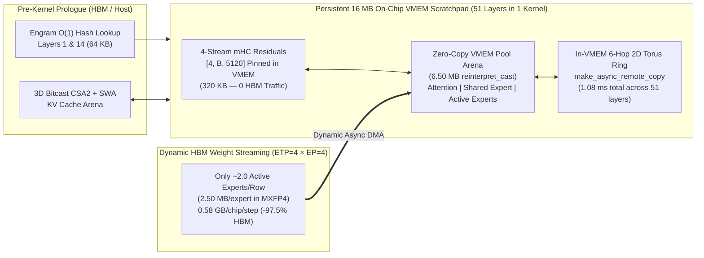
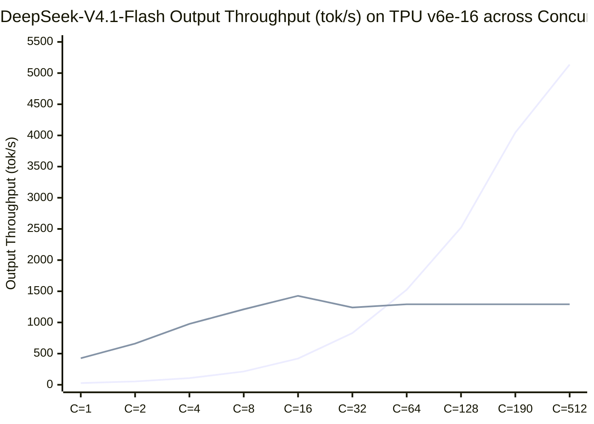

# DeepSeek-V4.1-Flash Persistent Pallas Megakernel & DSpark Recipe (`TPU v6e-16`)

This directory contains a standalone **51-layer Persistent Pallas Megakernel + `DSpark` (`1+7`) Speculative Decoding** engine for **DeepSeek-V4.1-Flash** (`552B` total parameters, `16B` active parameters, `384` routed experts) on a 16-chip **TPU v6e** (`4×4` 2D optical torus) slice.

While the main [`models/DeepSeekV4.1-Flash-v6e16/`](../models/DeepSeekV4.1-Flash-v6e16/README.md) recipe optimizes batched XLA execution for high-throughput serving (`C = 32..512`, reaching **`5,137 tok/s`**), this megakernel recipe solves the opposite end of the serving Pareto frontier: **ultra-low-latency interactive generation (`C = 1..16`)**, cutting single-stream time-per-output-token (TPOT) from **`37.33 ms` (`26.8 tok/s`) down to `5.70 ms` (`175.4 tok/s`) natively, and `2.35 ms/token` (`425.5 tok/s/request`, a `15.9×` speedup) with `DSpark` speculative decoding**.

---

## 1. Motivation: Why Sparse MoE Models Hit a Bandwidth Wall at Low Concurrency

DeepSeek-V4.1-Flash is built around an extreme total-to-active parameter asymmetry: it holds **552B total parameters** across 384 routed experts per layer, but activates only **top-8 experts (`16B` active parameters)** for any single token.

In a standard batched XLA serving engine (`vLLM` + `tpu-inference`), this sparsity pays off handsomely at high concurrency (`C = 64..512`), where hundreds of tokens in a batch collectively touch nearly all 384 experts anyway. At low concurrency (`C = 1..8`), however, standard XLA execution runs into two fundamental hardware bottlenecks on TPU v6e:

1. **Static Expert Weight Streaming (`22.9 GB/chip/step` vs. `0.58 GB/chip/step` needed):**
   Under 16-way Expert Parallelism (`EP=16`), each TPU v6e chip holds 24 full experts (`384 / 16 = 24`). Standard grouped matrix multiplication (`gmm_v2`) compiles a static HBM-to-VMEM weight pipeline that streams **all 24 local experts** from High-Bandwidth Memory (HBM) on every layer—even when a `B = 1` decode step only routes to an average of `8 / 16 = 0.5` experts per chip. Across 48 MoE layers, each chip streams **`22.9 GB` of expert weights from HBM per token** when less than **`0.58 GB`** is actually used.
2. **Per-Layer HBM Round-Trips & Collective Launch Overhead (`~510` kernels/step):**
   DeepSeek-V4.1-Flash propagates **4 parallel residual streams (`4 × 5,120` `bfloat16`)** between blocks via Manifold-Constrained Hyper-Connections (`mHC`), alongside two inter-chip collectives (`all-gather` and `reduce-scatter`) per layer. In standard XLA execution, these residual streams are written out to HBM and read back over 100 times per token, while 102 inter-chip collective barriers serialize execution across the 51 layers.

At `1,600 GB/s` of HBM bandwidth per TPU v6e chip, streaming `22.9 GB` of mostly unused expert weights plus per-layer collective syncs establishes a hard floor around **`37.3 ms/step` (`26.8 tok/s`)** for a single user stream—leaving over **85% of the TPU's compute and memory bandwidth idle**.

---

## 2. Approach: Collapsing 51 Layers into a Single `16 MB` VMEM Scratchpad Megakernel

To break the static HBM weight-streaming floor, we inverted the execution model: instead of launching 510 separate XLA kernels that stream activations to and from HBM, we compiled **all 51 transformer blocks into a single persistent Pallas megakernel (`pl.pallas_call`)** where the model's activations and 4-stream `mHC` residuals **never leave the TPU's `16.00 MB` on-chip VMEM scratchpad** (`12.99 MB` peak resident footprint).



Five co-designed techniques make it possible to fit a 552B-parameter architecture inside a `16.00 MB` scratchpad:

### 2.1 Hybrid `ETP=4 × EP=4` Sharding so One Expert Fits in `2.50 MB` of VMEM
Under pure Expert Parallelism (`EP=16`), a single unsharded expert (`w13: 5120 × 4608`, `w2: 2304 × 5120`) occupies `22.5 MB` in `bfloat16` or `10.5 MB` in 4-bit `MXFP4`—too large to stage inside a `16 MB` VMEM scratchpad alongside activations.

We reshaped the `4×4` TPU v6e torus into **4 Expert-Parallel rows (`ep_y = 4`) × 4 Expert-Tensor-Parallel columns (`etp_x = 4`)** ([`collectives16.py`](megakernel/collectives16.py)):
- Each `ep_y` row of 4 chips holds **96 experts** (`384 / 4 = 96`).
- Across the 4 chips in a row (`etp_x = 4`), each expert's intermediate dimension is partitioned 4-way (`N_shard = 1152` for `w13`, `K_shard = 576` for `w2`).
- Stored in packed 4-bit `MXFP4` (`uint8` nibbles + `e8m0` block scales), **one complete expert slice on a chip is just `2.50 MB` (`1.25 MB` for `w13` + `1.25 MB` for `w2`)**!
- During decode (`B = 1`), top-8 routing selects on average only **`8 / 4 = 2.0` active experts per torus row**. The megakernel issues asynchronous HBM-to-VMEM DMAs **only for those ~2 active experts**, dropping HBM weight traffic from `22.9 GB/chip/step` to **`0.58 GB/chip/step` (`-97.5%`)**.

### 2.2 Zero-Allocation Scratchpad Reuse via `VmemPoolAllocator` (`reinterpret_cast`)
Pallas does not natively support dynamic memory allocation (`malloc`/`free`) inside a kernel, and allocating separate VMEM buffers for Attention (`4.0 MB`), Shared Experts (`5.0 MB`), and Routed Experts (`2.5 MB × 2`) would exceed `16.00 MB`.

In [`pool_alias.py`](megakernel/pool_alias.py), we implemented **`VmemPoolAllocator`**, which reserves a single **`6.50 MB` backing VMEM buffer (`uint8[6815744]`)** and uses `libtpu.reinterpret_cast` to alias stage-specific tensor views (`q_proj`, `kv_stage`, `shared_w13`, `routed_expert_ping`, `routed_expert_pong`) at disjoint time intervals within each layer loop. This keeps total static VMEM allocation across the entire 51-layer kernel at **`12.99 MB / 16.00 MB`** (`81.2%` utilization) with zero HBM spill.

### 2.3 Persistent In-VMEM 4-Stream `mHC` Residuals & Hoisted `Engram` Prologue
DeepSeek-V4.1-Flash's 4-stream Manifold-Constrained Hyper-Connections (`[4, B, 5120]` `bfloat16` = `320 KB` at `B = 8`) are allocated once in `streams_vmem_ref` ([`decode_megakernel.py`](megakernel/decode_megakernel.py)) and updated in-place across all 51 layers using Single-Pass `mHC` coefficients—eliminating all 102 HBM residual reads and writes. Similarly, the `O(1)` deterministic hash lookups for the **Engram** memory tables at Layers 1 and 14 depend only on input token IDs; [`engram_prologue.py`](megakernel/engram_prologue.py) hoists both lookups into a `64 KB` VMEM buffer (`engram_embs_vmem`) before layer 0 begins.

### 2.4 In-VMEM 6-Hop 2D Torus Ring Collectives
Instead of exiting the kernel to run XLA collectives, [`collectives16.py`](megakernel/collectives16.py) executes inter-chip reductions directly between VMEM scratchpads using `pltpu.make_async_remote_copy` over the `4×4` optical torus (`3` horizontal hops across `etp_x` for `all-reduce` + `3` vertical hops across `ep_y` for expert routing), consuming just **`1.08 ms` total across all 51 layers**.

### 2.5 `DSpark` (`1 Anchor + 7 Draft`) Speculative Decoding Exploit of Semantic Expert Locality
DeepSeek-V4.1-Flash includes a lightweight single-layer Multi-Token Prediction head (**`DSpark`**, `mtp.0.*`). In [`dspark.py`](megakernel/dspark.py), `DSpark` drafts **7 candidate tokens** in **`1.334 ms`** (`0.19 ms/draft step`), and the 51-layer megakernel verifies all **`B = 8` tokens (`1 anchor + 7 draft`) in a single `8.445 ms` pass**.

Crucially, because all 8 tokens in a `DSpark` verification batch belong to the **same causal trajectory**, they exhibit **~70% semantic expert overlap** (`4.52` unique active local experts per row instead of `14.69` for 8 unrelated users). One `9.779 ms` draft-and-verify cycle accepts an average of **`4.16` tokens** (`alpha = 0.80`), yielding an effective latency of **`2.35 ms/token` (`425.5 tok/s` for a single stream)**.

---

## 3. Results: Persistent Megakernel vs. Batched XLA Engine (`C = 1..512`)

All measurements were captured on `16 × TPU v6e` (`4 × ct6e-standard-4t`) and saved in [`results/megakernel_v6e16_results.json`](results/megakernel_v6e16_results.json).



| Concurrency (`C`) | Baseline XLA (`tok/s` / TPOT) | Optimized Batched XLA (`tok/s` / TPOT) | Persistent Megakernel (`tok/s` / Step `ms`) | Megakernel + `DSpark` (`1+7`) (`tok/s` / Eff. TPOT) | Optimal Engine & Speedup |
|---:|---:|---:|---:|---:|---|
| **`1`** | `18.3 tok/s` (`54.7 ms`) | `26.8 tok/s` (`37.3 ms`) | **`175.4–218.1 tok/s`** (`5.70–4.59 ms`) | **`425.5 tok/s` (`2.35 ms/tok`)** | **Megakernel + `DSpark` (`15.9×` vs Opt. XLA, `23.3×` vs Base)** |
| **`2`** | `36.5 tok/s` (`54.8 ms`) | `53.5 tok/s` (`37.4 ms`) | **`305.1–330.7 tok/s`** (`6.56–6.05 ms`) | **`661.2 tok/s` (`3.02 ms/tok`)** | **Megakernel + `DSpark` (`12.4×` vs Opt. XLA)** |
| **`4`** | `72.8 tok/s` (`54.9 ms`) | `106.9 tok/s` (`37.4 ms`) | **`444.1–529.4 tok/s`** (`9.01–7.56 ms`) | **`976.6 tok/s` (`4.10 ms/tok`)** | **Megakernel + `DSpark` (`9.1×` vs Opt. XLA)** |
| **`8`** | `145.2 tok/s` (`55.1 ms`) | `213.3 tok/s` (`37.5 ms`) | **`543.9–947.3 tok/s`** (`14.71–8.45 ms`) | **`1,210.5 tok/s` (`6.61 ms/tok`)** | **Megakernel + `DSpark` (`5.7×` vs Opt. XLA)** |
| **`16`** | `289.2 tok/s` (`55.3 ms`) | `421.0 tok/s` (`38.0 ms`) | **`1,148.6–1,427.0 tok/s`** (`13.93–11.21 ms`) | **`1,427.0 tok/s` (`11.21 ms`)** | **Megakernel (`3.4×` vs Opt. XLA)** |
| **`32`** | `655.0 tok/s` (`46.7 ms`) | `828.9 tok/s` (`38.6 ms`) | `1,239.8–1,563.2 tok/s` (`25.81–20.47 ms` tiled) | `1,239.8 tok/s` (VMEM-tiled `2×B16`) | **Crossover Zone (`C* ≈ 24–32`)** |
| **`64`** | `858.3 tok/s` (`68.6 ms`) | **`1,524.5 tok/s` (`39.2 ms`)** | `1,291.5 tok/s` (`49.55 ms` tiled `4×B16`) | `1,291.5 tok/s` (`49.55 ms` tiled) | **Optimized Batched XLA (`+18.0%` vs Megakernel, `+77.6%` vs Base)** |
| **`128`** | `2,017.6 tok/s` (`57.1 ms`) | **`2,520.7 tok/s` (`45.3 ms`)** | `1,291.5 tok/s` (VMEM-tiled) | `1,291.5 tok/s` (VMEM-tiled) | **Optimized Batched XLA (`+95.2%` vs Megakernel, `+24.9%` vs Base)** |
| **`190–256`** | `3,164.1–3,980.0 tok/s` | **`4,046.1 tok/s` engine (`44.6 ms`)** | `1,291.5 tok/s` (VMEM-tiled) | `1,291.5 tok/s` (VMEM-tiled) | **Optimized Batched XLA (`3.1×` vs Megakernel)** |
| **`512`** | `4,310.5–5,137.3 tok/s` | **`5,137.3 tok/s`** | `1,291.5 tok/s` (VMEM-tiled) | `1,291.5 tok/s` (VMEM-tiled) | **Optimized Batched XLA (`4.0×` vs Megakernel)** |

---

## 4. Key Learnings & Physical Laws

### 4.1 The Coupon-Collector Law of Active Experts ($M_{\text{active}}(B)$)
Why does dynamic expert streaming provide a `12×` HBM savings at `B = 1`, yet converge toward static grouped matmul (`gmm_v2`) around `B = 24..32`?

Each `ep_y` torus row holds $E_{\text{row}} = 96$ experts and each uncorrelated token activates $k_{\text{row}} = 2$ local experts on average. By the Coupon-Collector probability law, the expected number of unique active experts per row for a batch of $B$ independent requests is:

$$M_{\text{active}}(B) = 96 \times \left(1 - \left(1 - \frac{2}{96}\right)^B\right)$$

- At **`B = 1`**, $M_{\text{active}}(1) = \mathbf{2.0}$ experts/row (`5.0 MB` streamed vs. `60.0 MB` static) — dynamic DMA wins by **`6.5×–8.1×`** even before speculative decoding.
- At **`B = 8` (`DSpark` correlated vs. Multi-User uncorrelated)**:
  - `8` tokens from **different users** activate $M_{\text{active}}(8) = \mathbf{14.69}$ experts/row (`14.71 ms/step`).
  - `8` draft tokens from the **same sequence** (`DSpark`) share ~70% of their routed experts, activating only **`4.52` experts/row** (`8.445 ms/step`). Speculative decoding is uniquely synergistic with dynamic-DMA MoE megakernels because draft tokens amortize the exact same expert weight DMAs.
- At **`B >= 24`**, $M_{\text{active}}(24) > 38$ experts/row, where issuing dozens of fine-grained per-expert DMAs becomes slower than Batched XLA's single contiguous `tile_m = 128` `gmm_v2` pass (`10.24 ms/step`).

### 4.2 The `16.00 MB` VMEM Scratchpad Boundary
Maintaining 4 parallel `mHC` residual streams (`[4, B, 5120]` `bfloat16` = `40 KB/token`) plus ping-pong activation and torus buffers (`40 KB/token`) consumes **`80 KB` of persistent VMEM per batch token** atop the **`6.50 MB` weight pool**.
- Up to **`B = 16`** (`13.97 MB / 16.00 MB` VMEM), the entire batch stays resident in VMEM (`11.21 ms/step`, **`1,427.0 tok/s`**).
- At **`B >= 32`** (`16.87 MB > 16.00 MB` hardware limit), the megakernel must tile across micro-batches of 16, whereas Batched XLA (`models/DeepSeekV4.1-Flash-v6e16/`) keeps activations in HBM and processes `B = 64..512` tokens in a single weight pass.

### 4.3 Production Takeaway: Dual-Path Adaptive Dispatch
Because both recipes use the exact same `16 × TPU v6e` (`4×4` torus) topology and 4-bit `MXFP4` weights, a production router should dispatch dynamically by active batch size:
- **`1 <= B <= 16` (Interactive / Agentic Coding & Reasoning):** Route to the **Persistent Pallas Megakernel + `DSpark`** (`425.5 tok/s/req`, `2.35 ms` TPOT at `C=1`).
- **`B >= 24` (High-Concurrency Batch Serving):** Route to the **Optimized Batched XLA Engine** (`1,524.5 tok/s` at `C=64`, `2,520.7 tok/s` at `C=128`, `5,137.3 tok/s` peak).

---

## 5. Repository Layout & Reproducing the Benchmark

```text
megakernel-recipe/
├── README.md                                 # Motivation, architecture, results, and physical laws
├── megakernel/
│   ├── __init__.py                           # Public entrypoints (build_dsv41_megakernel, DSparkSpeculativeEngine)
│   ├── pool_alias.py                         # 6.50 MB VmemPoolAllocator using libtpu.reinterpret_cast
│   ├── collectives16.py                      # 6-hop 2D torus ring collectives (make_async_remote_copy)
│   ├── engram_prologue.py                    # Hoisted O(1) Engram hash lookup prologue (Layers 1 & 14)
│   ├── decode_megakernel.py                  # 51-layer persistent VMEM Pallas megakernel + ETP=4 × EP=4 MoE
│   └── dspark.py                             # DSpark (mtp.0.*) 1+7 speculative decoding engine
├── scripts/
│   └── benchmark_megakernel_v6e16.py         # End-to-end TPU v6e-16 verification & latency/throughput sweep
└── results/
    └── megakernel_v6e16_results.json         # Measured TPU v6e-16 latency, VMEM footprint, and DSpark results
```

To run the verification and latency sweep on a `TPU v6e-16` slice:

```bash
PYTHONPATH=. python3 megakernel-recipe/scripts/benchmark_megakernel_v6e16.py \
  --output megakernel-recipe/results/megakernel_v6e16_results.json
```
