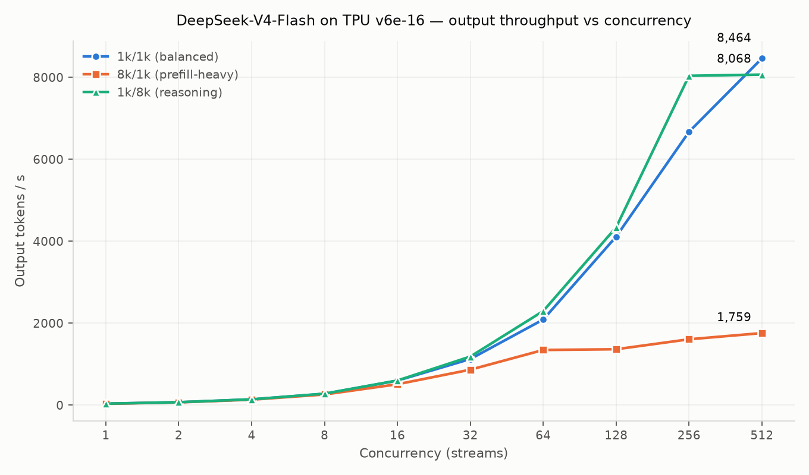
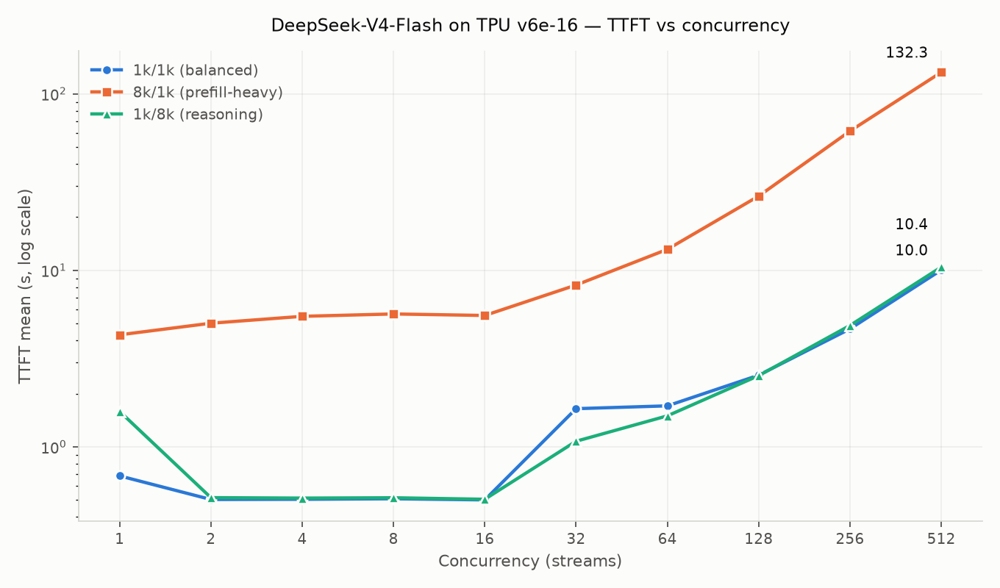
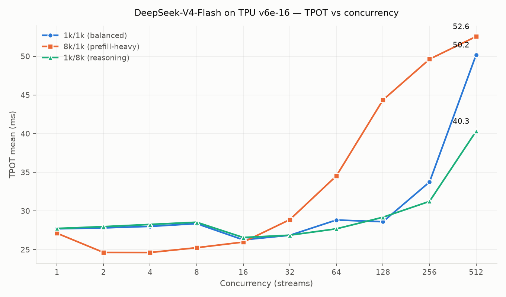

# DeepSeek-V4-Flash on TPU v6e-16 — benchmark results (concurrency sweep 1 → 512)

Three workload patterns, run with a streaming client against a live vLLM endpoint on a 16-chip TPU v6e slice. Every concurrency level from 1 to 512 is measured, not interpolated.

## Configuration

| Item | Value |
|---|---|
| Hardware | TPU v6e-16, one `4x4` slice, 4 × `ct6e-standard-4t` on GKE |
| Model | `deepseek-ai/DeepSeek-V4-Flash` |
| Serving | vLLM with the `tpu-inference` backend, TP=16, expert parallel |
| Quantisation | INT8 weights, `--kv-cache-dtype=fp8` |
| Flags | `--gpu-memory-utilization 0.85 --no-enable-prefix-caching --max-num-batched-tokens 2048` |
| Client | streaming `/v1/completions`, `ignore_eos`, temperature 0, run inside the serving pod |

**Two serving arms, not one.** `max_num_seqs × max_model_len` must stay at or below 4,194,304 on this stack, because the block table is prefetched into a 1 MiB SMEM. The `1k/1k` rows therefore come from `max_model_len 2048, max_num_seqs 512`, and the two 8k shapes come from `max_model_len 9216, max_num_seqs 256`. The lower sequence ceiling costs nothing at a 9216-token context, because the KV pool holds only 141 sequences there. **The three shapes are not all measured on one configuration**, and a reader must not treat the three rows as one system state.

**The `1k/8k` point at C=512 has two possible limits, and this run cannot separate them.** Arm A caps the scheduler at 256 sequences. A reasoning request occupies only its 1024-token prompt at admission, so the KV pool would hold about 1272 of them at that moment, and the 256 cap binds before the pool does. The measured curve is flat from C=256 to C=512, and either the cap or the growing KV footprint can explain that. **Read the `1k/8k` C=512 row as a lower bound.**

**8k prompts arrive as four prefill chunks.** `--max-num-batched-tokens` stays at 2048, because a higher value fails to compile on this slice. An 8192-token prompt therefore takes four chunked prefill steps. This is a property of the measurement, and it is the main cause of the `8k/1k` result below.

## Summary

| Pattern | Peak output tok/s | @ conc | Req/s | TTFT mean @ 512 | TPOT @ 512 |
|---|---|---|---|---|---|
| `1k/1k` (balanced) | **8,463.70** | 512 | 8.27 | 10.03 s | 50.19 ms |
| `8k/1k` (prefill-heavy) | 1,758.53 | 512 | 1.72 | 132.31 s | 52.56 ms |
| `1k/8k` (reasoning) | 8,067.90 | 512 | 0.98 | 10.42 s | 40.32 ms |

## Beside the published reference

The reference is **SGLang on 2 × g4-standard-384 (16 × RTX PRO 6000 Blackwell, 96 GB)**, read from its README on 2026-09-02. It runs the same model on different accelerators, so **this is a comparison of two whole systems on one workload**. It is not a per-accelerator, per-watt or per-dollar comparison, and it does not hold the software stack constant.

| Pattern | This slice, peak tok/s | Reference, peak tok/s | Ratio | This slice, TPOT @ 512 | Reference, TPOT @ 512 |
|---|---:|---:|---:|---:|---:|
| `1k/1k` | **8,463.70** | 4,710.94 | **1.80×** | 50.19 ms | 106.50 ms |
| `8k/1k` | **1,758.53** | 4,209.22 | **0.42×** | 52.56 ms | 113.38 ms |
| `1k/8k` | **8,067.90** | 1,606.27 | **5.02×** | 40.32 ms | 107.64 ms |

## 1k/1k (balanced)

Measured ISL 1019 to 1024 tokens, OSL 1024, `ignore_eos`, temperature 0. A request reaches 2048 tokens at completion. The KV pool holds 1,302,832 tokens across the slice, so it holds **636 of them at once**; concurrency above that queues at the server.

| Concurrency | Requests | Output tok/s | tok/s per chip | Req/s | TTFT mean (ms) | TTFT p90 (ms) | TPOT mean (ms) | Success | Wall (s) |
|---:|---:|---:|---:|---:|---:|---:|---:|---:|---:|
| 1 | 4 | **35.3** | 2.2 | 0.034 | 684 | 1,235 | 27.69 | 100% | 116 |
| 2 | 4 | **70.7** | 4.4 | 0.069 | 503 | 505 | 27.81 | 100% | 58 |
| 4 | 4 | **140.5** | 8.8 | 0.137 | 504 | 504 | 28.01 | 100% | 29 |
| 8 | 8 | **277.5** | 17.3 | 0.271 | 508 | 508 | 28.36 | 100% | 30 |
| 16 | 16 | **598.6** | 37.4 | 0.585 | 500 | 500 | 26.26 | 100% | 27 |
| 32 | 32 | **1,125.4** | 70.3 | 1.099 | 1,644 | 1,645 | 26.85 | 100% | 29 |
| 64 | 64 | **2,089.5** | 130.6 | 2.041 | 1,706 | 2,613 | 28.83 | 100% | 31 |
| 128 | 128 | **4,113.0** | 257.1 | 4.017 | 2,544 | 3,869 | 28.60 | 100% | 32 |
| 256 | 256 | **6,671.9** | 417.0 | 6.516 | 4,655 | 7,511 | 33.74 | 100% | 39 |
| 512 | 512 | **8,463.7** | 529.0 | 8.265 | 10,033 | 18,745 | 50.19 | 100% | 62 |

## 8k/1k (prefill-heavy)

Measured ISL 8189 to 8191 tokens, OSL 1024, `ignore_eos`, temperature 0. A request reaches 9215 tokens at completion. The KV pool holds 1,302,832 tokens across the slice, so it holds **141 of them at once**; concurrency above that queues at the server.

| Concurrency | Requests | Output tok/s | tok/s per chip | Req/s | TTFT mean (ms) | TTFT p90 (ms) | TPOT mean (ms) | Success | Wall (s) |
|---:|---:|---:|---:|---:|---:|---:|---:|---:|---:|
| 1 | 4 | **32.0** | 2.0 | 0.031 | 4,309 | 5,161 | 27.12 | 100% | 128 |
| 2 | 4 | **67.8** | 4.2 | 0.066 | 5,011 | 6,012 | 24.63 | 100% | 60 |
| 4 | 4 | **133.5** | 8.3 | 0.130 | 5,483 | 5,979 | 24.63 | 100% | 31 |
| 8 | 8 | **260.1** | 16.3 | 0.254 | 5,656 | 5,899 | 25.25 | 100% | 31 |
| 16 | 16 | **510.1** | 31.9 | 0.498 | 5,545 | 5,660 | 25.97 | 100% | 32 |
| 32 | 32 | **865.3** | 54.1 | 0.845 | 8,246 | 10,764 | 28.88 | 100% | 38 |
| 64 | 64 | **1,346.4** | 84.1 | 1.315 | 13,138 | 19,797 | 34.53 | 100% | 49 |
| 128 | 128 | **1,364.2** | 85.3 | 1.332 | 26,313 | 68,607 | 44.35 | 100% | 96 |
| 256 | 256 | **1,607.3** | 100.5 | 1.570 | 61,433 | 130,331 | 49.63 | 100% | 163 |
| 512 | 512 | **1,758.5** | 109.9 | 1.718 | 132,308 | 255,151 | 52.56 | 100% | 298 |

## 1k/8k (reasoning)

Measured ISL 1019 to 1024 tokens, OSL 8192, `ignore_eos`, temperature 0. A request reaches 9216 tokens at completion. The KV pool holds 1,302,832 tokens across the slice, so it holds **1272 of them at admission and only 141 once they are complete**; concurrency above that queues at the server.

| Concurrency | Requests | Output tok/s | tok/s per chip | Req/s | TTFT mean (ms) | TTFT p90 (ms) | TPOT mean (ms) | Success | Wall (s) |
|---:|---:|---:|---:|---:|---:|---:|---:|---:|---:|
| 1 | 1 | **35.8** | 2.2 | 0.004 | 1,587 | 1,587 | 27.74 | 100% | 229 |
| 2 | 2 | **71.4** | 4.5 | 0.009 | 515 | 515 | 27.97 | 100% | 230 |
| 4 | 4 | **141.3** | 8.8 | 0.017 | 512 | 512 | 28.26 | 100% | 232 |
| 8 | 8 | **279.7** | 17.5 | 0.034 | 514 | 515 | 28.54 | 100% | 234 |
| 16 | 16 | **600.9** | 37.6 | 0.073 | 504 | 505 | 26.57 | 100% | 218 |
| 32 | 32 | **1,185.5** | 74.1 | 0.145 | 1,075 | 1,075 | 26.86 | 100% | 221 |
| 64 | 64 | **2,296.4** | 143.5 | 0.280 | 1,497 | 1,947 | 27.69 | 100% | 228 |
| 128 | 128 | **4,339.0** | 271.2 | 0.530 | 2,529 | 3,860 | 29.19 | 100% | 242 |
| 256 | 256 | **8,038.5** | 502.4 | 0.981 | 4,866 | 7,816 | 31.24 | 100% | 261 |
| 512 | 512 | **8,067.9** | 504.2 | 0.985 | 10,422 | 20,231 | 40.32 | 100% | 520 |

## Charts

