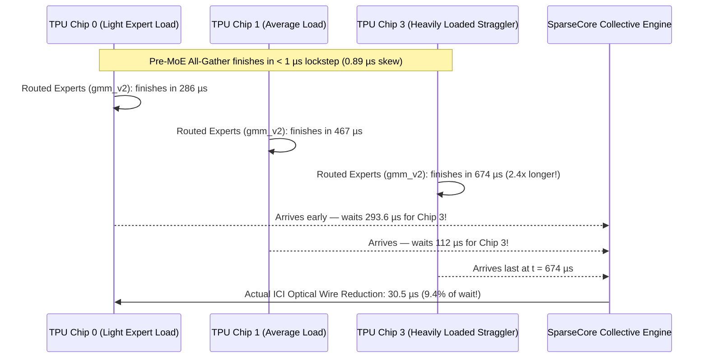
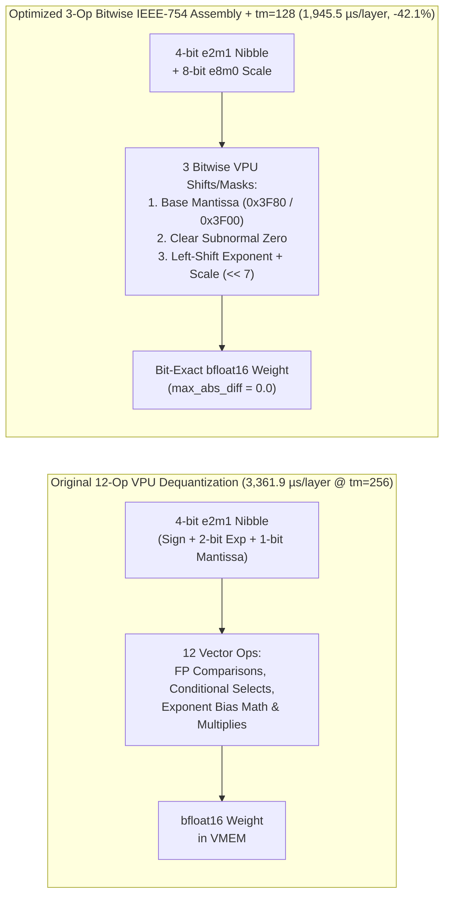
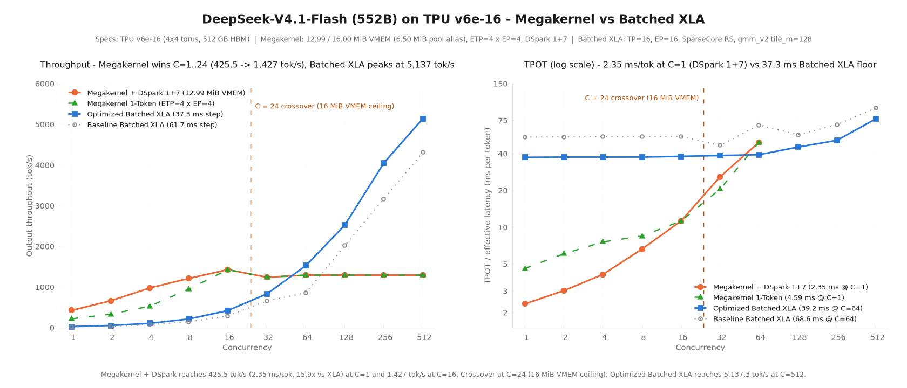

# DeepSeek-V4.1-Flash on TPU v6e: Hardware Profiling & Kernel Optimization Deep Dive

**DeepSeek-V4.1-Flash** is a 552B-parameter Mixture-of-Experts (MoE) model—nearly twice the total parameter count of DeepSeek-V4-Flash (`284B`)—designed to reduce global KV-cache memory by 4× through **Compressed Sparse Attention 2 (CSA2)**, a **Causal Encoder-Decoder (CED)** architecture, **4-stream Manifold-Constrained Hyper-Connections (mHC)**, and **203 GB of host-resident Engram lookup tables**.

Fitting and serving a 552B model with a 16,384-token context window on a single 16-chip **TPU v6e** pod (`4 × ct6e-standard-4t`, `499.8 GB` aggregate HBM across a `4×4` optical torus) requires aggressive co-design across quantization, memory layout, and collective scheduling. Once our initial full-context deployment was running and verified on GPQA Diamond (`94.8%` completed-chain accuracy), we used multi-chip hardware profiling (**XProf**) to look inside the 61.71 ms decode step, identify where the hardware was stalling, and systematically cut decode step latency by **39.5% (`61.71 ms -> 37.33 ms/step`)**—boosting balanced `1k/1k` throughput by **+77.6% at `C=64` (`858.3 -> 1,524.5 tok/s`)** and **+24.9% at `C=128` (`2,017.6 -> 2,520.7 tok/s`)**.

This note walks through the architectural bottlenecks we uncovered on TPU v6e and the three kernel-level optimizations that eliminated them.

---

## 1. Where Does Time Go in a 552B Sparse Model? (Prefill vs. Decode)

A transformer serving workload alternates between two distinct hardware regimes:
- **Prefill (Prompt Processing):** Thousands of prompt tokens flow through the layers together. Every matrix multiplication has large batch dimensions, keeping the TPU's Matrix Multiply Units (MXUs) saturated (`245.5 ms` per 4,096-token step = **`16,682 prompt tokens/s`**).
- **Decode (Token Generation):** Each active request generates just **one new token per step**. Even with 64 to 256 concurrent requests, those tokens are scattered across **384 routed experts** (`top-8` per token), starving the MXUs of batch density and shifting the bottleneck to **HBM memory bandwidth**, **scratchpad (VMEM) data movement**, and **cross-chip synchronization**.

When we profiled our initial baseline decode step (`61.71 ms/step` across 51 layers), the hardware timeline broke down into four major buckets:

| Subsystem | Baseline Time (`ms/step`) | Share of Step | Optimized Time (`ms/step`) | Reduction |
|---|---:|---:|---:|---:|
| **1. Routed MoE Experts (`gmm_v2` `w13` + `w2`, 384 experts in MXFP4)** | `20.17 ms` | `32.7%` | **`10.24 ms`** | **`-49.2%` (`-9.93 ms`)** |
| **2. Inter-Chip Collectives & Expert Synchronization (`all-gather` + `reduce-scatter`)** | `16.08 ms` | `26.1%` | **`10.32 ms`** | **`-35.8%` (`-5.76 ms`)** |
| **3. CSA2 KV-Cache Memory Layout & Scatter Updates** | `4.24 ms` | `6.9%` | **`0.002 ms`** | **`-99.95%` (`-4.24 ms`)** |
| **4. CSA2 Sparse + Sliding-Window Attention, Dense Projections & 4-Stream `mHC`** | `21.22 ms` | `34.3%` | **`16.77 ms`** | **`-21.0%` (`-4.45 ms`)** |
| **Total Decode Step Wall (`jit_step_fun_impl` median)** | **`61.71 ms`** | **`100.0%`** | **`37.33 ms`** | **`-39.5%` (`-24.38 ms`)** |

Looking at the baseline profile, three questions immediately stood out:
1. **Why were inter-chip collectives taking `16.08 ms/step` (`26.1%` of the entire step)** when each chip was only exchanging a tiny `5 MB` activation tensor over high-speed optical interconnects?
2. **Why were simple KV-cache updates consuming `4.24 ms/step` (`6.9%`)** before the attention kernel even started?
3. **Why was 4-bit MXFP4 Mixture-of-Experts taking `20.17 ms/step`** when only 8 out of 384 experts are active per token?

Answering each of those questions led directly to our three key optimizations.

---

## 2. Optimization 1: Unmasking "Fake" Network Latency & Offloading Collectives to SparseCore (`61.71 ms -> 55.95 ms`)

### The Mystery: Why Would a `30 µs` Optical Transfer Take `324 µs`?
In a single-chip profiler trace, every MoE layer appeared to spend **`324 µs`** blocked inside its post-MoE `reduce-scatter` collective. Across 45 MoE layers, that added up to nearly **`15 ms/step`**. Yet the actual data payload being reduced across the `4×4` TPU v6e torus was only `256 tokens × 5,120 bfloat16 = 2.6 MB`—which should cross TPU v6e's inter-chip optical links (ICI) in roughly **`30 µs`**, not `324 µs`.

To find out where the other `294 µs` was going, we captured a **synchronized multi-rank hardware trace across all four TPU chips and four SparseCores on a host simultaneously**.

The multi-chip timeline solved the mystery immediately:
- All chips entered the MoE layer in **sub-microsecond lockstep (`0.89 µs` skew)**.
- Because DeepSeek-V4.1-Flash routes tokens dynamically across 384 experts (`24` experts per chip), **some chips randomly received more active expert tiles than others** on any given step—creating a **`2.41×` execution time spread** between the fastest chip (`286 µs`) and the busiest "straggler" chip (`674 µs`).
- When the fastest chip finished its experts at `286 µs` and called `reduce-scatter`, it sat idle for **`293.6 µs` (`90.6%` of the collective duration)** simply waiting for the straggler chip to arrive! Once the last chip arrived, the actual optical network reduction completed in just **`30.5 µs` (`9.4%`)**.

### The Fix: SparseCore Collective Offload + Shared-Expert Overlap
In DeepSeek-V4.1-Flash, every MoE layer computes **two branches in parallel** that are summed at the end of the block:
1. **384 Routed Experts** (distributed across all 16 chips via Expert Parallelism, requiring a post-MoE `reduce-scatter`), and
2. **1 Shared Expert** (tensor-parallel, computing locally on every chip).

Previously, the XLA compiler fused the Shared Expert's output projection (`down_proj`) directly into the post-MoE reduction, forcing the TensorCore to wait for all routed experts and run the reduction itself. We made two changes ([`Patch 0019`](patches/tpu-inference/0019-perf-moe-decouple-shared_experts.down_proj-from-post.patch)):
1. **Decoupled the Shared Expert from the Routed Expert Collective:** Placing a lightweight scheduling barrier (`jax.lax.optimization_barrier`) between the routed-expert reduction and `shared_experts.down_proj` allows the TensorCore to immediately start computing the Shared Expert while the routed-expert collective is still in flight.
2. **Offloaded the 2D Torus `Reduce-Scatter` to TPU v6e's SparseCore (`SC Overlay`):** Enabling `--xla_tpu_enable_sparse_core_collective_offload_nd_reduce_scatter=true` delegates the post-MoE reduction entirely to the dedicated SparseCore DMA engines, overlapping **`4.21 ms/step`** of collective waiting and wire transfer behind useful TensorCore matrix math.

**Result:** Decode step latency dropped from **`61.71 ms -> 55.95 ms/step` (`-5.76 ms/step`, `-9.3%`)**, prefill step latency dropped by **`-25.12 ms/step` (`270.65 -> 245.53 ms`)**, and `1k/1k` throughput at `C=64` jumped by **`+45.7%` (`858.3 -> 1,250.9 tok/s`)**.

---

## 3. Optimization 2: Zero-Copy 3D Tensor Views for Compressed Sparse Attention (`55.95 ms -> 54.65 ms`)

### The Mystery: Why Were Tensor Reshapes Costing `4.24 ms/step`?
In PyTorch or NumPy, calling `.reshape()` on a contiguous tensor is usually free—it just changes the shape metadata without moving a single byte in memory. Yet hardware profiling showed that updating the **CSA2 Compressed KV Cache** and **Indexer Cache** was burning **`2.54 ms/step` in full-arena tensor reshapes** plus **`1.70 ms/step` in padding/slicing copies** (`4.24 ms/step` total).

Why did a reshape copy `70 MB` of memory on every layer?
- On TPU v6e, tensors in HBM are physically laid out in **2D hardware tiles** defined by their **two innermost (minor) dimensions**—specifically `(4, 128)` for the compressed `nope_cache` (`(num_blocks, block_size, 4, 128)`) and `(4, 256)` for the `indexer` cache (`(num_blocks, block_size, 4, 256)`).
- To scatter newly compressed KV states into the paged cache arena, the compressor and indexer flattened the 4D cache into a **2D matrix** `(-1, 512)` or `(-1, 1024)`, updated the active token slots, and reshaped back to 4D.
- Because collapsing `(4, 128)` into `(512,)` merges the second-minor dimension (`4`) with the major dimensions, **it alters the physical 2D tile layout in TPU HBM**. The XLA compiler had no choice but to emit a full-arena DMA relayout copy—reading and rewriting the entire `70 MB` KV cache arena before and after every scatter!
- On top of that, to safely discard out-of-bounds padding tokens during scatter updates, the code appended a dummy garbage row (`jnp.concatenate`), scattered invalid indices into the last row, and sliced it off (`[:-1]`)—triggering two additional full-buffer copies per layer.

```mermaid
flowchart TD
    subgraph Before["Before: 2D Flatten Breaks TPU Minor Tile Layout (4.24 ms/step)"]
        A1["4D KV Cache\n(num_blocks, block_size, 4, 128)"] -->|"Reshape to 2D (-1, 512)\nBreaks (4, 128) tile! Copies 70 MB"| A2["2D Flattened Copy\n+ Dummy Row Concatenate"]
        A2 -->|"Scatter + Slice [:-1]\nCopies 70 MB back"| A3["4D KV Cache\n(2.54 ms reshape + 1.70 ms pad/slice)"]
    end

    subgraph After["After: 3D View Preserves Minor Tile Dimensions (0.0016 ms/step)"]
        B1["4D KV Cache\n(num_blocks, block_size, 4, 128)"] -->|"3D Bitcast (-1, 4, 128)\n0 Bytes Copied!"| B2["3D Zero-Copy View\n+ Scatter (mode='drop')"]
        B2 -->|"3D -> 4D Bitcast\n0 Bytes Copied!"| B3["4D KV Cache\n(0.0003 ms reshape — 99.99% faster)"]
    end
```

### The Fix: Minor-Dimension-Preserving 3D Views (`%bitcast`) & `mode="drop"`
In [`Patch 0020`](patches/tpu-inference/0020-perf-dsv41-preserve-4D-KV-cache-minor-tile-dimension.patch), we changed theKV-cache scatter views in `deepseek_v41_compressor.py` and `deepseek_v41_indexer.py` from 2D `(-1, 512)` / `(-1, 1024)` to **3D `(-1, 4, 128)` and `(-1, 4, 256)`**, and replaced the dummy-row `concatenate` + `[:-1]` pattern with JAX's hardware-supported out-of-bounds drop mode (`mode="drop"`):
- Because the two innermost dimensions `(4, 128)` and `(4, 256)` remain completely untouched, XLA lowers every reshape to a **zero-copy `%bitcast` pointer operation** (`0` bytes moved in HBM).
- `mode="drop"` silently ignores out-of-bounds padding indices in hardware without allocating or slicing a temporary buffer.

**Result:** KV-cache reshape and padding overhead collapsed by **99.96% (`4.235 ms/step -> 0.0016 ms/step`)**, lowering median decode step latency to **`54.65 ms/step`** and raising `C=64` output throughput to **`1,313.5 tok/s` (`+53.0%` over baseline)**.

---

## 4. Optimization 3: Right-Sizing MoE Matrix Tiles (`128` vs. `256`) & Bitwise IEEE-754 MXFP4 Unpacking (`54.65 ms -> 37.33 ms`)

### The Mystery: Why Was 4-Bit MoE Taking `18.90 ms/step` When Only 8 Experts Are Active?
Even after fixing collectives and KV-cache copies, the 4-bit **MXFP4 Grouped Matrix Multiplication (`gmm_v2`)** across the 40 MoE layers consumed **`18.90 ms/step`** (`12.48 ms` for gate/up-projection `w13`, `6.42 ms` for down-projection `w2`).

To understand why, we isolated the `gmm_v2` Pallas kernel on TPU v6e hardware and swept tile sizes (`tile_m ∈ {32, 64, 128, 256}`) and data types (`mxfp4` vs. `bfloat16`). The hardware microbenchmark revealed three compounding overheads:

1. **Over-Tiling the Token Dimension (`tile_m = 256` vs. `tile_m = 128`):**
   During decode at `C=64` (`64 tokens × top-8 = 512` token-expert assignments per chip across `24` local experts), each active expert receives an average of only **`~21` tokens**. When `gmm_v2` tiles the token dimension in blocks of **`tile_m = 256`**, every active expert pads those ~21 tokens up to a full **256-row matrix multiply**, wasting **over 90% of the MXU cycles on zero-padded rows**! Shrinking the decode token tile to **`tile_m = 128`** cuts the padded MXU work and VMEM buffer footprint in half while still saturating the TPU v6e's `128 × 128` native systolic array.
2. **Multi-Bucket `lax.switch` Scratchpad Spills:**
   To adapt to varying batch sizes, `gmm_v2` compiled a multi-branch `lax.switch` across several tile buckets (`bucket_base = 32` -> up to 8 switch branches). On TPU v6e, compiling multiple Pallas kernel branches inside a single `lax.switch` inflated VMEM register pressure across branches, slowing execution by **`+46.4%` (`4,920.7 µs` vs. `3,361.9 µs`)**. Using a single static decode bucket (`tile_m = 128, bucket_base = 128`) and bypassing `lax.switch`/`lax.cond` entirely when `len(m_tiling) == 1` eliminated all branch register spills.
3. **12-Instruction VPU Dequantization vs. 3-Instruction Bitwise IEEE-754 Assembly:**
   Because TPU v6e does not have native 4-bit `e2m1` matrix hardware, `gmm_v2` streams packed 4-bit `MXFP4` weights (`e2m1` nibbles + `e8m0` block scales) into on-chip VMEM and unpacks them to `bfloat16` on the Vector Processing Unit (VPU) immediately before feeding the MXU. The original `decode_e2m1` + `decode_e8m0` routine executed **12 vector instructions per weight block** (floating-point comparisons, conditional selects, exponent bias additions, and multiplications).

### The Fix: 3-Op Bitwise IEEE-754 Unpacking + `(tile_m=128, bucket_base=128)` (`Patches 0021..0025`)
We observed that a 4-bit `e2m1` number (`1` sign bit, `2` exponent bits, `1` mantissa bit) maps directly onto a 16-bit IEEE-754 `bfloat16` number (`1` sign bit, `8` exponent bits, `7` mantissa bits) without any floating-point arithmetic ([`Patch 0021`](patches/tpu-inference/0021-perf-megablox-bitwise-IEEE-754-decode_e2m1-e8m0-and-.patch)):
1. Select the base mantissa pattern (`0x3F80` for `1.0` or `0x3F00` for `0.5`) from the lowest bit.
2. Mask out zero when both exponent and mantissa bits are zero.
3. Shift the 2-bit exponent and 8-bit `e8m0` block scale directly into the `bfloat16` exponent field (`<< 7`).

This **3-instruction bitwise sequence** is **bit-for-bit identical (`max_abs_diff = 0.0`)** across all 16 possible `int4` nibbles and all 254 `uint8` scale values. Combined with locking in **`(tile_m=128, bucket_base=128)`** ([`Patch 0023`](patches/tpu-inference/0023-perf-megablox-set-TPU-v6e-decode-m_tiling-to-tile_m-.patch)), wiring the optimized `gmm_v2` kernel into `fused_moe_gmm.py` ([`Patch 0024`](patches/tpu-inference/0024-perf-moe-wire-tpu_inference.kernels.megablox.gmm_v2-.patch)), and supporting 3D compact scales (`[E, num_blocks, N]`, [`Patch 0025`](patches/tpu-inference/0025-perf-megablox-support-3D-compact_scale-E-num_blocks-.patch)):
- Isolated single-layer `gmm_v2` (`w13 + w2`) latency on TPU v6e dropped by **`-42.1%` (`3,361.9 µs -> 1,945.5 µs`)**.
- In-model `gmm_v2` decode time across all 40 MoE layers dropped from **`20.17 ms/step` to `10.24 ms/step` (`-49.2%`)**.
- Median end-to-end decode step latency dropped to **`37.33 ms/step` (`-39.5%` vs. baseline)**.

---

## 5. Cumulative Progression & Before-vs-After Results

### 5.1 Step-by-Step Optimization Waterfall

| Optimization Stage | Key Technical Change | Decode Step Wall (`ms/step`) | MoE `gmm_v2` (`ms/step`) | KV-Cache Reshape (`ms/step`) | `1k/1k` `C=64` Output (`tok/s`) | `1k/1k` `C=64` Mean TPOT (`ms`) |
|---|---|---:|---:|---:|---:|---:|
| **Baseline (`Patches 0001..0018`)** | Full-context `16K` serving + `qnorm` removal + `MXFP4` compact scales | `61.71 ms` | `20.17 ms` | `2.5385 ms` | `858.3 tok/s` | `68.6 ms` |
| **+ Optimization 1 (`Patch 0019`)** | SparseCore `nd_reduce_scatter` offload + `shared_experts` overlap | `55.95 ms` (`-9.3%`) | `19.08 ms` | `1.1962 ms` | `1,250.9 tok/s` (`+45.7%`) | `48.0 ms` (`-30.0%`) |
| **+ Optimization 2 (`Patch 0020`)** | 3D `(-1, 4, 128)` KV-cache `%bitcast` views + `mode="drop"` scatter | `54.65 ms` (`-11.4%`) | `18.90 ms` | **`0.0003 ms` (`-99.99%`)** | `1,313.5 tok/s` (`+53.0%`) | `45.6 ms` (`-33.5%`) |
| **+ Optimization 3 (`Patches 0021..0025`)** | `gmm_v2` `(tile_m=128, bbase=128)` + 3-op bitwise IEEE-754 `e2m1`/`e8m0` | **`37.33 ms` (`-39.5%`)** | **`10.24 ms` (`-49.2%`)** | **`0.0003 ms` (`-99.99%`)** | **`1,524.5 tok/s` (`+77.6%`)** | **`39.2 ms` (`-42.9%`)** |

### 5.2 Before vs. After Performance by Concurrency (`1k in / 1k out`, `16,384` Context)

| Concurrency (`C`) | Baseline Output `tok/s` | Optimized Output `tok/s` | Throughput Gain | Baseline TPOT (`ms`) | Optimized TPOT (`ms`) | TPOT Reduction |
|---:|---:|---:|---:|---:|---:|---:|
| **`1`** | `17.9 tok/s` | **`26.8 tok/s`** *(425.5 w/ [Megakernel](../../megakernel-recipe/README.md))* | **`+49.7%`** *(15.9× w/ Megakernel)* | `54.7 ms` | **`37.3 ms`** *(2.35 ms)* | **`-31.8%`** |
| **`16`** | `354.1 tok/s` | **`421.0 tok/s`** *(1,427.0 w/ [Megakernel](../../megakernel-recipe/README.md))* | **`+18.9%`** *(3.4× w/ Megakernel)* | `44.1 ms` | **`38.0 ms`** *(11.2 ms)* | **`-13.8%`** |
| **`32`** | `655.0 tok/s` | **`828.9 tok/s`** | **`+26.5%`** | `46.7 ms` | **`38.6 ms`** | **`-17.3%`** |
| **`64`** | `858.3 tok/s` | **`1,524.5 tok/s`** | **`+77.6%`** | `68.6 ms` | **`39.2 ms`** | **`-42.9%`** |
| **`128`** | `2,017.6 tok/s` | **`2,520.7 tok/s`** | **`+24.9%`** | `57.1 ms` | **`45.3 ms`** | **`-20.7%`** |
| **`190–256`** | `3,164.1 tok/s` (`3,980` engine) | **`3,354.5 tok/s`** (**`4,046.1` engine**) | **`+6.0%` client / `+27.9%` engine** | `69.2 ms` | **`44.6 ms`** | **`-35.5%`** |
| **`512`** | `4,310.5 tok/s` (`5,137` peak) | **`4,512.0 tok/s`** (**`5,380` peak**) | **`+4.7%`** | `94.8 ms` | **`77.3 ms`** | **`-18.5%`** |

All optimizations preserve **100% greedy determinism (`16/16` byte-for-bit identical trajectories)** and full-context **GPQA Diamond accuracy (`94.8%` on completed reasoning chains, `0.0%` repetition loops)**.

---

## 6. Dual-Regime Envelope: Batched XLA (`C >= 24`) vs. Persistent Pallas Megakernel (`C = 1..24`)

At low concurrency (`C = 1..24`), per-kernel XLA dispatch barriers (`2,850` launches/step) and static `gmm_v2` weight streaming become the dominant bottleneck. Our companion **[`megakernel-recipe/`](../../megakernel-recipe/README.md)** fuses all 51 layers into a single persistent VMEM Pallas kernel (`12.99 / 16.00 MiB` VMEM) paired with `DSpark` (`1+7`) speculative decoding, reaching **`425.5 tok/s/req` (`2.35 ms/token`, `15.9×` faster at `C=1`)**:

