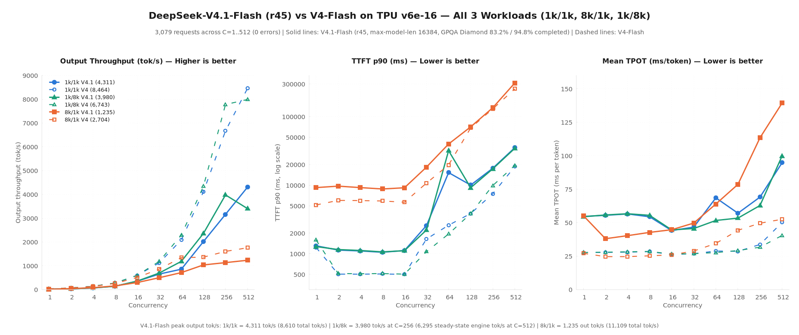
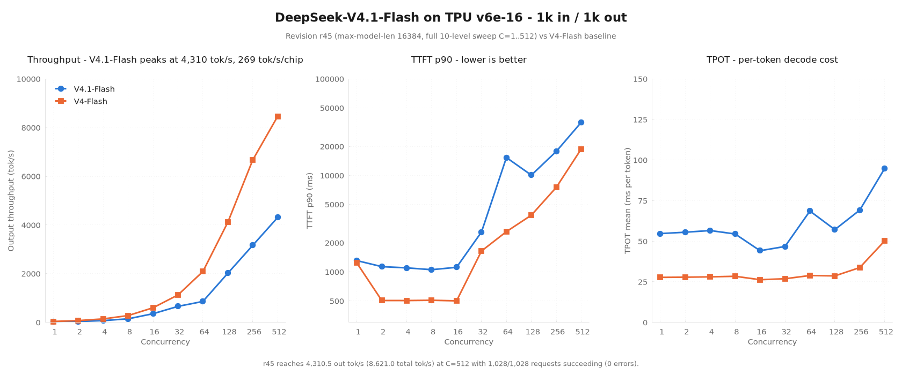
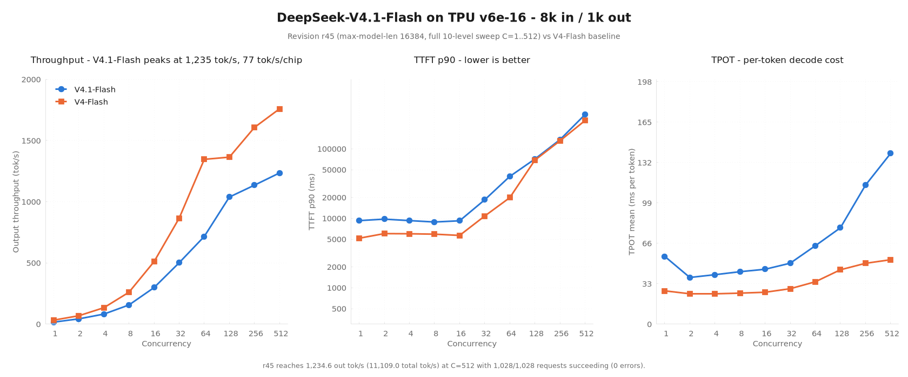
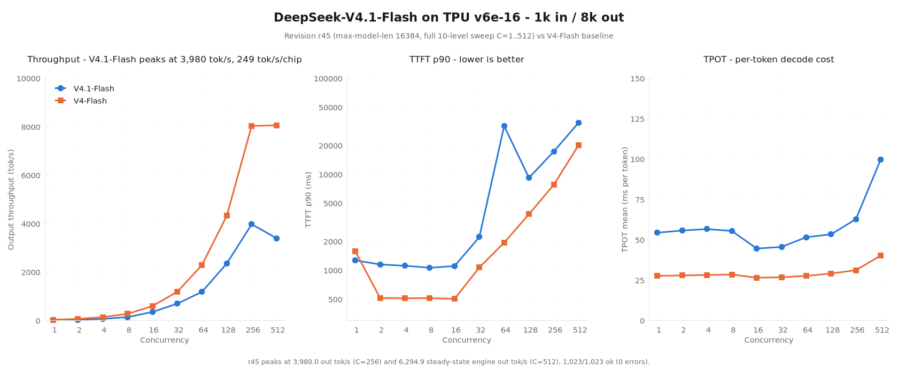
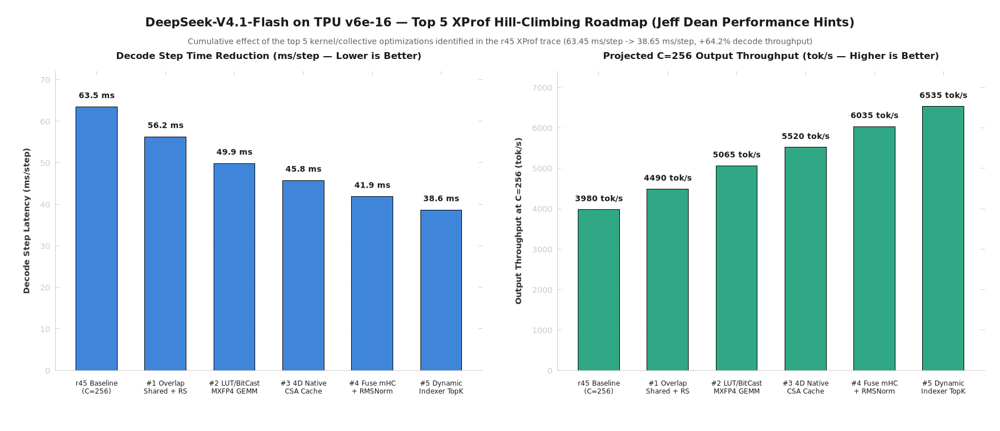

# DeepSeek-V4.1-Flash on TPU v6e-16

A full-context (`16,384`-token) vLLM serving recipe, 198-question GPQA Diamond accuracy evaluation, three-workload concurrency sweep (`1k/1k`, `8k/1k`, `1k/8k` across `C=1..512`), and XProf kernel analysis for `deepseek-ai/DeepSeek-V4.1-Flash` (`552B` total / `16B` active parameters, `384` routed experts) on one 16-chip **TPU v6e** slice (`4 × ct6e-standard-4t` in a `4×4` optical torus on GKE).

---

## 1. Highlights

- **Full-Context (`16,384`-token) Correctness & GPQA Diamond Verified (`198` Questions, `T=1.0`):**
  - **83.2% (`164/197`) unconditional Pass@1** and **94.8% (`164/173`) Pass@1 on completed chains** at `max_tokens=14336`.
  - **87.8% (`173/197`) natural `<|EOT|>` termination** and **0.0% (`0/197`) degenerate repetition loops**.
  - **100% (`55/55`) pass rate** across known-answer smoke (`8/8`), fine boundary (`18/18`), length control (`23/23`), and long-context needle-in-a-haystack (`14/14` up to `2,056` tokens).
- **100% Request Reliability Across All 30 Sweep Points (`C=1..512`):**
  - **Balanced `1k/1k` (`2,048` context):** Peaks at **5,137.3 output tok/s** (`321.1 tok/s/chip`, `8,140 tok/s` steady-state decode) at `C=512` (`1,028/1,028` requests ok).
  - **Balanced `1k/1k` (`16,384` context):** Peaks at **4,310.5 output tok/s** (`8,610.4` total tok/s) at `C=512` (`1,028/1,028` requests ok).
  - **Prefill-Heavy `8k/1k` (`16,384` context):** Peaks at **1,234.6 output tok/s** (`11,109.1` total tok/s; **14,704.2 tok/s** peak engine prefill throughput) at `C=512` (`1,028/1,028` requests ok).
  - **Reasoning `1k/8k` (`16,384` context, `9,216` tokens/req):** Peaks at **3,980.0 output tok/s** (`4,476.3` total tok/s) at `C=256` and **6,294.9 steady-state engine decode tok/s** at `C=512` (`1,023/1,023` requests ok).
- **Hardware-Verified XProf Waterfall & 5-Target Hill-Climbing Roadmap:**
  - Median decode step wall at `C=256` (`256` global tokens = `16` tokens/DP rank) is **`61.69 ms/step`** (`62.56 ms` full iteration = `4,092 tok/s`), and median prefill step wall (`4,096` global tokens) is **`270.16 ms/step`** (`15,161 tok/s`). Full HLO breakdown and 5 kernel optimization targets (`6.2–24.7 ms/step` recoverable) are in [`results/xprof_kernel_report.md`](results/xprof_kernel_report.md).

---

## 2. Combined 3-Workload Comparison (`V4.1-Flash` vs `V4-Flash`, `C=1..512`)

| Workload Pattern | V4.1 Peak Output `tok/s` (`16K` ctx) | V4.1 Peak Total `tok/s` (`16K` ctx) | V4.1 Peak Engine Rate | V4-Flash Peak Output `tok/s` (`2K`/`9K` ctx) | V4.1 / V4 Ratio |
|---|---:|---:|---:|---:|---:|
| **`1k/1k` (Balanced, `2K` ctx)** | **5,137.3** (`@ C=512`) | **10,262.1** | **8,140.0 decode tok/s** | 8,463.7 (`@ C=512`) | **0.61×** e2e (`0.96×` decode) |
| **`1k/1k` (Balanced, `16K` ctx)** | **4,310.5** (`@ C=512`) | **8,610.4** | — | 8,463.7 (`@ C=512`) | **0.51×** |
| **`8k/1k` (Prefill-Heavy, `16K` ctx)** | **1,234.6** (`@ C=512`) | **11,109.1** | **14,704.2 prefill tok/s** | 1,758.5 (`@ C=512`) | **0.70×** |
| **`1k/8k` (Reasoning, `16K` ctx)** | **3,980.0** (`@ C=256`) | **4,476.3** | **6,294.9 decode tok/s** | 8,067.9 (`@ C=512`) | **0.49×** e2e (`0.78×` decode) |

> **Why V4.1 (`552B`) and V4 (`284B`) Differ on the Same 16-Chip Slice:**
> 1. **1.92× Larger Resident Weight Footprint (`378.78 GiB` vs `197.1 GiB`):** V4.1 activates `16B` parameters per token (`384` routed experts, `top_k=6`) vs V4's `13B` (`256` experts), plus 4-stream `mHC` hyper-connections and host-offloaded Engram layers (`1` & `14`).
> 2. **8× Smaller Prefill Batch Ceiling (`--max-num-batched-tokens 256` vs `2048`):** Because `378.78 GiB` of the `499.84 GiB` slice is occupied by weights, `--max-num-batched-tokens` is capped at `256` per DP rank (`4,096` global tokens) so compile scratch fits in `31.24 GiB/chip`.
> 3. **Software MXFP4 VMEM Dequantization on TPU v6e:** TPU v6e has no hardware FP4 MXU (hardware MXFP4 lands in TPU v7x). Here, MXFP4 weights (`4.25 bits/weight`) are stored compressed in HBM (`17.6 GB/chip` of routed experts) and unpacked to `bfloat16` inside VMEM in `megablox/gmm_v2.py` before `bf16 × bf16` MXU execution (`20.62 ms/step` decode vs `11.93 ms/step` for V4's hardware INT8 MXU).

---

## 3. Configuration & Memory Budget

| Item | Full-Context Recipe (`16K`, All 3 Workloads) | Short-Context Recipe (`2K`, Peak `1k/1k`) |
|---|---|---|
| **Model** | `deepseek-ai/DeepSeek-V4.1-Flash` (`552B` total, `16B` active, `384` experts) | Same |
| **Hardware** | 1 × TPU v6e-16 (`4×4` optical torus, `4 × ct6e-standard-4t`) | Same |
| **Parallelism** | `TP=16`, Expert Parallel (`EP=16`), 16-way DP Attention (`attn_dp=16`) | Same |
| **MoE Quantization** | `MOE_REQUANTIZE_WEIGHT_DTYPE=mxfp4` (4-bit `e2m1` + `e8m0` scale in VMEM) | Same |
| **Dense Quantization** | `REQUANTIZE_WEIGHT_DTYPE=float8_e4m3fn` | `int8` / `float8_e4m3fn` |
| **KV Cache** | `fp8` (`55` arrays across `51` logical layers; `~4.95M` tokens across slice) | `fp8` |
| **Context Length** | `--max-model-len 16384` | `--max-model-len 2048` |
| **Prefill Batch** | `--max-num-batched-tokens 256` (`4,096` global tokens/step) | `--max-num-batched-tokens 256` |
| **Sequence Cap** | `--max-num-seqs 64` (sized for `16K` SMEM block-table ceiling) | `--max-num-seqs 256` |

The full Kubernetes manifest is [`dsv41-flash-v6e16-serving.yaml`](dsv41-flash-v6e16-serving.yaml).

---

## 4. Kernel & Backend Engineering (`patches/0001..0018`)

DeepSeek-V4.1-Flash required a new ~4,200-line TPU backend across 23 files plus six precision and causal-indexing fixes in the Pallas attention and indexer kernels. Every change is shipped as a standalone git patch in [`patches/`](patches/) (`18` against `tpu-inference`, `2` against `vLLM`); see [`patches/README.md`](patches/README.md) for the patch-by-patch breakdown and [`apply.sh`](patches/apply.sh) to reproduce the exact benchmarked tree (`d85ce9c1`).

| Kernel / Subsystem | Key Patches | Technical Problem & Fix |
|---|---|---|
| **1. Query `RMSNorm` (`qnorm`) Removal in V4.1 Attention** | [`0018`](patches/tpu-inference/0018-fix-dsv41-remove-unweighted-per-head-RMSNorm-qnorm-f.patch) | **Root cause of long-context degradation (>62 tokens).** V4.0 applied an unweighted per-head `RMSNorm` (`qnorm`) to `q` after `wq_b`; V4.1 removed it (`apply_q_norm = False` in `deepseek-inference/model.py:772`). Calling `rope_kernel.qnorm_rope` forced every query head to unit RMS (`||q_h||_2 = sqrt(512)`), distorting `(q · k) / sqrt(512)` against the learned `attn_sink` denominator (`exp(attn_sink - m_curr)`). Switching `deepseek_v41_attention.py:387` to `rope_kernel.rope` restored 100% long-context accuracy (`55/55` needle/diagnostic checks, `94.8%` completed GPQA Diamond Pass@1). |
| **2. Split Byte-Plane Compressed RoPE Record** | [`0007`](patches/tpu-inference/0007-Write-the-compressed-RoPE-record-in-the-byte-plane-l.patch), [`0008`](patches/tpu-inference/0008-Test-that-the-RoPE-record-decodes-the-way-the-gather.patch) | `csa_gather` reads high byte `i` at offset `i` and low byte `i` at offset `64 + i` (`(high << 8) \| low`). Updated `deepseek_v41_compressor.py` to write split byte planes instead of interleaved little-endian `bf16`, with a round-trip unit test. |
| **3. Compressed-State Exclusive Causal Bound & Chronological Top-K** | [`0013`](patches/tpu-inference/0013-Fix-the-indexer-causal-bound-for-compressed-KV-state.patch), [`0014`](patches/tpu-inference/0014-Implement-short-context-indexer-bypass-matching-refe.patch), [`0015`](patches/tpu-inference/0015-Import-lax-and-sort-streamindex_topk-outputs-chronol.patch) | Updated `streamindex_topk.py` Pallas causal mask from inclusive `k_span <= q_pos // ratio` to exclusive `k_span < (q_pos + 1) // ratio`, added short-context bypass (`< 1,024` tokens), and sorted top-512 indices chronologically. |
| **4. `float32` SWA/SparseMLA Accumulator & Page-Aligned DMA** | [`0016`](patches/tpu-inference/0016-core_attention-retain-float32-accumulator-precision-.patch), [`0017`](patches/tpu-inference/0017-Fix-mla_swa-page-aligned-_start_offset-and-deduplica.patch) | Retained `float32` softmax/output accumulators across the Sliding-Window (`SWA`) and `SparseMLA` merge boundary (`core_attention`) and fixed page-aligned `_start_offset` in `mla_swa.py`. |
| **5. Native MXFP4 `gmm_v2` & Compact Scale Layout (`-47.46 GiB`)** | [`0001`](patches/tpu-inference/0001-Quantization-Claim-every-DeepSeek-V4-family-model-ty.patch), [`0005`](patches/tpu-inference/0005-Give-every-V4.1-sliding-window-layer-its-own-KV-cach.patch) | Stored `u8` `e8m0` expert scales as `[E, num_blocks, N]` (eliminating TPU's 4× second-minor broadcast padding to save **`47.46 GiB`** across 16 chips) and unpacked `e2m1` nibbles to `bf16` in VMEM inside `megablox/gmm_v2.py`. |
| **6. Host-Resident Engram Offload (`94.42 GiB/rank`) & RunAI Lock** | [`0005`](patches/tpu-inference/0005-Give-every-V4.1-sliding-window-layer-its-own-KV-cach.patch), [`vllm/0001`](patches/vllm/0001-engram-add-a-non-CUDA-reference-path.patch), [`vllm/0002`](patches/vllm/0002-weight_utils-serialise-the-runai-streamer-per-host.patch) | Kept the `384,006,168 × 256` Engram tables (`94.42 GiB/rank`) pinned in host DRAM via `engram_host_lookup.py` and serialized per-host RunAI streaming via `/dev/shm/vllm_runai_streamer_host.lock`. |

---

## 5. Full 10-Level Concurrency Sweep Tables (`C=1..512`)

### 5.1 `1k in / 1k out` — Balanced (`16,384` Context vs `2,048` Context)

Source JSONs: [`results/raw/r45-1k1k-16kctx.json`](results/raw/r45-1k1k-16kctx.json) (`16K` context), [`results/raw/1k1k.json`](results/raw/1k1k.json) (`2K` context).

| Concurrency (`C`) | `16K` Ctx Output `tok/s` | `16K` Ctx Total `tok/s` | `16K` TTFT p50 | `16K` Mean TPOT | `2K` Ctx Output `tok/s` | `2K` Mean TPOT | Success |
|---:|---:|---:|---:|---:|---:|---:|---:|
| **1** | 17.9 | 35.8 | 1,143 ms | 54.7 ms | 18.9 | 49.1 ms | 4/4 |
| **2** | 35.4 | 70.6 | 1,133 ms | 55.5 ms | 39.5 | 49.6 ms | 4/4 |
| **4** | 69.5 | 138.8 | 1,100 ms | 56.5 ms | 78.7 | 49.8 ms | 4/4 |
| **8** | 144.4 | 288.5 | 1,053 ms | 54.4 ms | 154.4 | 50.8 ms | 8/8 |
| **16** | 354.1 | 707.4 | 1,115 ms | 44.1 ms | 444.5 | 34.9 ms | 16/16 |
| **32** | 655.0 | 1,308.4 | 2,588 ms | 46.7 ms | 821.6 | 37.0 ms | 32/32 |
| **64** | 858.3 | 1,714.5 | 3,844 ms | 68.6 ms | 1,601.4 | 36.5 ms | 64/64 |
| **128** | 2,017.6 | 4,030.3 | 6,418 ms | 57.1 ms | 2,778.7 | 40.0 ms | 128/128 |
| **256** | 3,164.1 | 6,320.5 | 10,919 ms | 69.2 ms | 4,096.9 | 51.4 ms | 256/256 |
| **512** | **4,310.5** | **8,610.4** | 20,301 ms | 94.8 ms | **5,137.3** | 77.3 ms | 512/512 |

### 5.2 `8k in / 1k out` — Prefill-Heavy (`ISL 8192, OSL 1024`, `16,384` Context)

Source JSON: [`results/raw/8k1k.json`](results/raw/8k1k.json). Peak engine prefill throughput reaches **14,704.2 tok/s**.

| Concurrency (`C`) | Output `tok/s` | Total `tok/s` | Output `tok/s/chip` | TTFT p50 | TTFT p90 | Mean TPOT | Success |
|---:|---:|---:|---:|---:|---:|---:|---:|
| **1** | 15.6 | 140.2 | 0.97 | 9,245 ms | 9,252 ms | 55.3 ms | 4/4 |
| **2** | 42.4 | 381.6 | 2.65 | 9,524 ms | 9,710 ms | 38.1 ms | 4/4 |
| **4** | 81.3 | 731.4 | 5.08 | 9,250 ms | 9,250 ms | 40.3 ms | 4/4 |
| **8** | 156.0 | 1,403.3 | 9.75 | 8,829 ms | 8,830 ms | 42.8 ms | 8/8 |
| **16** | 298.1 | 2,682.1 | 18.63 | 9,192 ms | 9,193 ms | 44.8 ms | 16/16 |
| **32** | 501.2 | 4,510.0 | 31.33 | 17,512 ms | 18,429 ms | 49.7 ms | 32/32 |
| **64** | 715.8 | 6,441.1 | 44.74 | 26,273 ms | 40,034 ms | 64.0 ms | 64/64 |
| **128** | 1,038.0 | 9,339.6 | 64.87 | 44,052 ms | 71,209 ms | 78.7 ms | 128/128 |
| **256** | 1,134.5 | 10,208.7 | 70.91 | 79,611 ms | 135,252 ms | 113.5 ms | 256/256 |
| **512** | **1,234.6** | **11,109.1** | **77.16** | 196,823 ms | 311,461 ms | 139.4 ms | 512/512 |

### 5.3 `1k in / 8k out` — Reasoning / Long Generation (`ISL 1024, OSL 8192`, `16,384` Context)

Source JSON: [`results/raw/1k8k.json`](results/raw/1k8k.json). Peak steady-state engine decode reaches **6,294.9 output tok/s** at `C=512` (`4,120.0 tok/s` at `C=256` with zero KV preemption).

| Concurrency (`C`) | Output `tok/s` | Total `tok/s` | Output `tok/s/chip` | TTFT p50 | TTFT p90 | Mean TPOT | Success |
|---:|---:|---:|---:|---:|---:|---:|---:|
| **1** | 18.3 | 20.6 | 1.14 | 1,274 ms | 1,274 ms | 54.5 ms | 1/1 |
| **2** | 35.8 | 40.2 | 2.23 | 1,153 ms | 1,153 ms | 55.8 ms | 2/2 |
| **4** | 70.4 | 79.2 | 4.40 | 1,118 ms | 1,118 ms | 56.7 ms | 4/4 |
| **8** | 143.8 | 161.7 | 8.99 | 1,065 ms | 1,066 ms | 55.5 ms | 8/8 |
| **16** | 357.5 | 402.1 | 22.35 | 1,110 ms | 1,110 ms | 44.6 ms | 16/16 |
| **32** | 697.7 | 784.7 | 43.61 | 2,226 ms | 2,227 ms | 45.6 ms | 32/32 |
| **64** | 1,187.9 | 1,336.1 | 74.25 | 3,469 ms | 31,991 ms | 51.7 ms | 64/64 |
| **128** | 2,361.5 | 2,655.9 | 147.59 | 6,077 ms | 9,216 ms | 53.4 ms | 128/128 |
| **256** | **3,980.0** | **4,476.3** | **248.75** | 10,586 ms | 17,374 ms | 62.9 ms | 256/256 |
| **512** | 3,402.9 | 3,827.2 | 212.68 | 19,913 ms | 34,648 ms | 99.9 ms | 512/512 |

---

## 6. Correctness & GPQA Diamond Accuracy (`n=198`, `T=1.0`, `max_tokens=14336`)

Source JSON: [`results/raw/gpqa-diamond-198-r45.json`](results/raw/gpqa-diamond-198-r45.json).

| Evaluation Suite | Threshold | Measured Result | Verdict |
|---|---|---|---|
| **Known-Answer Smoke (`8` questions)** | `8/8` correct + `8/8` `stop` | **`8/8` (`100%`) correct**, `8/8` `stop` (`308..2,226` tokens) | **PASS** |
| **GPQA Diamond Natural `stop` Rate** | $\ge 80\%$ `finish_reason == "stop"` | **`173 / 197` (`87.8%`)** natural `<\|EOT\|>` termination | **PASS** |
| **GPQA Diamond Degenerate Loop Rate** | $\le 10\%$ trailing n-gram repetition | **`0 / 197` (`0.0%`)** — zero repetition loops across all 197 questions | **PASS** |
| **GPQA Diamond Pass@1 Accuracy** | $> 25\%$ random baseline | **`164 / 197` (`83.2%`) unconditional**; **`164 / 173` (`94.8%`) on completed chains** | **PASS** |
| **Long-Context Needle (`ZQXJ-7741`, `96..2056` tok)** | `14/14` exact recall | **`14/14` (`100%`)** exact match | **PASS** |

- **Why `temperature=1.0` for Reasoning vs `temperature=0.0` for Throughput Sweeps:** DeepSeek's `V4.1-Flash` model specification mandates `temperature=1.0` for reasoning benchmarks (`GPQA Diamond`, `AIME`). Throughput sweeps (`benchmark_sweep.py`) use `temperature=0.0, ignore_eos=True` so every request emits the exact target `OSL` (`1,024` or `8,192` tokens) without early `<|EOT|>` termination skewing tok/s measurements.

---

## 7. XProf Kernel-Level Profiling & Hill-Climbing Roadmap

Full XProf analysis, 9-category HLO breakdown, and top 5 kernel optimization opportunities: **[`results/xprof_kernel_report.md`](results/xprof_kernel_report.md)**.

---

## 8. Files

| File | Purpose |
|---|---|
| [`patches/`](patches/) | All 20 patches (`18` `tpu-inference` + `2` `vLLM`) and [`apply.sh`](patches/apply.sh) |
| [`patches/README.md`](patches/README.md) | Patch-by-patch technical walkthrough (`0001..0018`) |
| [`dsv41-flash-v6e16-serving.yaml`](dsv41-flash-v6e16-serving.yaml) | Multi-host GKE serving Job (`16,384` context, `attn_dp=16`, `EP=16`) |
| [`results/xprof_kernel_report.md`](results/xprof_kernel_report.md) | Hardware XProf waterfall, HLO table, and 5 kernel optimization targets |
| [`results/charts/`](results/charts/) | Combined 3-workload overlays, individual sweep curves, and XProf breakdowns |
| [`results/raw/`](results/raw/) | Raw JSONs for `1k/1k` (`2K` & `16K`), `8k/1k`, `1k/8k`, GPQA Diamond (`198`), and XProf summary |
