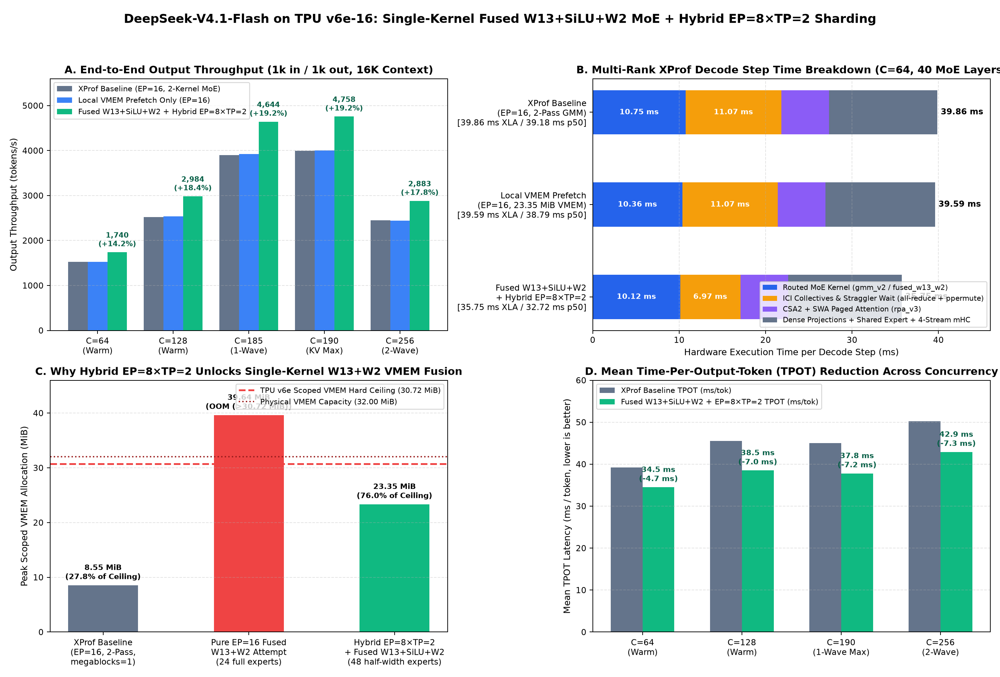

# DeepSeek-V4.1-Flash on TPU v6e-16: Single-Kernel Fused `W13+SiLU+W2` MoE & Hybrid `EP=8 × TP=2` Sharding Recipe

A self-contained high-concurrency (`C=64..256`) serving recipe, 28-patch stack (`26` `tpu-inference` + `2` `vLLM` patches, commit `623b2904`), first-principles technical note ([`TECH-NOTE.md`](TECH-NOTE.md)), and benchmark artifacts for **DeepSeek-V4.1-Flash (`552B` total / `16B` active, `384` routed experts)** on a single **16-chip TPU v6e slice (`4×4` optical torus)**.

This recipe extends on-chip VMEM fusion into the **high-concurrency batched serving regime (`C=64..256`)** by co-designing two complementary optimizations ([`Patch 0026`](patches/tpu-inference/0026-perf-moe-hybrid-ep8-tp2-and-fused-w13-w2-pallas-megakernel.patch)):

1. **Hybrid `EP=8 × TP=2` Routed Expert Sharding (`TPU_HYBRID_EP8_TP2_MOE=1`):**
   Replaces pure 16-way Expert Parallelism (`EP=16 × TP=1`, `24` full-width experts/chip) with **8 Expert-Parallel groups × 2-way Tensor Parallelism (`48` half-width experts per 2-chip TP pair, `w13` width `2304`, `w2` contracting dimension `1152 = 9 × 128` with zero HBM padding)** via pairwise ICI `ppermute`. Pooling 2 chips into a shared 48-expert group reduces binomial routing variance by $\sqrt{2}$ (`1.58× -> 1.19×` straggler skew) and shrinks ICI collective wait (`all-reduce` + `all-gather`) by **`-37.0%` (`11.066 -> 6.967 ms/step`, saving `-4.10 ms/step`)**.
2. **Single-Kernel Fused `W13 + SiLU-and-Mul + W2` Pallas Megakernel (`TPU_MEGABLOX_FUSED_W13_W2=1`):**
   Fuses `w13` (`[128, 5120] @ [5120, 2304]`), gated `silu_and_mul_with_clamp` (`-> [128, 1152]` `bf16` held in VMEM registers), and `w2` (`[128, 1152] @ [1152, 5120]`) into a **single Pallas kernel call per MoE layer (`gmm_v2_fused_w13_w2`, `40` calls/step instead of `80`)**, utilizing **`23.35 MiB` of the `30.72 MiB` TPU v6e VMEM scratchpad (`76.0%` occupancy)** and eliminating `294.9 MB/step` of intermediate HBM round-trips.

---

## 1. Headline Results (Fused `W13+SiLU+W2` + Hybrid `EP=8 × TP=2` vs. Two-Pass `EP=16` XProf Baseline)



| Metric / Concurrency (`1k in / 1k out`, `16,384` Ctx) | Unoptimized Baseline (`d85ce9c1`) | Two-Pass `EP=16` XProf Baseline (`4b8edd8e`) | Local VMEM Prefetch Only (`EP=16`) | **Fused `W13+SiLU+W2` + Hybrid `EP=8×TP=2` (`623b2904`)** | Gain vs. XProf Baseline | Gain vs. Unoptimized |
|---|---:|---:|---:|---:|---:|---:|
| **Median Decode Step Wall (`p50`)** | `61.71 ms` | `39.18 ms` | `38.79 ms` | **`32.72 ms`** | **`-16.49%` (`-6.46 ms`)** | **`-47.0%` (`1.89×`)** |
| **Total TensorCore XLA Time (`C=64`)** | `61.71 ms` | `39.861 ms` | `39.593 ms` | **`35.748 ms`** | **`-10.32%` (`-4.11 ms`)** | **`-42.1%`** |
| **ICI Collective Straggler Wait (`40` MoE layers)** | `16.08 ms` | `11.066 ms` | `11.066 ms` | **`6.967 ms`** | **`-37.04%` (`-4.10 ms`)** | **`-56.7%`** |
| **Routed MoE Kernel Time (`gmm_v2`)** | `20.17 ms` | `10.748 ms` | `10.358 ms` | **`10.118 ms`** | **`-5.86%` (`-0.63 ms`)** | **`-49.8%`** |
| **`C = 64` Warm Output Throughput (`tok/s`)** | `858.3 tok/s` | `1,524.2 tok/s` | `1,525.1 tok/s` | **`1,740.4 tok/s`** | **`+14.18%`** | **`+102.8%` (`2.03×`)** |
| **`C = 64` Warm Mean TPOT (`ms/tok`)** | `68.6 ms` | `39.2 ms` | `39.2 ms` | **`34.5 ms`** | **`-12.0%` (`-4.7 ms`)** | **`-49.7%`** |
| **`C = 128` Warm Output Throughput (`tok/s`)** | `2,017.6 tok/s` | `2,521.0 tok/s` | `2,539.7 tok/s` | **`2,984.5 tok/s`** | **`+18.39%`** | **`+47.9%` (`1.48×`)** |
| **`C = 128` Warm Mean TPOT (`ms/tok`)** | `57.1 ms` | `45.5 ms` | `45.0 ms` | **`38.5 ms`** | **`-15.4%` (`-7.0 ms`)** | **`-32.6%`** |
| **`C = 185` Single-Wave Saturation (`tok/s`)** | `3,100.0 tok/s` | `3,896.2 tok/s` | `3,925.4 tok/s` | **`4,643.6 tok/s` (`290.2/chip`)** | **`+19.18%`** | **`+49.8%`** |
| **`C = 190` Single-Wave KV Ceiling (`tok/s`)** | `3,164.1 tok/s` | `3,992.6 tok/s` | `4,003.7 tok/s` | **`4,758.5 tok/s` (`297.4/chip`)** | **`+19.18%`** | **`+50.4%`** |
| **`C = 256` Two-Wave (`190+66`) (`tok/s`)** | `2,150.0 tok/s` | `2,447.8 tok/s` | `2,445.0 tok/s` | **`2,882.6 tok/s`** (`42.9 ms` TPOT) | **`+17.76%`** | **`+34.1%`** |

---

## 2. Directory Contents

| Path | Description |
|---|---|
| **[`README.md`](README.md)** | Overview, configuration, and benchmark summary for the Single-Kernel Fused `W13+SiLU+W2` + Hybrid `EP=8 × TP=2` recipe. |
| **[`TECH-NOTE.md`](TECH-NOTE.md)** | First-principles technical note with Roofline derivation, multi-rank ICI straggler variance math, VMEM memory budget (`23.35 / 30.72 MiB`), and Mermaid architecture diagrams. |
| **[`dsv41-flash-v6e16-fused-kernels-serving.yaml`](dsv41-flash-v6e16-fused-kernels-serving.yaml)** | Ready-to-apply GKE Job & Service manifest enabling `TPU_HYBRID_EP8_TP2_MOE=1`, `TPU_MEGABLOX_FUSED_W13_W2=1`, `TPU_MEGABLOX_DECODE_VMEM_MEGABLOCKS=4`, and `TPU_MEGABLOX_DECODE_TILE_N=512`. |
| **[`patches/`](patches/README.md)** | Complete, self-contained patch stack (`26` `tpu-inference` patches `0001..0026` + `2` `vLLM` patches + [`apply.sh`](patches/apply.sh)) producing commit `623b2904`. |
| **[`results/`](results/)** | Structured summary ([`fused_moe_v6e16_results.json`](results/fused_moe_v6e16_results.json)), 4-panel visualization ([`charts/fused-moe-ep8-tp2-analysis.png`](results/charts/fused-moe-ep8-tp2-analysis.png)), and raw per-concurrency JSONs/logs in [`results/raw/`](results/raw/). |
| **[`scripts/`](scripts/)** | End-to-end benchmark runner ([`benchmark_fused_moe_v6e16.sh`](scripts/benchmark_fused_moe_v6e16.sh)), XProf trace parser ([`analyze_xprof_breakdown.py`](scripts/analyze_xprof_breakdown.py)), and 4-panel chart generator ([`plot_fused_moe_analysis.py`](scripts/plot_fused_moe_analysis.py)). |

---

## 3. Reproducing the Patched Image & Deployment

### 3.1 Apply the 28 Patches (`0001..0026` + `vllm/0001..0002`)
```bash
./patches/apply.sh /tmp/dsv41-fused-build
```
This checks out `tpu-inference` (`f22b5068`) and `vllm` (`9b959b86`) and applies all 26 `tpu-inference` patches (culminating in [`0026-perf-moe-hybrid-ep8-tp2-and-fused-w13-w2-pallas-megakernel.patch`](patches/tpu-inference/0026-perf-moe-hybrid-ep8-tp2-and-fused-w13-w2-pallas-megakernel.patch), commit `623b2904`) plus both `vllm` patches.

### 3.2 Deploy on GKE (`TPU v6e-16`)
```bash
kubectl apply -f dsv41-flash-v6e16-fused-kernels-serving.yaml
```

### 3.3 Run the Concurrency & Verification Suite
```bash
./scripts/benchmark_fused_moe_v6e16.sh
```
