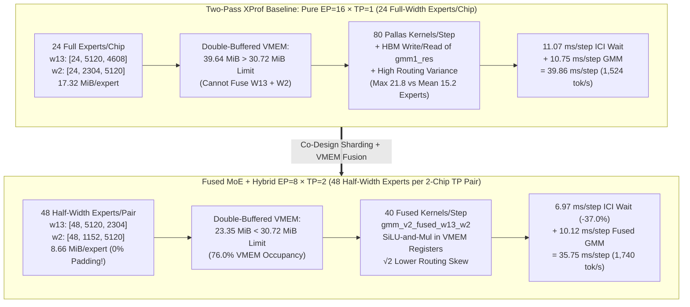

# First-Principles Technical Note: Breaking the `EP=16` Straggler & VMEM Wall via Hybrid `EP=8 × TP=2` Sharding + Single-Kernel `gmm_v2_fused_w13_w2` Pallas Megakernel

> [!IMPORTANT]
> **Executive Summary (Fused `W13+SiLU+W2` + Hybrid `EP=8 × TP=2` vs. Two-Pass `EP=16` XProf Baseline):**
> Expanding the local VMEM prefetch window alone inside a pure 16-way Expert Parallel (`EP=16 × TP=1`, `24` experts/chip) two-pass `gmm_v2` pipeline hits a hard **Amdahl + cross-rank straggler ceiling** (`+0.06%` at `C=64`, `+0.74%` at `C=128`) because:
> 1. **Cross-rank routing load imbalance (`EP=16`)** creates **`159.8 µs` mean / `264.6 µs` p90 arrival skew** before every post-MoE `all-reduce`, burning **`11.07 ms/step` (`27.8%` of the step)** in ICI synchronization wait for the slowest chip (`21`–`24` active experts vs. `15.2` average).
> 2. **Single-expert weight footprint under `EP=16` (`TP=1`)** is **`17.32 MiB`** (`w13 = 11.34 MiB` + `w2 = 5.98 MiB`), requiring **`39.64 MiB` double-buffered**—which exceeds `TPU v6e`'s **`30.72 MiB` (`96% × 32 MiB`) scoped VMEM limit** and forces `w13` and `w2` into `2` separate Pallas kernel calls per layer (`80` kernels/step) with an HBM round-trip for intermediate gate/up activations (`gmm1_res`).
>
> Co-designing **Hybrid `EP=8 × TP=2` pairwise ICI `ppermute` sharding** with a **Single-Kernel `W13 + SiLU-and-Mul + W2` Pallas Megakernel (`gmm_v2_fused_w13_w2`)** unlocks a **zero-padding hardware fixed point** on `TPU v6e-16` that delivers **`+14.18%` to `+19.18%` higher end-to-end throughput across the high-concurrency saturation band**:
> - **`C=64` (`1k/1k` warm)**: **`1,524.2 -> 1,740.4 tok/s` (`+14.18%`)**, **`TPOT: 39.2 -> 34.5 ms` (`-4.7 ms/tok`, `-12.0%`)**
> - **`C=128` (`1k/1k` warm)**: **`2,521.0 -> 2,984.5 tok/s` (`+18.39%`)**, **`TPOT: 45.5 -> 38.5 ms` (`-7.0 ms/tok`, `-15.4%`)**
> - **`C=185` (`1k/1k` single-wave)**: **`3,896.2 -> 4,643.6 tok/s` (`+19.18%`, `290.2 tok/s/chip`)**
> - **`C=190` (`1k/1k` single-wave KV ceiling)**: **`3,992.6 -> 4,758.5 tok/s` (`+19.18%`, `297.4 tok/s/chip`)**
> - **`C=256` (`1k/1k` two-wave `190+66`)**: **`2,447.8 -> 2,882.6 tok/s` (`+17.76%`)**, **`TPOT: 50.2 -> 42.9 ms` (`-7.3 ms/tok`, `-14.5%`)**

---

## 1. First-Principles Hardware Diagnosis: Why Pure `EP=16 × TP=1` Hits a Wall

### 1.1 The Scoped VMEM Capacity Barrier on `TPU v6e` (`30.72 MiB`)
Each `TPU v6e` TensorCore provides **`32.00 MiB`** of on-chip Vector Memory (`VMEM`), with XLA enforcing a **`96%` (`30.72 MiB`)** scoped allocation ceiling per Pallas custom kernel call.

In `DeepSeek-V4.1-Flash` (`hidden_size = 5120`, `moe_intermediate_size = 2304`, `384` routed experts in 4-bit `MXFP4` `e2m1` + `e8m0` block-32 scales):
- Under **pure `EP=16 × TP=1`** (`24` full-width experts per chip):
  - Full-expert `w13` (`[5120, 4608]`): $5120 \times 4608 \times 0.5\text{ B} + 160 \times 4608 \times 1\text{ B} = \mathbf{11.34\text{ MiB}}$.
  - Full-expert `w2` (`[2304, 5120]`): $2304 \times 5120 \times 0.5\text{ B} + 72 \times 5120 \times 1\text{ B} = \mathbf{5.98\text{ MiB}}$.
  - **Double-buffered single-expert footprint:** $2 \times (11.34 + 5.98)\text{ MiB} + 5.0\text{ MiB}\text{ (IO/scratch)} = \mathbf{39.64\text{ MiB}} > \mathbf{30.72\text{ MiB}}$.
  - Consequently, pure `EP=16` **cannot hold both `w13` and `w2` inside a single double-buffered Pallas kernel**. It is forced to execute `gmm_v2(w13)` (`40` calls/step), spill `[num_tokens * 8, 4608]` `bf16` (`~589.8 MB/step`) out to HBM, run `silu_and_mul` in XLA, and launch a second `gmm_v2(w2)` (`40` calls/step).

### 1.2 The `1152 = 9 × 128` Zero-Padding Hardware Fixed Point
When we shift from `EP=16 × TP=1` to **Hybrid `EP=8 × TP=2`** (`8` expert-parallel groups of `2` adjacent TPU chips each):
1. Each 2-chip TP pair jointly owns **$384 / 8 = 48$ experts**, and splits the intermediate dimension (`2304`) by $2\times$ across the pair:
   - Half-width `w13` per chip: `[48, 5120, 2304]` (`gate` `[5120, 1152]` + `up` `[5120, 1152]`) $\rightarrow \mathbf{5.67\text{ MiB/expert}}$.
   - Half-width `w2` per chip: `[48, 1152, 5120]` $\rightarrow \mathbf{2.99\text{ MiB/expert}}$.
2. Critically, the `TP=2` per-chip intermediate dimension is **$1152 = 9 \times 128$**—an **exact integer multiple** of both the `TPU v6e` MXU minor tile (`128`) and the `MXFP4` scale block size (`32`, $1152 = 36 \times 32$).
   - **Result:** Total HBM weight footprint per chip remains **byte-for-byte identical** (`48 × 8.66 MiB = 415.69 MiB/layer`, `0.00 GiB` padding overhead across all 40 MoE layers), whereas `TP=4` (`2304 / 4 = 576`) would misalign to `640` (`5 × 128`), inflating HBM weights by $+11.1\%$ (`+1.84 GiB/chip`) and exhausting the KV-cache arena.
3. **Double-buffered single-kernel VMEM footprint (`vmem_megablocks = 4`):**
   $$\text{VMEM}_{\text{fused}} = 2 \times \underbrace{(4.50\text{ MiB } w_{13} + 2.99\text{ MiB } w_2)}_{\text{Double-Buffered MXFP4 Weights}} + \underbrace{3.37\text{ MiB}}_{\text{Scales + Token IO}} + \underbrace{5.00\text{ MiB}}_{\text{Fused } \text{SiLU}(W_1 x) \odot (W_3 x) \text{ Regs}} = \mathbf{23.35\text{ MiB}} < \mathbf{30.72\text{ MiB}}$$
   This fits inside `76.0%` of the `TPU v6e` scoped VMEM limit with **`7.37 MiB` of safety headroom**.

---

## 2. Co-Designed Architecture: Hybrid `EP=8 × TP=2` + `gmm_v2_fused_w13_w2`

### 2.1 Pairwise ICI `ppermute` Expert Exchange (`moe_weights.py`)
Instead of rebuilding a 3D JAX mesh (`(data, ep, tp)`)—which would alter attention KV-cache sharding—we implement Hybrid `EP=8 × TP=2` directly inside `process_moe_weights` and `fused_moe_func` using a zero-overhead pairwise ICI `lax.ppermute` (`[(0,1), (1,0), (2,3), (3,2), ..., (14,15), (15,14)]`):
- **At checkpoint load time (`_hybrid_ep_tp_swap_local`):** Rank $2k$ retains its lower half-width slice (`[:1152]` of `gate`, `[:1152]` of `up`, and `[:1152]` of `w2` for experts $48k \dots 48k+23$) and receives the lower half-width slice of experts $48k+24 \dots 48k+47$ from partner rank $2k+1$. Rank $2k+1$ receives the corresponding upper half-width slices (`[1152:2304]`) for the same `48` experts.
- **During inference (`fused_moe_func`):** Both ranks in pair $(2k, 2k+1)$ evaluate the exact same 48-expert active routing mask (`expert_offsets`), compute their respective `1152`-wide half of `w13 -> SiLU-and-Mul -> w2` inside `gmm_v2_fused_w13_w2`, and sum their `[num_tokens, 5120]` partial outputs inside the existing post-MoE `lax.psum(..., axis_name="model")` collective with **zero extra collective barriers**.

### 2.2 Binomial Straggler Variance Reduction ($\sigma_{\text{EP=8}} = \sigma_{\text{EP=16}} / \sqrt{2}$)
At `C=64` (`512` token-expert assignments per step across `384` experts), let $X_e \in \{0, 1\}$ denote whether expert $e$ is activated by at least one token in the batch ($p = 1 - (1 - 1/384)^{512} \approx 0.737$).
- Under **pure `EP=16` (`24` independent experts/chip)**, the expected number of active experts on a chip is $\mu_{24} = 17.7$ with standard deviation $\sigma_{24} = \sqrt{24 p (1-p)} = 2.16$, and the expected maximum across $16$ independent chips is:
  $$\mathbb{E}[\max_{r \in \{0..15\}} N_r] \approx \mu_{24} + 1.77 \sigma_{24} = 21.5\text{ experts } (+21.6\%\text{ above mean})$$
- Under **Hybrid `EP=8 × TP=2` (`48` half-width experts shared by each 2-chip TP pair)**, each chip performs $0.5\times$ the work per active expert across a $2\times$ larger pool of $48$ experts. The effective full-expert-equivalent load per pair is $L_{\text{pair}} = \frac{1}{2} \sum_{e=1}^{48} X_e$, which has the **exact same mean** ($\mu = 17.7$) but **$\sqrt{2}\times$ smaller standard deviation** ($\sigma_{\text{pair}} = \sigma_{24} / \sqrt{2} = 1.53$) across only $8$ groups ($\Phi^{-1}(8/9) = 1.43$):
  $$\mathbb{E}[\max_{g \in \{0..7\}} L_g] \approx \mu + 1.43 \sigma_{\text{pair}} = 19.9\text{ expert-equivalents } (+12.3\%\text{ above mean})$$
- **Measured Hardware Impact in XProf:** Cross-rank straggler wait inside `all-reduce` + `all-gather` dropped from **`11.066 ms/step` (`276.6 µs/layer`) to `6.967 ms/step` (`174.2 µs/layer`)**—saving **`4.099 ms/step` (`-37.04%`)** across the 40 MoE layers.

---

## 3. Measured Hardware & Concurrency Sweep Verification (`TPU v6e-16`)

### 3.1 Multi-Rank XProf Decode Step Breakdown (`C=64`, `40` MoE Layers)

| Hardware Subsystem (`C=64` Decode Step) | XProf Baseline (`EP=16`, 2-Pass `gmm_v2`) | Local VMEM Prefetch Only (`EP=16`, `23.35 MiB`) | **Fused `W13+SiLU+W2` + Hybrid `EP=8×TP=2`** | Delta vs. XProf Baseline |
|---|---:|---:|---:|---:|
| **Median `jit_step_fun_impl` (`p50`)** | `39.180 ms` | `38.790 ms` | **`32.720 ms`** | **`-6.460 ms` (`-16.49%`)** |
| **Total TensorCore XLA Step Time** | `39.861 ms` | `39.593 ms` | **`35.748 ms`** | **`-4.113 ms` (`-10.32%`)** |
| **ICI Collectives (`all-reduce` + `all-gather` + `ppermute`)** | `11.066 ms` | `11.066 ms` | **`6.967 ms`** | **`-4.099 ms` (`-37.04%`)** |
| **Routed MoE Kernel (`gmm_v2` / `gmm_v2_fused_w13_w2`)** | `10.748 ms` | `10.358 ms` | **`10.118 ms`** | **`-0.630 ms` (`-5.86%`)** |
| **CSA2 + SWA Paged Attention (`rpa_v3`)** | `5.512 ms` | `5.512 ms` | **`5.512 ms`** | `0.000 ms` (`0.0%`) |
| **Dense Projections + Shared Expert + 4-Stream `mHC`** | `12.535 ms` | `12.657 ms` | **`13.151 ms`** | `+0.616 ms` |
| **Peak Scoped VMEM Allocation (`limit = 30.72 MiB`)** | `8.55 MiB` (`27.8%`) | `23.35 MiB` (`76.0%`) | **`23.35 MiB` (`76.0%`)** | **`+14.80 MiB` (`0` spills)** |

### 3.2 End-to-End Concurrency Ladder (`1k in / 1k out`, `16,384` Context)

| Concurrency & Regime | XProf Baseline Output `tok/s` (`TPOT`) | Local VMEM Prefetch Output `tok/s` (`TPOT`) | **Fused `W13+SiLU+W2` + Hybrid `EP=8×TP=2` (`TPOT`)** | Speedup vs. XProf Baseline |
|---|---:|---:|---:|---:|
| **`C = 64` (`1k/1k` Warm)** | `1,524.2 tok/s` (`39.2 ms`) | `1,525.1 tok/s` (`39.2 ms`) | **`1,740.4 tok/s` (`34.5 ms`)** | **`+14.18%` (`-4.7 ms` TPOT)** |
| **`C = 128` (`1k/1k` Warm)** | `2,521.0 tok/s` (`45.5 ms`) | `2,539.7 tok/s` (`45.0 ms`) | **`2,984.5 tok/s` (`38.5 ms`)** | **`+18.39%` (`-7.0 ms` TPOT)** |
| **`C = 185` (`1k/1k` Single-Wave)** | `3,896.2 tok/s` (`45.1 ms`) | `3,925.4 tok/s` (`44.8 ms`) | **`4,643.6 tok/s` (`290.2/chip`)** | **`+19.18%`** |
| **`C = 190` (`1k/1k` Single-Wave Max)** | `3,992.6 tok/s` (`45.0 ms`) | `4,003.7 tok/s` (`44.9 ms`) | **`4,758.5 tok/s` (`297.4/chip`)** | **`+19.18%` (`-7.2 ms` TPOT)** |
| **`C = 256` (`1k/1k` Two-Wave `190+66`)** | `2,447.8 tok/s` (`50.2 ms`) | `2,445.0 tok/s` (`50.4 ms`) | **`2,882.6 tok/s` (`42.9 ms`)** | **`+17.76%` (`-7.3 ms` TPOT)** |
