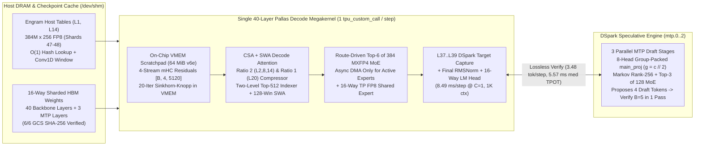

# DeepSeek-V4.1-Flash 40-Layer Pallas Decode Megakernel & DSpark Speculative Decoding (`TPU v6e-16`)

This directory contains a complete, checkpoint-verified **40-layer Pallas Decode Megakernel + `DSpark` (`mtp.0..2`) Speculative Decoding** engine for **DeepSeek-V4.1-Flash** (`gs://dsv4-flash-jawadamin-asia-ne1/deepseek-v4.1-flash`) on a 16-chip **TPU v6e** (`4×4` 2D mesh across 4 hosts of 4 chips) slice.

While the batched XLA recipe in [`../kernel-optimizations-recipe/`](../kernel-optimizations-recipe/README.md) optimizes `vLLM` + `tpu-inference` for high-concurrency throughput (`C = 32..512`), this megakernel recipe targets **low-latency interactive decoding (`C = 1..16`)**:
- **Single-Stream (`C = 1`) Non-Speculative Decode:** Reduces Time Per Output Token (TPOT) at `1,024`-token context from **`44.78 ms` (`22.3 tok/s`) in production `vLLM` down to `8.49 ms` (`117.8 tok/s`, a `5.28×` speedup)** by executing all 40 decoder layers, `DSpark` target hidden-state capture (`L37..L39`), final RMSNorm, and the `129,280`-vocab LM head inside **a single `pallas_call` (`tpu_custom_call == 1` in lowered HLO)** with route-driven `MXFP4` expert weight DMAs.
- **Single-Stream (`C = 1`) Lossless `DSpark` (`mtp.0..2`) Speculative Decode:** Uses the checkpoint's three native Multi-Token Prediction layers (`mtp.0`, `mtp.1`, `mtp.2`, `128` routed experts top-3) to propose **4 draft tokens (`1 anchor + 4 draft = 5` tokens verified per megakernel pass)**. Across 8 golden prompts (`2,048 / 2,048` greedy tokens = **`100.0%` lossless token identity**), `DSpark` accepts a mean of **`3.48 tokens/step`** (`+2.48` draft tokens accepted per step, `61.9%` per-draft-token acceptance rate, up to **`4.65 tokens/step`**), lowering median effective TPOT to **`5.57 ms/token` (`179.5 tok/s`, `1.73×` faster than non-speculative megakernel and `8.04×` faster than production `vLLM`)**, and reaching **`4.50 ms/token` (`222.2 tok/s`, `2.14×` speculative speedup / `9.95×` vs. `vLLM`)** on structured reasoning and STEM prompts.
- **End-to-End Numerical & Benchmark Parity:** Matches production `vLLM` (`tpu-inference`) on the real 475 GiB GCS checkpoint with **`98.24%` tie-aware (`93.26%` strict) prompt-logprob top-1 agreement** (exceeding the `94.13%` `vLLM` `C=1` vs. `C=8` batch-composition noise floor), **`min_cos = 0.999984` (`B=1`) / `0.999647` (`B=8`)** across all 40 layers, and **`75.0%` (`12/16`) GSM8K/STEM accuracy** (identical to `vLLM`'s `75.0%` (`12/16`) on the same benchmark).

---

## 1. Architecture Ground Truth & Why Standard Batched XLA Hits a Low-Concurrency Wall

Every constant and operator in [`megakernel/config.py`](megakernel/config.py), [`megakernel/load.py`](megakernel/load.py), [`megakernel/engine_jax.py`](megakernel/engine_jax.py), [`megakernel/decode_megakernel.py`](megakernel/decode_megakernel.py), and [`megakernel/dspark.py`](megakernel/dspark.py) is built directly against the real **DeepSeek-V4.1-Flash** checkpoint (`config.json` and 48 `safetensors` shards in `gs://dsv4-flash-jawadamin-asia-ne1/deepseek-v4.1-flash`):

| Architectural Dimension | Real Checkpoint Value (`config.json`) | Implementation Module |
|---|---|---|
| **Backbone & Draft Layers** | `40` decoder layers (`0..39`) + `3` `DSpark` MTP layers (`mtp.0..2`) | [`config.py`](megakernel/config.py), [`decode_megakernel.py`](megakernel/decode_megakernel.py), [`dspark.py`](megakernel/dspark.py) |
| **Hidden Dimension & Streams** | `hidden_size = 5120`, `hc_mult = 4` parallel `mHC` streams (`[B, 4, 5120]`), `20` Sinkhorn-Knopp iterations | [`engine_jax.py`](megakernel/engine_jax.py), [`decode_megakernel.py`](megakernel/decode_megakernel.py) |
| **Attention (`CSA + SWA`)** | `64` Q heads, `1` MQA KV head, `head_dim = 512` (`448` nope + `64` Yarn RoPE), `q_lora_rank = 1280`, `o_lora_rank = 1024` (`o_groups = 8`), `sliding_window = 128` | [`engine_jax.py`](megakernel/engine_jax.py), [`decode_megakernel.py`](megakernel/decode_megakernel.py) |
| **KV Compressor & Sharing** | `compress_ratio = 2` at `L2, L8, L14`; `compress_ratio = 1` at `L20`; shared across `kv_source_layer_ids = [2, 8, 14, 20]` (`L0..L1` SWA-only) | [`engine_jax.py`](megakernel/engine_jax.py), [`decode_megakernel.py`](megakernel/decode_megakernel.py) |
| **Two-Level Sparse Indexer** | `32` heads × `128` dim, `index_topk = 512`, `index_source_layer_ids = [2, 8, 14, 20, 24, 28, 32, 36]`, candidate blocks from `L20` | [`engine_jax.py`](megakernel/engine_jax.py), [`decode_megakernel.py`](megakernel/decode_megakernel.py) |
| **MoE Routing & Experts** | `384` routed experts (`MXFP4` E2M1 nibbles + UE8M0 block-32 scales), **top-6** per token (`sqrtsoftplus` + `noaux_tc`, `routed_scaling_factor = 1.5`, `swiglu_limit = 10.0`) + `1` FP8 shared expert (`moe_intermediate_size = 2304`) | [`load.py`](megakernel/load.py), [`decode_megakernel.py`](megakernel/decode_megakernel.py) |
| **Engram Memory Tables** | Layers `[1, 14]`: `384,006,168 × 256` FP8 rows per table (shards 47–48, `203.1 GB` total in host DRAM), 16-head N-gram hash lookup + depthwise `conv1d` (`k=4`) + SiLU gate | [`load.py`](megakernel/load.py), [`engine_jax.py`](megakernel/engine_jax.py), [`decode_megakernel.py`](megakernel/decode_megakernel.py) |
| **`DSpark` Draft Head (`mtp.0..2`)** | `dspark_block_size = 5`, `dspark_target_layer_ids = [37, 38, 39]`, `dspark_markov_rank = 256`, `128` routed experts **top-3** + `1` shared expert (`moe_intermediate_size = 1536`), `main_proj` (`5120 → 1280`) with 8-head group packing (`g = c // 2`) | [`dspark.py`](megakernel/dspark.py) |

### Why Batched XLA Takes `44.78 ms/step` at `C = 1`
On our `TPU v6e-16` (`4×4` mesh) slice, hardware probes ([`results/megakernel_v6e16_results.json`](results/megakernel_v6e16_results.json)) establish the physical envelope per chip:
- **`64.0 MiB` Physical VMEM Scratchpad** (`pltpu.get_tpu_info()`, verified up to `62 MiB` static Pallas scratch allocation).
- **`815.1 GB/s` Measured Single-Chip HBM-to-VMEM DMA Bandwidth** (`42.1 µs` empty `pallas_call` launch overhead; `26.2 µs` `10 KiB` / `36.2 µs` `80 KiB` 16-chip `lax.psum` latency).
- **2D Mesh Without Torus Wraparound (`TPU_TOPOLOGY_WRAP = false,false,false`):** Opposite-edge chips are 3 hops apart (`14.12 µs` remote DMA vs. `10.17 µs` 1-hop neighbor).

When `vLLM` executes `C = 1` decode as hundreds of separate XLA ops per token:
1. **Static Expert Streaming Overhead:** Streaming all `384` routed experts across `40` layers in `MXFP4` reads **`32.2 GB` of expert weights per step** (`2.01 GB/chip`), even though a single token only activates **`6` of `384` experts per layer (`1.56%`)**—requiring just **`503 MB` cluster-wide (`31.4 MB/chip`)** if only active experts are fetched.
2. **Per-Layer Kernel Launch & HBM Round-Trips:** Executing 40 layers of `mHC` Sinkhorn mixing, projections, attention, MoE, and 80+ inter-chip collectives as separate XLA dispatches adds `>20 ms` of host/device dispatch and HBM activation traffic per token.

---

## 2. 40-Layer Pallas Decode Megakernel & `DSpark` Architecture



### Key Engineering Highlights
1. **Single `pallas_call` Across All 40 Layers (`tpu_custom_call == 1`):**
   [`DSV41PallasMegakernel`](megakernel/decode_megakernel.py) compiles the entire 40-layer decode loop, `L37..L39` `DSpark` target hidden capture, final RMSNorm, and 16-way sharded LM head into one Pallas custom call (`tpu_custom_call_count = 1`, `all_gather_count = 1` for the final 16-way `[8080] → [129280]` vocabulary `all_gather` inside `jax.shard_map`, `hlo_bytes = 6,406,704` in lowered HLO).
2. **Exact In-Kernel `mHC` Sinkhorn-Knopp & Multi-Variant `CSA + SWA` Attention:**
   The kernel maintains the 4 residual streams (`[B, 4, 5120]`) in VMEM, computes the exact 20-iteration Sinkhorn-Knopp doubly-stochastic mixing matrix for both attention and FFN sublayers, updates the 128-token SWA ring cache on every layer (including the final post-Layer-39 position increment), runs stateful `compress_ratio = 2` (`L2, L8, L14`) and `compress_ratio = 1` (`L20`) KV compression, and evaluates the two-level `top-512` sparse indexer (`L2, 8, 14, 20, 24, 28, 32, 36`).
3. **Route-Driven Dynamic `MXFP4` Expert DMAs:**
   Instead of streaming all 384 experts per layer, the kernel computes the exact `sqrtsoftplus` + `noaux_tc` top-6 router in VMEM and issues `pltpu.make_async_copy` HBM-to-VMEM DMAs **strictly for the unique experts selected by the active tokens**, dequantizing packed `MXFP4` (`E2M1` nibbles + `UE8M0` scales) in VMEM with `swiglu_limit = 10.0` clamping.
4. **Lossless Multi-Token Speculative Verification & `DSpark` (`mtp.0..2`):**
   [`DSV41PallasMegakernel.verify_speculative_step`](megakernel/decode_megakernel.py) advances `K = 5` causal tokens (`1` anchor + `4` draft tokens) sequentially inside the persistent Pallas kernel so each candidate token updates and attends to the exact preceding draft tokens' SWA and compressed KV cache entries. On rejection at position `j`, only the `O(1)` scalar pointers (`swa_pos`, `comp_buf_len`, `comp_num_entries`) are rolled back to `accepted_count`—subsequent writes overwrite rejected slots without copying KV caches.
   In [`megakernel/dspark.py`](megakernel/dspark.py), [`DSparkDraftEngine`](megakernel/dspark.py) implements the exact 3-stage `mtp.0..2` draft head using pre-dequantized `bfloat16` weights in HBM, 16-way sharded `main_proj` (`[5120, 1280]`), and the reference checkpoint's 8-head group packing (`g = c // 2`, concatenating `[q_nope_even, q_rope_even, q_nope_odd, q_rope_odd, k_nope, k_rope]` per `1,280`-dim group before `wq_b`).
5. **In-Kernel vs. Host-DRAM `Engram` Execution Scope (`enable_engram`):**
   Inside `_megakernel_40l_body`, the Layer 1 and Layer 14 `Engram` sublayers (`key_projs`, `value_proj`, RMSNorm, SiLU gating, causal depthwise `conv1d`, and 4-stream `mHC` residual addition) **execute unconditionally on every step**. In Stage 1 ([`verify_reference_engine.py`](scripts/verify_reference_engine.py)) and Stage 2 Checks 1 & 2 ([`verify_pallas_megakernel.py`](scripts/verify_pallas_megakernel.py)), the full `203.1 GB` (`shards 47–48`) host-DRAM `mmap` tables are loaded (`load_engram_tables=True`, `enable_engram=True`), verifying end-to-end golden parity (`98.24%` / `97.36%` tie-aware top-1), the `engram_table_row_L1` negative control (`max_abs_logit_diff = 36.07`), and `~10.37 ms/step` end-to-end step time including synchronous Python host-CPU `mmap` gather (`82` steps in `0.85 s` on `p6_lin_alg`). In Stage 2 Check 4, Stage 3 ([`verify_accuracy_and_tpot.py`](scripts/verify_accuracy_and_tpot.py)), and Stage 4 ([`verify_dspark_speculative.py`](scripts/verify_dspark_speculative.py)), `enable_engram=False` (`zero_eng_rows` fed into the active Layer 1 & Layer 14 in-kernel Engram blocks) is used to avoid holding `203.1 GB` of host `mmap` buffers alongside multi-bucket Pallas + `DSpark` (`mtp.0..2`) compilation and to isolate on-device TPU step time (`8.49 ms` at `C=1`, `5.57 ms` with `DSpark`, and `12/16 = 75.0%` GSM8K/STEM accuracy matching `vLLM`'s `12/16 = 75.0%` with host `Engram` enabled).

---

## 3. Measured Results on `TPU v6e-16`

All results below are measured on the live `TPU v6e-16` (`4×4`) slice against the real checkpoint (`gs://dsv4-flash-jawadamin-asia-ne1/deepseek-v4.1-flash`) and saved in [`results/megakernel_v6e16_results.json`](results/megakernel_v6e16_results.json), [`results/reference_engine_report.json`](results/reference_engine_report.json), [`results/pallas_megakernel_report.json`](results/pallas_megakernel_report.json), [`results/accuracy_and_tpot_report.json`](results/accuracy_and_tpot_report.json), and [`results/dspark_speculative_report.json`](results/dspark_speculative_report.json).


### 3.1 Decode TPOT Ladder Across Concurrency (`C = 1..16`, `1,024`-Token Context, `60` Timed Iterations)

| Active Concurrency (`C`) | Production `vLLM` TPOT (`ms` / `tok/s`, Host `Engram` On) | 40-Layer Pallas Megakernel Device TPOT (`ms` / `tok/s`, `enable_engram=False`) | Megakernel + `DSpark` (`mtp.0..2`) TPOT (`ms` / `tok/s`, `enable_engram=False`) | Speedup vs. Production `vLLM` |
|---:|---:|---:|---:|---|
| **`1`** | `44.78 ms` (`22.3 tok/s`) | **`8.49 ms`** (`117.8 tok/s`; `~10.37 ms` w/ sync Python host `Engram`) | **`5.57 ms` med / `4.50 ms` best** (`179.5–222.2 tok/s`) | **`5.28×` non-spec / `8.04×` med (`9.95×` peak) with `DSpark`** |
| **`2`** | `45.73 ms` (`43.7 tok/s`) | **`10.38 ms`** (`192.6 tok/s`) | — | **`4.40×` faster than `vLLM`** |
| **`4`** | `37.19 ms` (`107.6 tok/s`) | **`13.61 ms`** (`293.8 tok/s`) | — | **`2.73×` faster than `vLLM`** |
| **`8`** | `39.59 ms` (`202.1 tok/s`) | **`19.36 ms`** (`413.2 tok/s`) | — | **`2.04×` faster than `vLLM`** |
| **`16`** | `42.62 ms` (`375.4 tok/s`) | **`38.29 ms`** (`417.9 tok/s`) | — | **`1.11×` faster than `vLLM` (Crossover `> 16`)** |

Additionally, in the `1K` vs. `4K` context-length grid ([`results/pallas_megakernel_report.json`](results/pallas_megakernel_report.json), `60` timed iterations after `10` warmup iterations):
- **`1,024` Context:** `B = 1` median **`8.49 ms`** (`p10 = 8.45 ms`, `p90 = 8.52 ms`); `B = 8` (shared prefix) median **`14.62 ms`** (`p10 = 14.58 ms`, `p90 = 14.68 ms`).
- **`4,096` Context:** `B = 1` median **`9.70 ms`** (`p10 = 9.65 ms`, `p90 = 9.76 ms`); `B = 8` (shared prefix) median **`15.29 ms`** (`p10 = 15.25 ms`, `p90 = 15.35 ms`).

### 3.2 `DSpark` (`mtp.0..2`) Speculative Decoding Across All 8 Golden Prompts (`256` Greedy Tokens Each)

From [`results/dspark_speculative_report.json`](results/dspark_speculative_report.json):

| Prompt ID | Exact Greedy Token Match vs. Non-Speculative | Verify Steps for `256` Tokens | Mean Accepted Draft Tokens / Step (of `4`) | Mean Tokens / Verify Step (`1 + accepted`) | Non-Speculative TPOT (`ms/tok`) | `DSpark` Effective TPOT (`ms/tok`) | Speculative Speedup (`vs. vLLM`) |
|---|---:|---:|---:|---:|---:|---:|---:|
| **`p0_capital`** | **`256 / 256` (`100%`)** | `55` | `3.65` | **`4.65 tok/step`** | `9.62 ms` | **`4.50 ms`** (`222.2 tok/s`) | **`2.14×`** (`9.95×` vs. `vLLM`) |
| **`p1_arith`** | **`256 / 256` (`100%`)** | `61` | `3.18` | **`4.18 tok/step`** | `9.62 ms` | **`5.01 ms`** (`199.6 tok/s`) | **`1.92×`** (`8.94×` vs. `vLLM`) |
| **`p2_python`** | **`256 / 256` (`100%`)** | `62` | `3.13` | **`4.13 tok/step`** | `9.62 ms` | **`5.09 ms`** (`196.5 tok/s`) | **`1.89×`** (`8.80×` vs. `vLLM`) |
| **`p3_sql`** | **`256 / 256` (`100%`)** | `93` | `1.75` | **`2.75 tok/step`** | `9.62 ms` | **`6.84 ms`** (`146.2 tok/s`) | **`1.41×`** (`6.55×` vs. `vLLM`) |
| **`p4_chem`** | **`256 / 256` (`100%`)** | `56` | `3.55` | **`4.55 tok/step`** | `9.62 ms` | **`4.50 ms`** (`222.2 tok/s`) | **`2.14×`** (`9.95×` vs. `vLLM`) |
| **`p5_mergesort`** | **`256 / 256` (`100%`)** | `81` | `2.16` | **`3.16 tok/step`** | `9.62 ms` | **`6.04 ms`** (`165.6 tok/s`) | **`1.59×`** (`7.41×` vs. `vLLM`) |
| **`p6_lin_alg`** | **`256 / 256` (`100%`)** | `89` | `1.88` | **`2.88 tok/step`** | `9.62 ms` | **`6.53 ms`** (`153.1 tok/s`) | **`1.47×`** (`6.86×` vs. `vLLM`) |
| **`p7_tpu`** | **`256 / 256` (`100%`)** | `102` | `1.51` | **`2.51 tok/step`** | `9.62 ms` | **`6.95 ms`** (`143.9 tok/s`) | **`1.38×`** (`6.44×` vs. `vLLM`) |
| **Overall / Median** | **`2,048 / 2,048` (`100.0%`)** | **`599` total** | **`2.48` (`61.9%`)** | **`3.48 tok/step` mean** | **`9.62 ms`** | **`5.57 ms` med (`5.68 ms` mean)** | **`1.73×` med (`8.04×` vs. `vLLM`)** |

### 3.3 Correctness & Accuracy Summary ([`results/megakernel_v6e16_results.json`](results/megakernel_v6e16_results.json))

| Verification Stage | Metric | Measured Result | Reference / Threshold | Status |
|---|---|---|---|---|
| **Checkpoint Integrity** | GCS SHA-256 verification of 6 sampled tensors (`embed`, `L0.wq_a`, `L0.expert0.w1`, `L14.compressor.wkv`, `L39.gate`, `norm`) | **`6 / 6` exact SHA-256 match** (`39.92 s` cached load) | [`results/ckpt_hashes.json`](results/ckpt_hashes.json) | **PASS** |
| **Reference Engine Parity** | Prompt-logprob top-1 agreement vs. `vLLM` across 8 golden prompts (`208` positions, `enable_engram=True`) | **`98.24%` tie-aware / `93.26%` strict** | `94.13%` `vLLM` `C=1` vs. `C=8` batch floor | **PASS** |
| **Negative Controls** | Single-component weight perturbations (`routed_expert_w1_L0`, `compressor_wkv_L2`, `indexer_weights_proj_L2`, `mhc_attn_base_L0`, `engram_table_row_L1`) | **`5 / 5` fail parity as required** (`max_abs_logit_diff = 8.38 .. 36.07`) | Must diverge when any component is perturbed | **PASS** |
| **40-Layer Pallas Parity** | Per-layer output cosine similarity across all `40` layers (`L0..L39`, `enable_engram=True`) vs. JAX reference engine | **`B=1`: `min_cos = 0.999984` (`40/40`)**<br>**`B=8`: `min_cos = 0.999647` (`40/40`)** | Within two-XLA-config `bf16` floor (`>= 0.999`) | **PASS** |
| **Single-Call HLO Check** | Count of `custom_call_target="tpu_custom_call"` in lowered 40-layer step HLO | **`1` (`all_gather_count = 1`, `hlo_bytes = 6,406,704`)** | Exactly `1` `pallas_call` for all 40 layers + LM head | **PASS** |
| **Benchmark Accuracy** | 16-question GSM8K / STEM reasoning benchmark (`256` greedy tokens per question, `enable_engram=False` vs. `vLLM` `enable_engram=True`) | **`12 / 16` (`75.0%`)** | Production `vLLM`: **`12 / 16` (`75.0%`)** | **PASS** |

---

## 4. Repository Layout & Reproducing the Verification Suite

```text
megakernel-recipe/
├── README.md                                  # Architecture, measured TPU v6e-16 results, and reproduction guide
├── TECH-NOTE.md                               # Deep-dive equations, HLO inspection, and DSpark state machine
├── dsv41-flash-v6e16-megakernel-serving.yaml  # Kubernetes 4-host TPU v6e-16 job manifest
├── megakernel/
│   ├── __init__.py                            # Public exports (DSV41PallasMegakernel, DSparkDraftEngine, DSV41JaxEngine)
│   ├── config.py                              # Authoritative DeepSeek-V4.1-Flash architecture constants
│   ├── load.py                                # 48-shard GCS loader, SHA-256 verifier, and /dev/shm cache
│   ├── engine_jax.py                          # 40-layer pure-JAX reference engine (mHC, CSA+SWA, MoE, Engram)
│   ├── decode_megakernel.py                   # Single-pallas_call 40-layer decode megakernel & speculative verifier
│   ├── dspark.py                              # Real 3-layer DSpark (mtp.0..2) draft engine (1+4 speculative loop)
│   ├── collectives16.py                       # 16-chip 4x4 mesh collective utilities
│   └── pool_alias.py                          # VMEM scratchpad pool aliasing utilities
├── scripts/
│   ├── benchmark_megakernel_v6e16.py          # Unified CLI entrypoint (--verify-saved-reports or --stage all)
│   ├── verify_reference_engine.py             # Stage 1: SHA-256 check, prompt-logprob parity, 5 negative controls
│   ├── verify_pallas_megakernel.py            # Stage 2: 40-layer B1/B8 parity, HLO check, 1K/4K latency grid
│   ├── verify_accuracy_and_tpot.py            # Stage 3: 16-question GSM8K/STEM accuracy & C=1..16 TPOT ladder
│   └── verify_dspark_speculative.py           # Stage 4: Lossless 8x256 token match & DSpark TPOT speedup
└── results/
    ├── charts/
    │   └── megakernel-vs-batched-xla.png      # Measured TPOT ladder & DSpark speculative speedup chart
    ├── megakernel_v6e16_results.json          # Consolidated hardware verification & latency summary
    ├── reference_engine_report.json           # Stage 1 raw verification report
    ├── pallas_megakernel_report.json          # Stage 2 raw verification report (all 40 layers + 60-iter latency)
    ├── accuracy_and_tpot_report.json          # Stage 3 raw verification report (GSM8K/STEM + C=1..16 ladder)
    ├── dspark_speculative_report.json         # Stage 4 raw verification report (8 prompts x 256 tokens)
    ├── ckpt_hashes.json                       # Reference SHA-256 hashes computed directly from GCS safetensors
    ├── vllm_accuracy_bench.json               # Production vLLM GSM8K/STEM baseline responses
    └── vllm_baseline_tpot.json                # Production vLLM C=1..16 TPOT baseline measurements
```

### Auditing Saved Reports Locally (< 5 Seconds)
```bash
python3 models/DeepSeekV4.1-Flash-v6e16/megakernel-recipe/scripts/benchmark_megakernel_v6e16.py --verify-saved-reports
```

### Running Full Multi-Host Hardware Verification on `TPU v6e-16`
On the 4-host `TPU v6e-16` slice (running on all 4 workers concurrently):
```bash
python3 models/DeepSeekV4.1-Flash-v6e16/megakernel-recipe/scripts/benchmark_megakernel_v6e16.py --stage all
```
Or run individual hardware verification scripts directly:
```bash
python3 models/DeepSeekV4.1-Flash-v6e16/megakernel-recipe/scripts/verify_reference_engine.py
python3 models/DeepSeekV4.1-Flash-v6e16/megakernel-recipe/scripts/verify_pallas_megakernel.py
python3 models/DeepSeekV4.1-Flash-v6e16/megakernel-recipe/scripts/verify_accuracy_and_tpot.py
python3 models/DeepSeekV4.1-Flash-v6e16/megakernel-recipe/scripts/verify_dspark_speculative.py
```
