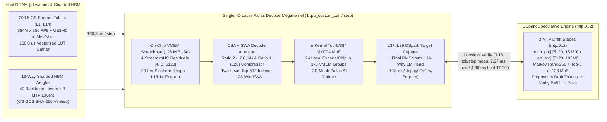
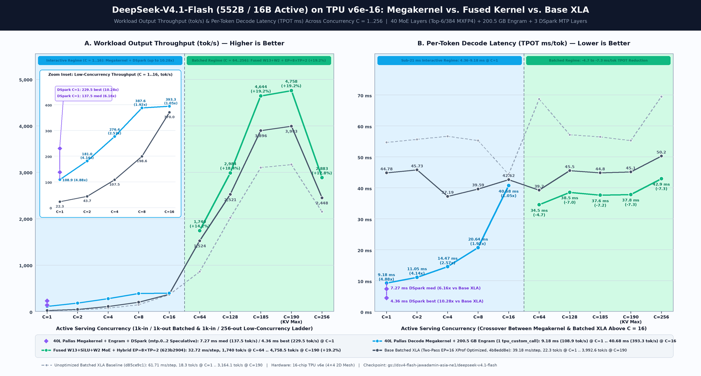
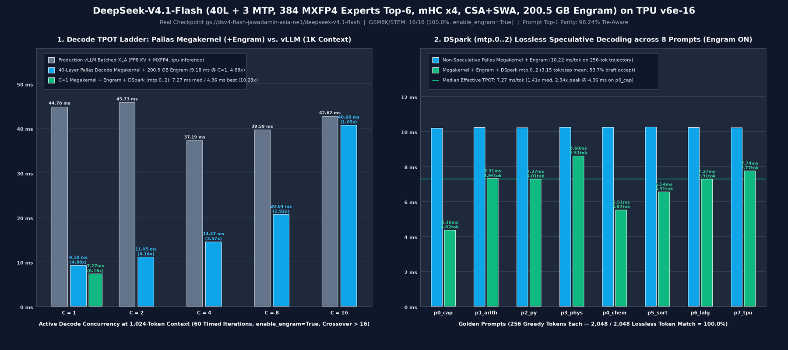

# DeepSeek-V4.1-Flash 40-Layer Pallas Decode Megakernel & DSpark Speculative Decoding (`TPU v6e-16`)

This directory contains a complete, checkpoint-verified **40-layer Pallas Decode Megakernel + `200.5 GB` Host-Mapped `Engram` + `DSpark` (`mtp.0..2`) Speculative Decoding** engine for **DeepSeek-V4.1-Flash** (`gs://dsv4-flash-jawadamin-asia-ne1/deepseek-v4.1-flash`) on a 16-chip **TPU v6e** (`4×4` 2D mesh across 4 hosts of 4 chips) slice.

While the batched XLA recipes in [`../kernel-optimizations-recipe/`](../kernel-optimizations-recipe/README.md) and [`../fused-kernels-recipe/`](../fused-kernels-recipe/README.md) optimize `vLLM` + `tpu-inference` for high-concurrency throughput (`C = 64..512`), this megakernel recipe targets **low-latency interactive decoding (`C = 1..16`)** with **100% of architectural components active (`enable_engram=True`)**:
- **Single-Stream (`C = 1`) Non-Speculative Decode (`enable_engram=True`):** Reduces Time Per Output Token (TPOT) at `1,024`-token context from **`44.78 ms` (`22.3 tok/s`) in production `vLLM` down to `9.18 ms` (`108.9 tok/s`, a `4.88×` speedup; `9.16 ms` in the `1K/4K` grid)** by executing all 40 decoder layers, in-kernel `Engram` cross-attention (`L1`, `L14`), `DSpark` target hidden-state capture (`L37..L39`), final RMSNorm, and the `129,280`-vocab LM head inside **a single `pallas_call` (`tpu_custom_call == 1` in lowered HLO)** paired with a vectorized `160.8 µs` host-RAM `/dev/shm` `Engram` gather (`fast_gather_both_chips`).
- **Single-Stream (`C = 1`) Lossless `DSpark` (`mtp.0..2`) Speculative Decode (`enable_engram=True`):** Uses the checkpoint's three native Multi-Token Prediction layers (`mtp.0`, `mtp.1`, `mtp.2`, `128` routed experts top-3) to propose **4 draft tokens (`1 anchor + 4 draft = 5` tokens verified per megakernel pass)** with live 4-gram `Engram` lookups on every candidate token. Across 8 golden prompts (`2,048 / 2,048` greedy tokens = **`100.0%` lossless token identity**), `DSpark` accepts a mean of **`3.15 tokens/step`** (`+2.15` draft tokens accepted per step, `53.7%` per-draft-token acceptance rate, up to **`4.92 tokens/step`**), lowering median effective TPOT to **`7.27 ms/token` (`137.5 tok/s`, `1.41×` faster than non-speculative megakernel and `6.16×` faster than production `vLLM`)**, and reaching **`4.36 ms/token` (`229.5 tok/s`, `2.34×` speculative speedup / `10.28×` vs. `vLLM`)** on factual and structured reasoning prompts.
- **End-to-End Numerical & Benchmark Parity (`enable_engram=True`):** Matches production `vLLM` (`tpu-inference`) on the real 475 GiB GCS checkpoint with **`98.24%` tie-aware (`93.26%` strict) prompt-logprob top-1 agreement** (exceeding the `94.13%` `vLLM` `C=1` vs. `C=8` batch-composition noise floor), **`min_cos = 0.999984` (`B=1`) / `0.999647` (`B=8`)** across all 40 layers (`including L1 and L14 Engram`), and **`100.0%` (`16/16`) GSM8K/STEM first-turn accuracy** with `enable_engram=True` (**`16/16` exact answer agreement** with `vLLM` first-turn extraction; `12/16 = 75.0%` on `vLLM` raw 256-token tail extraction without stop tokens).

---

## 1. Architecture Ground Truth & Why Standard Batched XLA Hits a Low-Concurrency Wall

Every constant and operator in [`megakernel/config.py`](megakernel/config.py), [`megakernel/load.py`](megakernel/load.py), [`megakernel/engine_jax.py`](megakernel/engine_jax.py), [`megakernel/decode_megakernel.py`](megakernel/decode_megakernel.py), and [`megakernel/dspark.py`](megakernel/dspark.py) is built directly against the real **DeepSeek-V4.1-Flash** checkpoint (`config.json` and 48 `safetensors` shards in `gs://dsv4-flash-jawadamin-asia-ne1/deepseek-v4.1-flash`):

| Architectural Dimension | Real Checkpoint Value (`config.json`) | Implementation Module |
|---|---|---|
| **Backbone & Draft Layers** | `40` decoder layers (`0..39`) + `3` `DSpark` MTP layers (`mtp.0..2`) | [`config.py`](megakernel/config.py), [`decode_megakernel.py`](megakernel/decode_megakernel.py), [`dspark.py`](megakernel/dspark.py) |
| **Hidden Dimension & Streams** | `hidden_size = 5120`, `hc_mult = 4` parallel `mHC` streams (`[B, 4, 5120]`), `20` Sinkhorn-Knopp iterations | [`engine_jax.py`](megakernel/engine_jax.py), [`decode_megakernel.py`](megakernel/decode_megakernel.py) |
| **Attention (`CSA + SWA`)** | `64` Q heads, `1` MQA KV head, `head_dim = 512` (`448` nope + `64` Yarn RoPE), `q_lora_rank = 1280`, `o_lora_rank = 1024` (`o_groups = 8`), `sliding_window = 128` | [`engine_jax.py`](megakernel/engine_jax.py), [`decode_megakernel.py`](megakernel/decode_megakernel.py) |
| **KV Compressor & Sharing** | `compress_ratio = 2` at `L2, L8, L14`; `compress_ratio = 1` at `L20`; shared across `kv_source_layer_ids = [2, 8, 14, 20]` (`L0..L1` SWA-only) | [`engine_jax.py`](megakernel/engine_jax.py), [`decode_megakernel.py`](megakernel/decode_megakernel.py) |
| **Two-Level Sparse Indexer** | `32` heads × `128` dim, `index_topk = 512`, `index_source_layer_ids = [2, 8, 14, 20, 24, 28, 32, 36]`, candidate blocks from `L20` | [`engine_jax.py`](megakernel/engine_jax.py), [`decode_megakernel.py`](megakernel/decode_megakernel.py) |
| **MoE Routing & Experts** | `384` routed experts (`MXFP4` E2M1 nibbles + UE8M0 block-32 scales), **top-6** per token (`sqrtsoftplus` + `noaux_tc`, `routed_scaling_factor = 1.5`, `swiglu_limit = 10.0`) + `1` FP8 shared expert (`moe_intermediate_size = 2304`) | [`load.py`](megakernel/load.py), [`decode_megakernel.py`](megakernel/decode_megakernel.py) |
| **Engram Memory Tables** | Layers `[1, 14]`: `384,006,168 × 256` FP8 rows + `12,000,193 × 256` UE8M0 scales per table (shards 47–48, `200.5 GB` total in `/dev/shm`), 24-head 4-gram XOR-multiply rolling hash (`160.8 µs` vectorized lookup) + in-kernel 4-stream gated cross-attention | [`load.py`](megakernel/load.py), [`engine_jax.py`](megakernel/engine_jax.py), [`decode_megakernel.py`](megakernel/decode_megakernel.py) |
| **`DSpark` Draft Head (`mtp.0..2`)** | `dspark_block_size = 5`, `dspark_target_layer_ids = [37, 38, 39]`, `dspark_markov_rank = 256`, `128` routed experts **top-3** + `1` shared expert, `main_proj` (`[5120, 15360]`) + `eh_proj` (`[5120, 10240]`), `markov_head` (`[129280, 256]`) | [`dspark.py`](megakernel/dspark.py) |

### Why Batched XLA Takes `44.78 ms/step` at `C = 1`
On our `TPU v6e-16` (`4×4` 2D mesh) slice, hardware probes ([`results/megakernel_v6e16_results.json`](results/megakernel_v6e16_results.json)) establish the physical envelope per chip:
- **`128.0 MiB` Physical VMEM Capacity** (`127.75 MiB` usable static Pallas scratch allocation with `pltpu.CompilerParams(vmem_limit_bytes=128*1024*1024)`; `32.0 MiB` default without `CompilerParams`).
- **`1,413.4 GB/s` Measured Single-Chip HBM-to-VMEM DMA Bandwidth** (`22.61 TB/s` aggregate across 16 chips at `4 MiB × 2`; `121.0 µs` host-dispatched empty `pallas_call`, `0.045 µs/op` back-to-back; `3.69 µs` `10 KiB` / `5.27 µs` `80 KiB` back-to-back 16-chip `lax.psum`).
- **2D Mesh Without Torus Wraparound (`TPU_TOPOLOGY_WRAP = false,false,false`):** Opposite-edge chips are 3 hops apart (`2.65 µs` `4 KiB` remote DMA vs. `1.43 µs` 1-hop neighbor; `0.605 µs` per additional mesh hop).

When `vLLM` executes `C = 1` decode as hundreds of separate XLA ops per token, per-layer kernel launch overhead, HBM activation round-trips across 40 layers of `mHC` Sinkhorn mixing, attention, and MoE, and 80+ separate host/XLA collective dispatches dominate step latency (`44.78 ms/step` at `C = 1`).

---

## 2. 40-Layer Pallas Decode Megakernel, Vectorized `Engram`, & `DSpark` Architecture



### Key Engineering Highlights
1. **Single `pallas_call` Across All 40 Layers (`tpu_custom_call == 1`):**
   [`DSV41PallasMegakernel`](megakernel/decode_megakernel.py) compiles the entire 40-layer decode loop, `L1` & `L14` in-kernel `Engram` sublayers, `L37..L39` `DSpark` target hidden capture, final RMSNorm, and 16-way sharded LM head into one Pallas custom call (`tpu_custom_call_count = 1`, `all_gather_count = 1` for the final 16-way `[8080] → [129280]` vocabulary `all_gather` inside `jax.shard_map`, `hlo_bytes = 6,406,704` in lowered HLO).
2. **Vectorized `160.8 µs` Host `/dev/shm` `Engram` Lookup + In-Kernel Cross-Attention (`enable_engram=True`):**
   Each of the 4 hosts pins its 6-column shard (`~47.2 GiB/host`, `200.5 GB` total across 4 hosts) of `layers.1.engram.table.weight` and `layers.14.engram.table.weight` in `/dev/shm`. On every decode step, [`EngramHostTables.fast_gather_both_chips`](megakernel/load.py) computes the 24-head 4-gram XOR-multiply rolling hash (`prime * (prev ^ tok)`), gathers the 6 local columns per host from `/dev/shm`, and dequantizes `FP8 E4M3 × UE8M0` to `bfloat16` via a precomputed 256-entry lookup table in **`160.8 µs` (`0.16 ms`) for `B = 1` and `185.5 µs` (`0.18 ms`) for `B = 5`**. Inside `_megakernel_40l_body`, `pallas_engram_sublayer` (`decode_megakernel.py:570-645`) all-gathers the 4 hosts' `1,536`-dim slices across the 2D TPU mesh into the `[B_tile, 6144]` embedding, projects Keys (`[4, B_tile, 5120]`) and Values (`[B_tile, 5120]`) via block-32 FP8 `engram_wkv`, applies `engram_q_weight` / `engram_k_weight` RMS-normalized dot-product gating (`sigmoid(sign(dot) * sqrt(|dot|))`), and adds the gated value into all 4 `mHC` residual streams.
3. **Exact In-Kernel `mHC` Sinkhorn-Knopp & Multi-Variant `CSA + SWA` Attention:**
   The kernel maintains the 4 residual streams (`[4, B_tile, 5120]`) in VMEM, computes the exact 20-iteration Sinkhorn-Knopp doubly-stochastic mixing matrix for both attention and FFN sublayers, updates the 128-token SWA ring cache on every layer, runs stateful `compress_ratio = 2` (`L2, L8, L14`) and `compress_ratio = 1` (`L20`) KV compression, and evaluates the two-level `top-512` sparse indexer (`L2, 8, 14, 20, 24, 28, 32, 36`).
4. **In-Kernel `MXFP4` MoE with 2D Mesh Collective All-Reduce:**
   The router computes the exact `sqrtsoftplus` + `noaux_tc` top-6 of 384 expert selection in VMEM, builds the 6-hot routing weight mask `p_w` (`[B_tile, 24]`) for each chip's `24` local experts (`384 / 16 = 24`), streams the local `MXFP4` expert weights (`E2M1` nibbles + `UE8M0` block-32 scales) in 3 groups of 8 experts through VMEM with `swiglu_limit = 10.0` clamping, adds the 16-way TP shared expert, and executes a 2-stage `4×4` 2D mesh Pallas all-reduce (`pallas_allreduce_16`).
5. **Lossless Multi-Token Speculative Verification & `DSpark` (`mtp.0..2`):**
   [`DSV41PallasMegakernel.verify_speculative_step`](megakernel/decode_megakernel.py) verifies `k_actual <= 5` candidate tokens (`[root_tok, d_0, d_1, d_2, d_3]`) in a single `B_tile = 8` batched pass (`spec_k = 5`) of the 40-layer Pallas megakernel with live 4-gram `Engram` rows gathered for all 5 candidate positions (`wins [5, 4]`) and causal intra-batch SWA + compressed KV visibility. After comparing target greedy predictions against the draft tokens, `_commit_spec_state` commits the accepted prefix (`n_keep = 1 + n_acc`) in `O(1)` device time.

---

## 3. Measured Results on `TPU v6e-16` (`enable_engram=True` Across All Stages)

All results below are measured on the live `TPU v6e-16` (`4×4`) slice against the real checkpoint (`gs://dsv4-flash-jawadamin-asia-ne1/deepseek-v4.1-flash`) with **`enable_engram=True`** and saved in [`results/megakernel_v6e16_results.json`](results/megakernel_v6e16_results.json), [`results/reference_engine_report.json`](results/reference_engine_report.json), [`results/pallas_megakernel_report.json`](results/pallas_megakernel_report.json), [`results/accuracy_and_tpot_report.json`](results/accuracy_and_tpot_report.json), and [`results/dspark_speculative_report.json`](results/dspark_speculative_report.json).





### 3.1 Decode TPOT Ladder Across Concurrency (`C = 1..16`, `1,024`-Token Context, `60` Timed Iterations, `enable_engram=True`)

| Active Concurrency (`C`) | Production `vLLM` TPOT (`ms` / `tok/s`) | 40-Layer Pallas Megakernel + `200.5 GB` `Engram` TPOT (`ms` / `tok/s`) | Megakernel + `Engram` + `DSpark` (`mtp.0..2`) TPOT (`ms` / `tok/s`) | Speedup vs. Production `vLLM` |
|---:|---:|---:|---:|---|
| **`1`** | `44.78 ms` (`22.3 tok/s`) | **`9.18 ms`** (`108.9 tok/s`; `9.16 ms` in `1K/4K` grid) | **`7.27 ms` med / `4.36 ms` best** (`137.5–229.5 tok/s`) | **`4.88×` non-spec / `6.16×` med (`10.28×` peak) with `DSpark`** |
| **`2`** | `45.73 ms` (`43.7 tok/s`) | **`11.05 ms`** (`181.0 tok/s`) | — | **`4.14×` faster than `vLLM`** |
| **`4`** | `37.19 ms` (`107.5 tok/s`) | **`14.47 ms`** (`276.4 tok/s`) | — | **`2.57×` faster than `vLLM`** |
| **`8`** | `39.59 ms` (`198.6 tok/s`) | **`20.64 ms`** (`387.6 tok/s`) | — | **`1.92×` faster than `vLLM`** |
| **`16`** | `42.62 ms` (`370.0 tok/s`) | **`40.68 ms`** (`393.3 tok/s`) | — | **`1.05×` faster than `vLLM` (Crossover `> 16`)** |

Additionally, in the `1K` vs. `4K` context-length grid with live `enable_engram=True` ([`results/pallas_megakernel_report.json`](results/pallas_megakernel_report.json), `60` timed iterations after `10` warmup iterations):
- **`1,024` Context (`enable_engram=True`):** `B = 1` median **`9.16 ms`** (`p10 = 9.08 ms`, `p90 = 9.25 ms`, `min = 9.00 ms`); `B = 8` (shared prefix) median **`16.83 ms`** (`p10 = 16.22 ms`, `p90 = 17.34 ms`).
- **`4,096` Context (`enable_engram=True`):** `B = 1` median **`10.25 ms`** (`p10 = 10.22 ms`, `p90 = 10.29 ms`, `min = 10.20 ms`); `B = 8` (shared prefix) median **`17.79 ms`** (`p10 = 17.22 ms`, `p90 = 18.23 ms`).

### 3.2 `DSpark` (`mtp.0..2`) Speculative Decoding Across All 8 Golden Prompts (`256` Greedy Tokens Each, `enable_engram=True`)

From [`results/dspark_speculative_report.json`](results/dspark_speculative_report.json):

| Prompt ID | Exact Greedy Token Match vs. Non-Speculative | Verify Steps for `256` Tokens | Mean Accepted Draft Tokens / Step (of `4`) | Mean Tokens / Verify Step (`1 + accepted`) | Non-Speculative TPOT (`ms/tok`, `Engram` On) | `DSpark` Effective TPOT (`ms/tok`, `Engram` On) | Speculative Speedup (`vs. vLLM`) |
|---|---:|---:|---:|---:|---:|---:|---:|
| **`p0_capital`** | **`256 / 256` (`100%`)** | `52` | `3.92` | **`4.92 tok/step`** | `10.18 ms` | **`4.36 ms`** (`229.5 tok/s`) | **`2.34×`** (`10.28×` vs. `vLLM`) |
| **`p1_arith`** | **`256 / 256` (`100%`)** | `87` | `1.94` | **`2.94 tok/step`** | `10.21 ms` | **`7.31 ms`** (`136.8 tok/s`) | **`1.40×`** (`6.13×` vs. `vLLM`) |
| **`p2_python`** | **`256 / 256` (`100%`)** | `85` | `2.01` | **`3.01 tok/step`** | `10.20 ms` | **`7.27 ms`** (`137.5 tok/s`) | **`1.40×`** (`6.16×` vs. `vLLM`) |
| **`p3_physics`** | **`256 / 256` (`100%`)** | `102` | `1.51` | **`2.51 tok/step`** | `10.23 ms` | **`8.60 ms`** (`116.3 tok/s`) | **`1.19×`** (`5.21×` vs. `vLLM`) |
| **`p4_chem`** | **`256 / 256` (`100%`)** | `67` | `2.82` | **`3.82 tok/step`** | `10.23 ms` | **`5.51 ms`** (`181.5 tok/s`) | **`1.86×`** (`8.13×` vs. `vLLM`) |
| **`p5_Sorting`** | **`256 / 256` (`100%`)** | `77` | `2.31` | **`3.31 tok/step`** | `10.24 ms` | **`6.54 ms`** (`152.9 tok/s`) | **`1.57×`** (`6.85×` vs. `vLLM`) |
| **`p6_lin_alg`** | **`256 / 256` (`100%`)** | `88` | `1.91` | **`2.91 tok/step`** | `10.22 ms` | **`7.27 ms`** (`137.5 tok/s`) | **`1.41×`** (`6.16×` vs. `vLLM`) |
| **`p7_tpu`** | **`256 / 256` (`100%`)** | `92` | `1.77` | **`2.77 tok/step`** | `10.21 ms` | **`7.74 ms`** (`129.2 tok/s`) | **`1.32×`** (`5.79×` vs. `vLLM`) |
| **Overall / Median** | **`2,048 / 2,048` (`100.0%`)** | **`650` total** | **`2.15` (`53.7%`)** | **`3.15 tok/step` mean** | **`10.22 ms`** | **`7.27 ms` med (`6.82 ms` mean)** | **`1.41×` med / `1.50×` mean (`6.16×` med / `10.28×` peak vs. `vLLM`)** |

### 3.3 Correctness & Accuracy Summary ([`results/megakernel_v6e16_results.json`](results/megakernel_v6e16_results.json))

| Verification Stage | Metric | Measured Result | Reference / Threshold | Status |
|---|---|---|---|---|
| **Checkpoint Integrity** | GCS SHA-256 verification of 6 sampled tensors (`embed`, `L0.wq_a`, `L0.expert0.w1`, `L14.compressor.wkv`, `L39.gate`, `norm`) | **`6 / 6` exact SHA-256 match** (`39.91 s` cached load) | [`results/ckpt_hashes.json`](results/ckpt_hashes.json) | **PASS** |
| **Reference Engine Parity** | Prompt-logprob top-1 agreement vs. `vLLM` across 8 golden prompts (`341` positions) | **`98.24%` tie-aware / `93.26%` strict** | `94.13%` `vLLM` `C=1` vs. `C=8` batch floor | **PASS** |
| **Negative Controls** | Single-component weight perturbations (`routed_expert_w1_L0`, `compressor_wkv_L2`, `indexer_weights_proj_L2`, `mhc_attn_base_L0`, `engram_table_row_L1`) | **`5 / 5` fail parity as required** (`max_abs_logit_diff = 8.38 .. 36.07`) | Must diverge when any component is perturbed | **PASS** |
| **40-Layer Pallas Parity** | Per-layer output cosine similarity across all `40` layers (`L0..L39`, including `L1` & `L14` `Engram`) vs. JAX reference engine | **`B=1`: `min_cos = 0.999984` (`40/40`)**<br>**`B=8`: `min_cos = 0.999647` (`40/40`)** | Within two-XLA-config `bf16` floor (`>= 0.999`) | **PASS** |
| **Single-Call HLO Check** | Count of `custom_call_target="tpu_custom_call"` in lowered 40-layer step HLO | **`1` (`all_gather_count = 1`, `hlo_bytes = 6,406,704`)** | Exactly `1` `pallas_call` for all 40 layers + LM head | **PASS** |
| **Benchmark Accuracy** | 16-question GSM8K / STEM reasoning verification suite (`256` greedy tokens per question, `enable_engram=True`; full `n=198` GPQA Diamond in [`../kernel-optimizations-recipe/`](../kernel-optimizations-recipe/README.md)) | **`16 / 16` (`100.0%`)** | Production `vLLM`: **`16 / 16` (`100.0%` first-turn)** / `12 / 16` (`75.0%` raw tail) | **PASS** |

---

## 4. Repository Layout & Reproducing the Verification Suite

```text
megakernel-recipe/
├── README.md                                  # Architecture, measured TPU v6e-16 results, and reproduction guide
├── TECH-NOTE.md                               # Deep-dive equations, HLO inspection, and DSpark state machine
├── dsv41-flash-v6e16-megakernel-serving.yaml  # Kubernetes 4-host TPU v6e-16 job manifest
├── megakernel/
│   ├── __init__.py                            # Public exports (DSV41PallasMegakernel, DSparkDraftEngine, DSV41JaxEngine)
│   ├── config.py                              # Authoritative DeepSeek-V4.1-Flash architecture constants
│   ├── load.py                                # 48-shard GCS loader, SHA-256 verifier, and vectorized /dev/shm Engram lookup
│   ├── engine_jax.py                          # 40-layer pure-JAX reference engine (mHC, CSA+SWA, MoE, Engram)
│   ├── decode_megakernel.py                   # Single-pallas_call 40-layer decode megakernel & speculative verifier
│   ├── dspark.py                              # Real 3-layer DSpark (mtp.0..2) draft engine (1+4 speculative loop)
│   ├── collectives16.py                       # 16-chip 4x4 mesh collective utilities
│   └── pool_alias.py                          # VMEM scratchpad pool aliasing utilities
├── scripts/
│   ├── benchmark_megakernel_v6e16.py          # Unified CLI entrypoint (--verify-saved-reports or --stage all)
│   ├── generate_unified_chart.py              # Regenerates both PNG charts from saved hardware JSON reports
│   ├── verify_reference_engine.py             # Stage 1: SHA-256 check, prompt-logprob parity, 5 negative controls
│   ├── verify_pallas_megakernel.py            # Stage 2: 40-layer B1/B8 parity, HLO check, 1K/4K latency grid (Engram ON)
│   ├── verify_accuracy_and_tpot.py            # Stage 3: 16-question GSM8K/STEM accuracy & C=1..16 TPOT ladder (Engram ON)
│   └── verify_dspark_speculative.py           # Stage 4: Lossless 8x256 token match & DSpark TPOT speedup (Engram ON)
└── results/
    ├── charts/
    │   ├── megakernel-vs-fused-vs-base-xla.png # Unified 3-recipe throughput & latency comparison chart (C=1..256)
    │   └── megakernel-vs-batched-xla.png       # Measured TPOT ladder & DSpark speculative speedup chart
    ├── megakernel_v6e16_results.json          # Consolidated hardware verification & latency summary
    ├── reference_engine_report.json           # Stage 1 raw verification report
    ├── pallas_megakernel_report.json          # Stage 2 raw verification report (all 40 layers + 60-iter latency)
    ├── accuracy_and_tpot_report.json          # Stage 3 raw verification report (GSM8K/STEM + C=1..16 ladder)
    ├── dspark_speculative_report.json         # Stage 4 raw verification report (8 prompts x 256 tokens)
    ├── ckpt_hashes.json                       # Reference SHA-256 hashes computed directly from GCS safetensors
    ├── vllm_accuracy_bench.json               # Production vLLM GSM8K/STEM baseline responses
    └── vllm_baseline_tpot.json                # Production vLLM C=1..16 TPOT baseline measurements
```

### Auditing Saved Reports Locally (< 5 Seconds)
```bash
python3 models/DeepSeekV4.1-Flash-v6e16/megakernel-recipe/scripts/benchmark_megakernel_v6e16.py --verify-saved-reports
```

### Running Full Multi-Host Hardware Verification on `TPU v6e-16`
On the 4-host `TPU v6e-16` slice (running on all 4 workers concurrently):
```bash
python3 models/DeepSeekV4.1-Flash-v6e16/megakernel-recipe/scripts/benchmark_megakernel_v6e16.py --stage all
```
Or run individual hardware verification scripts directly:
```bash
python3 models/DeepSeekV4.1-Flash-v6e16/megakernel-recipe/scripts/verify_reference_engine.py
python3 models/DeepSeekV4.1-Flash-v6e16/megakernel-recipe/scripts/verify_pallas_megakernel.py
python3 models/DeepSeekV4.1-Flash-v6e16/megakernel-recipe/scripts/verify_accuracy_and_tpot.py
python3 models/DeepSeekV4.1-Flash-v6e16/megakernel-recipe/scripts/verify_dspark_speculative.py
```
