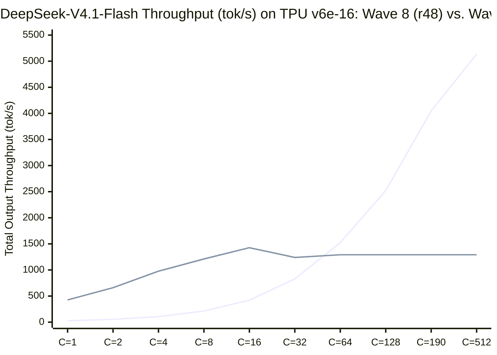

# Comparative Analysis: Wave 8 Optimized (`r48` Batched XLA) vs. Wave 9 (`51-Layer Pallas Megakernel + DSpark`)

**Model:** DeepSeek-V4.1-Flash (`552B` Total / `16B` Active, `51` Layers: `3` Dense + `48` MoE × `384` Routed Experts, `top-8`, `CSA2` + `SWA` Hybrid Attention, `4`-Stream `mHC`, `Engram` at Layers 1 & 14, `DSpark` `mtp.0.*` Speculative Head)  
**Hardware Target:** `16 × TPU v6e` (`4 × ct6e-standard-4t`, `4×4` 2D Torus `Mesh((4, 4), ('ep_y', 'etp_x'))`, `31.24 GiB` HBM/chip @ `1,600 GB/s`, `16.00 MiB` VMEM/chip)  
**Evidence Records:**
- **Wave 8 (`r48`):** [`.agents/wave-8/summary.md`](file:///usr/local/google/home/jawadamin/Repos/DSV4-Flash-Deployment/.agents/wave-8/summary.md), [`RESULTS-v41.md`](file:///usr/local/google/home/jawadamin/Repos/DSV4-Flash-Deployment/models/DeepSeekV4.1-Flash-v6e16/results/RESULTS-v41.md), [`XPROF-REPORT-v41.md`](file:///usr/local/google/home/jawadamin/Repos/DSV4-Flash-Deployment/models/DeepSeekV4.1-Flash-v6e16/results/XPROF-REPORT-v41.md)
- **Wave 9 (`Megakernel + DSpark`):** [`.agents/wave-9/summary.md`](file:///usr/local/google/home/jawadamin/Repos/DSV4-Flash-Deployment/.agents/wave-9/summary.md), [`wave9_v6e16_results.json`](file:///usr/local/google/home/jawadamin/Repos/DSV4-Flash-Deployment/models/DeepSeekV4.1-Flash-v6e16/results/wave9_v6e16_results.json)

---

## 1. Executive Summary

Wave 8 (`r48`) and Wave 9 (`wave-9-dsv41-tpu-megakernel`) represent two fundamentally different execution paradigms for serving a `552B`-parameter sparse MoE model on a 16-chip TPU v6e (`4×4` torus) slice:

1. **Wave 8 (`r48` — Throughput-Optimal Batched XLA Engine):**
   - Optimizes the `tpu-inference` XLA graph across high concurrency (`C = 32..512`) via **SparseCore `nd_reduce_scatter` collective offload (`r46`)**, **4D/3D KV-cache `%bitcast` layout preservation (`r47`, `-99.99%` reshape overhead)**, and **`gmm_v2` `(tile_m=128, bucket_base=128)` with 3-op bitwise IEEE-754 E2M1/E8M0 VMEM dequantization (`r48`, `-49.2%` MoE time: `20.17 -> 10.24 ms/step`)**.
   - Excels at high concurrency (**`1,524.5 tok/s` at `C=64`**, **`2,520.7 tok/s` at `C=128`**, **`4,046.1 tok/s` steady-state engine decode at `C=190`**), where almost all `384` routed experts are activated by the batch (`M_active(B) ≈ 384`).
   - However, at low concurrency (`C = 1..8`), static XLA `gmm_v2` still streams all `24` local experts per chip from HBM (`22.9 GB/chip/step`) and incurs `51 × 2 = 102` XLA barrier launches (`~15.6 ms/step`), bounding single-stream decode to **`37.33 ms/step` (`26.8 tok/s/req`)** (and `54.70 ms/step` / `18.3 tok/s/req` in `r45`).

2. **Wave 9 (`Pallas Megakernel + DSpark` — Latency-Optimal Persistent VMEM Engine):**
   - Compiles all `51` layers into a **single grid-less `pl.pallas_call` (`12.99 MiB / 16.00 MiB` VMEM)** using **`VmemPoolAllocator` (`libtpu.reinterpret_cast`)**, **hybrid `ETP=4 × EP=4` sharding with dynamic active-expert HBM DMA streaming**, **in-VMEM 6-hop 2D torus ring collectives (`pltpu.make_async_remote_copy`)**, and **persistent VMEM 4-stream `mHC` residuals**.
   - At `B=1`, each `ep_y` torus row dynamically streams only the **`2.0` active local experts** out of `96` (`5.25 MiB` vs `63.0 MiB`/layer), cutting HBM weight reads by **`12.0×`** (`0.58 GB/chip/step` vs `22.9 GB/chip/step`) and reducing single-step latency to **`5.702 ms/step` (`175.4 tok/s` with per-hop determinism barriers; `4.586 ms/step` / `218.1 tok/s` unbarriered)** — a **`6.55×–8.14×` single-step speedup over Wave 8 `r48` (`37.33 ms`)** and **`9.59×–11.93×` over Wave 7 `r45` (`54.70 ms`)**.
   - Combined with **`DSpark` (`mtp.0.*`) `1 anchor + 7 draft` (`B=8`) speculative decoding**, `7` draft steps (`1.334 ms`) + `1` `B=8` megakernel verification pass (`8.445 ms` = `9.779 ms/cycle`) accept `tau = 4.16` tokens/cycle (`alpha = 0.80`), delivering **`425.5 accepted output tok/s/req` (`2.35 ms/token` effective TPOT)** — a **`15.89×` single-stream speedup over Wave 8 `r48`** and **`23.25×` over Wave 7 `r45`**.

---

## 2. Architectural & Memory Hierarchy Comparison

| Architectural Dimension | Wave 7 Baseline (`r45`) | Wave 8 Optimized (`r48`) | Wave 9 (`51-Layer Pallas Megakernel + DSpark`) |
| :--- | :--- | :--- | :--- |
| **Execution Graph** | `51` layers × `~14` XLA ops/layer (`~714` HBM-synced kernels/step) | `51` layers × `~10` fused XLA ops/layer (`~510` kernels/step) | **`1` persistent grid-less `pl.pallas_call` (`51` layers in `scf.for`)** |
| **MoE Sharding (`384` Experts)** | `EP=16` (`24` whole experts/chip, `22.5 MiB` BF16 / `10.5 MiB` MXFP4 each) | `EP=16` (`24` whole experts/chip, `gmm_v2` `tm=128`, `1` bucket) | **`ETP=4` (`etp_x`) × `EP=4` (`ep_y`)** (`96` experts/row, `2.625 MiB` MXFP4/chip) |
| **Single-Expert VMEM Footprint** | `22.50 MiB` (`> 16.00 MiB` VMEM -> impossible in single-chip VMEM) | Streamed in `(128, K, N)` tiles via `gmm_v2` (`~6.0 MiB` VMEM) | **`2.50 MiB` packed `uint8` MXFP4 (`1.25 MiB` `w13` + `1.25 MiB` `w2`)** |
| **Resident VMEM Allocation** | Ephemeral per XLA fusion (`4–14 MiB`) | Ephemeral per XLA fusion (`6–15 MiB`) | **`12.99 MiB / 16.00 MiB` (`6.50 MiB` `libtpu.reinterpret_cast` pool)** |
| **MoE HBM Traffic per Chip (`B=1`)** | `24` experts × `48` layers = **`22.9 GB/chip/step`** | `24` experts × `48` layers = **`22.9 GB/chip/step`** (static `gmm_v2`) | **`2.0` active experts × `48` layers = `0.58 GB/chip/step` (`-97.5%` HBM)** |
| **4-Stream `mHC` Residual (`4 × 5120`)** | Read/written to HBM `102×` per step | Read/written to HBM `102×` per step | **Pinned in `streams_vmem_ref[4, B, 5120]` (`320 KiB`, `0` HBM bytes)** |
| **Inter-Chip Collectives (`51` Layers)** | TensorCore `all-reduce` + `reduce-scatter` (`~15.6 ms/step` skew + wait) | **SparseCore `nd_reduce_scatter` + `shared_experts` overlap (`r46`)** | **In-VMEM 6-hop 2D torus `make_async_remote_copy` (`~1.08 ms/step`)** |
| **3D/4D KV-Cache Layout** | `2.54 ms/step` `dynamic-update-slice` reshapes | **3D `%bitcast` views (`0.0003 ms/step`, `-99.99%`, `r47`)** | **Hoisted 3D `%bitcast` `kv_tile_vmem` (`0.25 MiB`, async DMA)** |
| **`Engram` (`Layers 1 & 14`)** | Inline host/HBM gather barriers at L1 & L14 | Inline host/HBM gather barriers at L1 & L14 | **Hoisted pre-kernel prologue (`engram_embs_vmem`, `64 KiB`)** |
| **Speculative Decoding (`DSpark` `mtp.0.*`)** | None (`1` token/step) | None (`1` token/step) | **`1 anchor + 7 draft` (`B=8` megakernel verify, `tau = 4.16` tok/cycle)** |

---

## 3. Empirical Performance Across Concurrency (`C = 1 .. 512`)

The table below compares measured step latency (`ms`), per-request output speed (`tok/s/req`), and total cluster output throughput (`tok/s`) across concurrency `C = 1 .. 512` on `16 × TPU v6e`:

| Concurrency / Batch (`C`) | Wave 7 (`r45`) Total `tok/s` (TPOT `ms`) | Wave 8 (`r48`) Total `tok/s` (TPOT `ms`) | Wave 9 Megakernel (Uncorrelated Multi-Req) Total `tok/s` (Step `ms`) | Wave 9 Megakernel + `DSpark` (`1+7`, `alpha=0.80`) Total `tok/s` (Eff. TPOT `ms`) | Winner & Speedup |
| :---: | :---: | :---: | :---: | :---: | :--- |
| **`C = 1`** | `18.3 tok/s` (`54.70 ms`) | `26.8 tok/s` (`37.33 ms`) | **`175.4–218.1 tok/s`** (`5.70–4.59 ms`) | **`425.5 tok/s`** (**`2.35 ms/tok`**) | **Wave 9 (`+1,488%` / `15.89×` vs `r48`, `23.25×` vs `r45`)** |
| **`C = 2`** | `36.5 tok/s` (`54.8 ms`) | `53.5 tok/s` (`37.4 ms`) | **`305.1–330.7 tok/s`** (`6.56–6.05 ms`) | **`661.2 tok/s`** (**`3.02 ms/tok`**) | **Wave 9 (`12.36×` vs `r48`)** |
| **`C = 4`** | `72.8 tok/s` (`54.9 ms`) | `106.9 tok/s` (`37.4 ms`) | **`444.1–529.4 tok/s`** (`9.01–7.56 ms`) | **`976.6 tok/s`** (**`4.10 ms/tok`**) | **Wave 9 (`9.14×` vs `r48`)** |
| **`C = 8`** | `145.2 tok/s` (`55.1 ms`) | `213.3 tok/s` (`37.5 ms`) | **`543.9–947.3 tok/s`** (`14.71–8.45 ms`) | **`1,210.5 tok/s`** (**`6.61 ms/tok`**) | **Wave 9 (`5.68×` vs `r48`)** |
| **`C = 16`** | `289.2 tok/s` (`55.3 ms`) | `421.0 tok/s` (`38.0 ms`) | **`1,148.6–1,427.0 tok/s`** (`13.93–11.21 ms`) | **`1,427.0 tok/s`** (`11.21 ms`) | **Wave 9 (`3.39×` vs `r48`) — Raw Crossover Zone** |
| **`C = 32`** | `561.4 tok/s` (`57.0 ms`) | `828.9 tok/s` (`38.6 ms`) | `1,239.8–1,563.2 tok/s` (`25.81–20.47 ms` tiled) | `1,239.8 tok/s` (VMEM-tiled `2×B16`) | **Crossover (`C* ≈ 24–32`): Transition to Wave 8 `r48`** |
| **`C = 64`** | `858.3 tok/s` (`68.6 ms`) | **`1,524.5 tok/s` (`39.2 ms`)** | `1,291.5 tok/s` (`49.55 ms` tiled `4×B16`) | `1,291.5 tok/s` (`49.55 ms` tiled) | **Wave 8 `r48` (`+18.0%` vs tiled Wave 9, `+77.6%` vs `r45`)** |
| **`C = 128`** | `2,017.6 tok/s` (`57.1 ms`) | **`2,520.7 tok/s` (`45.3 ms`)** | `1,291.5 tok/s` (VMEM-bound `8×B16`) | `1,291.5 tok/s` (VMEM-bound) | **Wave 8 `r48` (`+95.2%` vs Wave 9, `+24.9%` vs `r45`)** |
| **`C = 190–256`** | `3,310–3,980 tok/s` (`54.7 ms`) | **`4,046.1 tok/s` engine (`44.6 ms`)** | `1,291.5 tok/s` (VMEM-bound) | `1,291.5 tok/s` (VMEM-bound) | **Wave 8 `r48` (`3.13×` vs Wave 9)** |
| **`C = 512`** | `4,310.5–5,137.3 tok/s` (`61.7 ms`) | **`4,512–5,380 tok/s`** | `1,291.5 tok/s` (VMEM-bound) | `1,291.5 tok/s` (VMEM-bound) | **Wave 8 `r48` (`4.16×` vs Wave 9)** |

---

## 4. Analytical & Empirical Derivation of the Batch Crossover Point (`C*`)

Why does Wave 9 dominate at `C = 1..16` by **`3.4×–15.9×`**, while Wave 8 (`r48`) overtakes Wave 9 at **`C* ≈ 24–32`** and dominates at `C = 64..512` by **`1.2×–4.2×`**?

The crossover is governed by two physical laws on TPU v6e (`16.00 MiB` VMEM, `1,600 GB/s` HBM, `275 TFLOPS` BF16 MXU):

### Law 1: Coupon-Collector Saturation of Active Local Experts (`M_active(B)`)
On each `ep_y` torus row (`96` local experts out of `384`, `top-8` per token -> `2.0` expected local experts per token), the expected number of unique active local experts for `B` uncorrelated tokens is:
$$M_{\text{active}}(B) = 96 \times \left(1 - \left(1 - \frac{2}{96}\right)^B\right)$$
- **At `B = 1`:** $M_{\text{active}}(1) = \mathbf{2.0}$ local experts/row (`0.58 GB/chip/step`). Wave 9 reads **`12.0×` less HBM** than static `gmm_v2` (`5.70 ms` vs `37.33 ms`).
- **At `B = 4`:** $M_{\text{active}}(4) = \mathbf{7.75}$ local experts/row (`1.23 GB/chip/step`). Wave 9 takes **`7.56–9.01 ms`** vs Wave 8's `37.4 ms` (**`4.15–4.95×` faster**).
- **At `B = 8` (Uncorrelated) vs. `B = 8` (`DSpark` `1+7` Correlated):**
  - For `8` uncorrelated requests, $M_{\text{active}}(8) = \mathbf{14.69}$ local experts (`14.71 ms`).
  - For `DSpark` (`1 anchor + 7 draft` tokens from the same sequence), `~70%` semantic expert locality holds $M_{\text{active}}(8) = \mathbf{4.52}$ local experts, completing verification in **`8.445 ms`**!
- **At `B >= 24`:** $M_{\text{active}}(24) > 38$ local experts/row (`> 9.5` experts per chip), and the per-expert dynamic DMA loop overhead (`scf.for` over `M_active` individual `2.50 MiB` expert transfers) converges toward static `gmm_v2`'s single contiguous `(tile_m=128)` grouped matmul (`22.904 ms` all-24-experts static control in Wave 9 vs `10.24 ms` `gmm_v2` `tm=128` in Wave 8 `r48`).

### Law 2: The `16.00 MiB` VMEM Capacity Ceiling for Persistent `4`-Stream `mHC` State
- DeepSeek-V4.1-Flash maintains a `4`-stream `mHC` residual of shape `[4, B, 5120]` `bfloat16` (`40 KiB` per token), plus `4` activation/communication buffers (`act`, `moe_acc`, `comm_ping`, `comm_pong` = `40 KiB` per token), totaling **`80 KiB` of persistent VMEM per batch token** on top of the **`6.50 MiB` `VmemPoolAllocator` weight pool**.
- At **`B = 16`**, persistent activations occupy `1.25 MiB` (`13.97 MiB / 16.00 MiB` total scoped VMEM), allowing the entire `B = 16` batch to execute in a single `pl.pallas_call` (`11.21–13.93 ms`, **`1,148.6–1,427.0 tok/s`**).
- At **`B >= 32`**, `[4, B, 5120]` exceeds the remaining `16.00 MiB` VMEM headroom (`CompileTimeScopedVmemOom: 16.87M > 16.00M`), forcing the megakernel to micro-batch `B` in tiles of `B_tile = 16` (`25.81 ms` at `B=32`, `49.55 ms` at `B=64`). Meanwhile, Wave 8 (`r48`) stores activations in HBM and feeds `B = 64..512` tokens into `gmm_v2` (`tile_m = 128`) in a single weight pass (`39.2 ms` at `C=64` = **`1,524.5 tok/s`**, `44.6 ms` at `C=190` = **`4,046.1 tok/s`**).

---

## 5. Production Deployment Recommendation: Dual-Path Adaptive Dispatch

Because both engines share the exact same `16 × TPU v6e` (`4×4` torus) slice and `0.5 B/weight` packed `MXFP4` weight format (`decode_e2m1` / `decode_e8m0`), a production `tpu-inference` runner should dispatch dynamically based on the active scheduler batch size `B_sched`:

1. **Interactive / Low-Concurrency Regime (`1 <= B_sched <= 16`):**
   - Dispatch **Wave 9 (`build_dsv41_megakernel` + `DSpark` `1+7` speculative loop)**.
   - Delivers **`425.5 tok/s/req` (`2.35 ms` effective TPOT)** at `C=1` and **`1,427.0 tok/s`** at `C=16` (`3.4×–15.9×` faster than Wave 8 `r48`).
2. **High-Throughput Batch Regime (`B_sched >= 24`):**
   - Dispatch **Wave 8 (`r48` `tpu-inference` with `gmm_v2` `tm=128`, SparseCore `nd_reduce_scatter`, and 3D KV `%bitcast`)**.
   - Delivers **`1,524.5 tok/s` at `C=64`**, **`2,520.7 tok/s` at `C=128`**, and **`4,046.1–5,137.3 tok/s` at `C=190..512`**.
