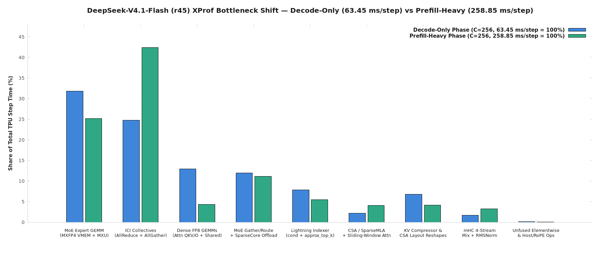

# DeepSeek-V4.1-Flash on TPU v6e-16 — XProf Kernel Breakdown & Optimization Roadmap

**Hardware:** 1 × TPU v6e-16 (`4 × 4` optical torus, `512 GiB` total HBM at `1,640 GB/s/chip`, `918 TFLOP/s/chip` `bf16` MXU)  
**Serving Configuration:** `--max-model-len 16384`, `--max-num-seqs 64`, `--max-num-batched-tokens 256`, `MOE_REQUANTIZE_WEIGHT_DTYPE=mxfp4`, `REQUANTIZE_WEIGHT_DTYPE=float8_e4m3fn`, `kv-cache-dtype=fp8`, `PYTHON_TRACER_LEVEL=0`  
**Parallelism (`mesh`):** 16-way Data-Parallel Attention (`attn_dp=16`) + 16-way Expert Parallelism (`24` local expert groups per chip, `384` routed experts total, `top_k = 6`, `hidden_size = 5120`, `moe_intermediate_size = 2304`). In decode (`C=256`), each DP rank processes `16` tokens (`256` global tokens/step). In prefill (`--max-num-batched-tokens 256`), each DP rank processes up to `256` tokens (`4,096` global tokens/step).

---

## 1. Executive Summary & Physical Roofline Check

| Metric | Measured in XProf (`C=256`) | Physical Floor (TPU v6e-16) | Utilization / Ratio | Key Takeaway |
|---|---:|---:|---:|---|
| **Decode Step Wall (`jit_step_fun_impl` median)** | **`61.69 ms/step`** | — | — | Full iteration incl. constant `0.87 ms` inter-step gap = **`62.56 ms/step`**. |
| **Decode Throughput (`256 ÷ 62.56 ms`)** | **`4,092 tok/s`** | — | — | Matches client-measured steady-state decode (`4,120 tok/s`) and end-to-end `1k/8k` (`3,980 tok/s`). |
| **Decode XLA Op-Sum vs Busy Time** | `64.87 ms` vs `62.38 ms` | — | **`1.040×` overlap** | Only **`4.0%` of op time is concurrent**; collectives and compute execute almost entirely in series. |
| **Prefill Step Wall (`jit_step_fun_impl` median)** | **`270.16 ms/step`** | — | — | `4,096 ÷ 270.16 ms` = **`15,161 tok/s`** (matches measured `14,704 tok/s` engine prefill peak). |
| **Routed-Expert Weight Read (`gmm_v2` MXFP4)** | **`20.62 ms/step`** | **`10.73 ms/step`** (`17.6 GB ÷ 1,640 GB/s`) | **`52.0%` of HBM floor** | `24` local experts × `35.39M` params × `0.53125 B` × `39` MoE layers = `17.6 GB/chip/step`. Headroom: **`~9.9 ms/step`**. |
| **Dense FP8 Weight Read (`wq_a/b`, `wkv_a`, `wo_a/b`, Shared MLP)** | **`8.37 ms/step`** | **`3.17 ms/step`** (`5.2 GB ÷ 1,640 GB/s`) | **`37.9%` of HBM floor** | Combined weight-bandwidth floor (`17.6 + 5.2 = 22.8 GB/chip`) is **`13.9 ms/step`** (`22.2%` overall step utilization). |
| **Exposed ICI Collectives (`all-reduce` + `all-gather`)** | **`16.05 ms/step`** (`24.7%`) | **`~2.0 ms/step`** (wire floor) | **`8.0×` over floor** | `%all-reduce.52` (`bf16[256,5120]`, `2.62 MB`) takes `356.5 µs/layer` vs `25.9 µs/layer` for `%all-gather.122` on the same mesh axis. **`~306 µs/layer` (`12.2 ms/step`) is barrier/wait.** |
| **Kernel Launch Count (`Decode`)** | **`16,962 launches/step`** | `< 1,500 launches/step` | `11×` fragmentation | `7,398` launches/step from unfused `mhc/torch.py` (`~0.1 µs` each = `1.07 ms/step`) + `4,264` layout `reshape`/`copy` ops (`4.40 ms/step`). |

> **Note on Custom-Call Telemetry:** XLA's `bytes_accessed` and `model_flops` counters on Pallas custom-calls (`gmm_v2`, `SparseMLA`, `SWA`) are nominal compiler estimates rather than hardware counters (for example, reporting `998.8 TF/s` on prefill `gmm_v2` against the `918 TFLOP/s` `bf16` hardware peak). All bandwidth and roofline floors above are computed directly from tensor geometry (`24` local experts × `35.39M` params × `4.25 bits/weight`).

---

## 2. Nine-Category XProf Breakdown (`Decode-Only` vs `Prefill-Heavy`)

Source: [`raw/v41-xprof-summary.json`](raw/v41-xprof-summary.json) (`14.67` complete decode steps at `61.69 ms` median step wall; `270.16 ms` median prefill step wall).

| # | Kernel / Architectural Category | Decode `ms/step` | Decode Share | Launches / Step | Prefill `ms/step` | Prefill Share |
|---:|---|---:|---:|---:|---:|---:|
| **1** | **MoE Expert GEMM (`gmm_v2`, MXFP4 VMEM Dequant + MXU)** | **`20.62 ms`** | **31.8%** | `79.8` | `67.98 ms` | 25.2% |
| **2** | **ICI Collectives (`all-reduce` + EP `all-gather`)** | **`16.05 ms`** | **24.7%** | `337.6` | **`114.58 ms`** | **42.4%** |
| **3** | **Dense FP8 Projections (`wq_a/b`, `wkv_a`, `wo_a/b`, Shared MLP)** | **`8.37 ms`** | **12.9%** | `915.3` | `11.76 ms` | 4.3% |
| **4** | **MoE Token Gather, Routing & SparseCore Offload** | **`7.76 ms`** | **12.0%** | `1,525.6` | `29.98 ms` | 11.1% |
| **5** | **Lightning Indexer (`conditional` + `approx_top_k`)** | **`5.07 ms`** | **7.8%** | `191.1` | `14.74 ms` | 5.5% |
| **6** | **KV Compressor & CSA Cache Layout `reshape` / `copy`** | **`4.40 ms`** | **6.8%** | `4,264.1` | `11.18 ms` | 4.1% |
| **7** | **CSA / SparseMLA & Sliding-Window Attention (`SWA`)** | **`1.44 ms`** | **2.2%** | `401.4` | `11.00 ms` | 4.1% |
| **8** | **mHC 4-Stream Hyper-Connections & `RMSNorm`** | **`1.07 ms`** | **1.6%** | **`7,398.0`** | `8.83 ms` | 3.3% |
| **9** | **Unfused Elementwise, Metadata & Host/RoPE Ops** | **`0.07 ms`** | **0.1%** | `1,848.9` | `0.12 ms` | 0.0% |
| | **Op-Sum per Step** | **`64.87 ms`** | **100.0%** | **`16,961.8`** | **`270.16 ms`** | **100.0%** |
| | **Union-of-Intervals Busy Time** | **`62.38 ms`** | — | — | — | — |
| | **Median Step Wall (`jit_step_fun_impl`)** | **`61.69 ms`** | — | — | **`270.16 ms`** | — |

---

## 3. Top Individual HLO Operations (`Decode-Only` vs `Prefill-Heavy`)

| Rank | HLO Instruction | Decode `ms/step` | Decode Shape (`16` tok/rank) | Prefill `ms/step` | Prefill Shape (`256` tok/rank) | Source Module |
|---:|---|---:|---|---:|---|---|
| **1** | `%all-reduce.52` / `%all-reduce.30` | **`14.24 ms`** (`356.5 µs × 40`) | `bf16[256,5120]` (`2.62 MB`) | **`103.95 ms`** (`2,668 µs × 39`) | `bf16[4096,5120]` (`41.94 MB`) | `fused_moe_gmm.py:341` (`psum_scatter` lowered to AR + slice) |
| **2** | `%gmm_v2...act_silu_and_mul_with_clamp` (`gate_up`) | **`13.73 ms`** (`343.7 µs × 40`) | `bf16[1536,2304]` (`g=24, tm=256`) | **`42.46 ms`** | `bf16[24576,2304]` (`g=24, tm=256`) | `megablox/gmm_v2.py` (MXFP4 VMEM dequant) |
| **3** | `%gmm_v2...act_None` (`down_proj`) | **`6.90 ms`** (`172.7 µs × 40`) | `bf16[1536,5120]` (`g=24, tm=256`) | **`25.52 ms`** | `bf16[24576,5120]` (`g=24, tm=256`) | `megablox/gmm_v2.py` (MXFP4 VMEM dequant) |
| **4** | `%mpmd_map.421.call-done` (SparseCore sync) | **`2.79 ms`** (`69.8 µs × 40`) | `bf16[2048,5120]` | **`1.42 ms`** | `bf16[24576,5120]` | `sparse_core/core_map_helper.py:57` |
| **5** | `%fusion.224` (`wq_b` FP8 Dense GEMM) | **`2.07 ms`** (`51.7 µs × 40`) | `bf16[16,32768]` | **`2.47 ms`** | `bf16[256,32768]` | `layers/common/linear.py:74` |
| **6** | `%conditional.12` (`jax.lax.cond` Indexer branch) | **`1.99 ms`** (`250.0 µs × 8`) | `s32[16,512]` | **`6.90 ms`** | `s32[256,512]` | `deepseek_v41_indexer.py:291` |
| **7** | `%fusion.527` (`wo_b` FP8 Dense GEMM) | **`1.96 ms`** (`48.9 µs × 40`) | `f32[16,5120]` | **`2.19 ms`** | `f32[256,5120]` | `layers/common/linear.py:74` |
| **8** | `%approx_top_k.141` / `.137` (Indexer sort) | **`1.74 ms`** (`218.7 µs × 8`) | `(f32[16,18432], s32[16,18432])` | **`6.42 ms`** | `(f32[256,18432], s32[256,18432])` | `indexer/streamindex_topk.py:799` |
| **9** | `%reshape.22232` / `.22201` (`4D <-> 2D` KV copy) | **`1.62 ms`** (`236.8 µs × 4`) | `u8[267,512,4,128] <- u8[136704,512]` | **`2.45 ms`** | `u8[267,512,4,128]` (`69.98 MB`) | `deepseek_v41_compressor.py:490` |
| **10** | `%all-gather.122` / `.82` (Pre-MoE token AG) | **`1.04 ms`** (`25.9 µs × 40`) | `bf16[256,5120] <- bf16[16,5120]` | **`9.24 ms`** (`236.6 µs × 39`) | `bf16[4096,5120] <- bf16[256,5120]` | `layers/common/moe.py:152` |
| **11** | `%reshape.23632` / `.23119` (`csa_gather` KV copy) | **`0.79 ms`** (`196.9 µs × 4`) | `u8[546816,128] <- u8[136704,512]` | **`4.71 ms`** | `u8[546816,128]` (`69.98 MB`) | `core_attention/csa_gather.py:290` |
| **12** | `%SWA-d-bq_1` + `%SparseMLA-p_512` | **`1.30 ms`** (`33.1 µs × 40`) | `bf16[16,64,512]` | **`9.85 ms`** | `bf16[256,64,512]` | `mla_swa.py:1123`, `sparse_mla.py:770` |

---

## 4. Five Concrete Performance Hill-Climbing Opportunities

### 1. Post-MoE Collective Lowering, Rank-Skew Elimination & Shared-Expert Overlap (`2.0–8.0 ms/step` Decode, `15–35 ms/step` Prefill)
- **What the HLO Shows:**
  - `interface/moe.py:120` sets `scatter_results = is_dp` (`True`), so `fused_moe_gmm.py:341` invokes `jax.lax.psum_scatter(chunk_hidden, axis_name=('attn_dp', 'attn_dp_expert', 'pcp'))`. However, XLA lowers that 3-axis tuple `psum_scatter` into `%all-reduce.52 = bf16[256,5120] all-reduce(%select_reduce_fusion.19)` (`2.62 MB` in decode, `41.94 MB` in prefill) followed by a `dynamic-slice` (`[16,5120]`).
  - On the exact same mesh axis, `%all-gather.122` (`bf16[256,5120] <- bf16[16,5120]`) completes in **`25.9 µs/layer`** (`236.6 µs/layer` in prefill), whereas `%all-reduce.52` takes **`356.5 µs/layer`** (`2,668 µs/layer` in prefill). Thus **`~306 µs/layer` (`12.2 ms/step`) in decode is barrier/rank-arrival wait, not wire transfer**.
  - Furthermore, `%fusion.647` (`shared_experts.down_proj`, `deepseek_v4.py:91`) fuses the post-MoE residual addition (`shared_out + dynamic_slice(all_reduce.52)`), making `%all-reduce.52` a direct input operand of `shared_experts.down_proj` and preventing overlap.
- **Actionable Fixes:**
  1. Enable the SparseCore Hierarchical Reduce-Scatter path (`ENABLE_RS_KERNEL=1` at `fused_moe_gmm.py:330`), fused GMM-RS (`USE_GMM_FUSED_RS_KERNEL=1`), and FP8 pre-MoE activation gather (`MOE_ALL_GATHER_ACTIVATION_DTYPE=float8_e4m3fn`).
  2. Decouple `shared_experts.down_proj` (`%fusion.647`) from `%all-reduce.52` so the Shared Expert MLP (`1.79 ms/step`) executes concurrently with the collective.
  3. Capture a 16-rank profile (`PROFILE_SINGLE_DEVICE=0`) to measure rank-to-rank arrival skew into `%all-reduce.52`.

### 2. Native 4D KV-Cache Pallas Indexing — Eliminate `70 MB` Full-Arena Reshapes (`2.5–3.1 ms/step` Decode, `5.0–6.2 ms/step` Prefill)
- **What the HLO Shows:**
  - `deepseek_v41_compressor.py:488-490` (`reshape.22232`, `2.35 ms/step`) and `csa_gather.py:290` (`reshape.23632`, `0.79 ms/step` decode / `4.71 ms/step` prefill) call `.reshape(-1, 512)` and `.reshape(-1, 128)` on the full `u8[267, 512, 4, 128]` (`69.98 MB`) paged KV cache tensor before indexing slots.
  - Because TPU v6e tiles 4D `u8[267,512,4,128]` with minor tiling `T(4,128)(4,1)` and 2D `u8[136704,512]` with `T(8,128)(4,1)`, XLA emits a physical HBM-to-HBM relayout DMA across the entire `70 MB` arena on every compressor/CSA group.
- **Actionable Fix:**
  - Pass the native 4D `cache` (`u8[num_pages, page_size, 4, 128]`) directly into `compress_norm_rope_store` and `csa_gather` using `(page_idx = slot // page_size, page_offset = slot % page_size)`.

### 3. `gmm_v2` Decode Tile-Size (`tm`) Autotuning & VMEM Dequantization (`2.0–9.0 ms/step` Decode)
- **What the HLO Shows:**
  - `gmm_v2` (`20.62 ms/step`, `31.8%` of decode) reads `17.6 GB/chip/step` (`10.73 ms` HBM floor = `52%` utilization).
  - In decode (`m = 1536` total token-expert assignments across `g = 24` local experts, or `~64` rows/expert), `gmm_v2` uses tile size `tm_256` (`gmm_v2-g_24-m_1536-k_5120-...-tm_256`). Padding 24 active groups to `256`-row tiles produces `24 × 256 = 6,144` padded rows/layer (`17.0 TFLOP/step` = **`18.5 ms/step` at MXU peak**), which nearly explains the measured `20.62 ms/step`.
- **Actionable Fix:**
  1. Run a 10-point standalone microbenchmark on `(g=24, m=1536, k=5120, n=4608)` sweeping `tm ∈ {8, 16, 32, 64, 256} × {mxfp4, bf16}`.
  2. Select smaller `tm` (`16` or `32`) for decode batches (`m <= 1536`) and/or replace the multi-op VPU `e2m1_to_bf16` expansion with a 16-entry register LUT.

### 4. Remove `jax.lax.cond` in `deepseek_v41_indexer.py:291` & Use Dynamic Pallas Grid (`1.0–3.0 ms/step` Decode)
- **What the HLO Shows:**
  - `conditional.12` (`deepseek_v41_indexer.py:291`, `1.99 ms/step` decode / `6.90 ms` prefill) and `approx_top_k.141` (`streamindex_topk.py:799`, `1.74 ms/step` decode sorting `s32[16, 18432]` and `s32[16, 9216]`) cost **`5.07 ms/step` (`7.8%`)** in decode.
- **Actionable Fix:**
  - Remove `jax.lax.cond` at `deepseek_v41_indexer.py:291` and unconditionally call the tiled Pallas `streamindex_topk` kernel with dynamic grid bound `num_kv_blocks = ceil_div(max_kv_len, block_k)`.

### 5. Fuse 4-Stream `mHC` (`mhc/torch.py`) + `RMSNorm` into Pallas VMEM (`0.7–1.6 ms/step` Decode, `2–5 ms/step` Prefill)
- **What the HLO Shows:**
  - `mhc/torch.py` + `layernorm.py` accounts for **`7,398` launches/step** (`43.6%` of all `16,962` decode kernel launches, `1.07 ms/step` decode, `8.83 ms/step` prefill).
- **Actionable Fix:**
  - Fuse `pre_mix` + `RMSNorm` + `post_mix` into a single Pallas VMEM kernel tiled in `T(8,128)`.
