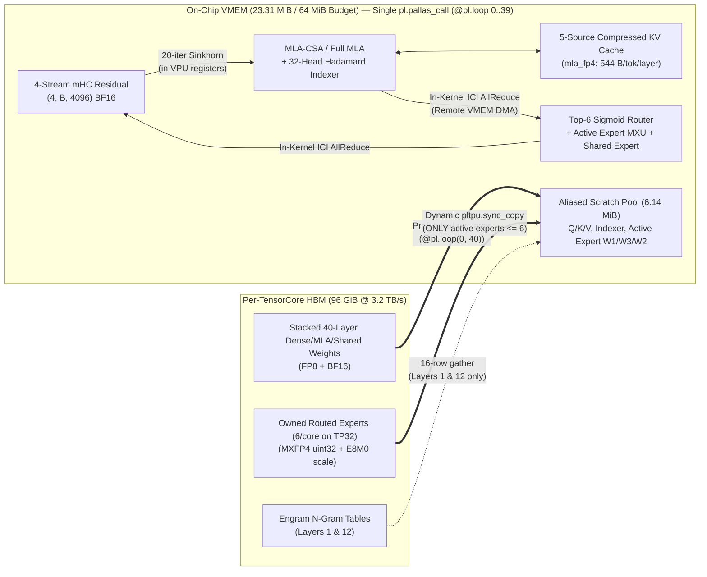

# Graduate Technical Note: The DeepSeek-V4.1-Flash + DSpark In-VMEM Megakernel on TPU v7x (Ironwood)

- **Codebase:** [`tpu-megakernels-v7x/deepseek_v41/`](deepseek_v41/)
- **Target Hardware:** 16× TPU v7 (Ironwood) chips = **32 TensorCores** across 4 hosts (`2x2x4` ICI topology, `TP32` / `EP32`)
- **Headline Performance:**
  - **Target-only decode (`q = 1`):** **`3.577 ms/step` (`279.55 tok/s`)** at `B = 1` (**`2.20×` faster** than 8× NVIDIA B200 at `127.0 tok/s`; **`59.59×` faster** than multi-kernel XLA) and **`4.691 ms/step` (`1,705.33 tok/s`)** at `B = 8` (**`2.68×` faster** than 8× B200).
  - **With DSpark Speculative Decoding (`q = 6`):** **`440.3 – 1,115.4 tok/s`** single-stream effective throughput (`2.73 – 3.99` emitted tokens per verification step, `100.0%` lossless greedy equivalence).
  - **End-to-End Accuracy (`TP32`):** **`100.0%`** GSM8K (`q = 1`), **`99.0%`** GSM8K (`q = 6` DSpark), **`72.0%`** GPQA Diamond (`q = 6` DSpark).

---

## 1. The First-Principles Motivation: Why Standard LLM Serving Hits a Latency Wall at Low Batch

### 1.1 The Roofline Paradox of Sparse MoE Decode
Consider generating one token at batch size $B = 1$ with **DeepSeek-V4.1-Flash**:
- **Total Checkpoint Footprint:** $510.3\text{ GB}$ across 40 transformer layers (plus 3 DSpark draft layers). Each layer has $E = 192$ routed experts (quantized to 4-bit `MXFP4`), 1 shared expert (`FP8`), and Multi-head Latent Attention (`MLA`, `FP8`).
- **Active Weight Footprint per Token ($B = 1$):** For a single token, the router activates only $K = 6$ out of $192$ routed experts per layer ($3.125\%$ of routed expert weights). Across all 40 layers, the total active weight volume read across the entire 32-TensorCore cluster is:
  $$W_{\text{active}}(B=1) \approx 43.8\text{ GB total} \implies \mathbf{1.37\text{ GB per TensorCore}}$$
- **Hardware Bandwidth Floor on Ironwood (TPU v7x):** Each TPU v7 chip contains **2 TensorCores**, and each individual TensorCore has **$3,700\text{ GB/s}$ theoretical peak HBM bandwidth** (**$3,198\text{ GB/s}$ measured sustained** in our hardware probe).
  Therefore, the physical time required to stream $1.37\text{ GB}$ of active weights from HBM into a TensorCore's on-chip SRAM (**VMEM**) is:
  $$t_{\text{HBM floor}} = \frac{1.37\text{ GB}}{3,198\text{ GB/s}} \approx \mathbf{0.43\text{ ms}}$$

**The Paradox:** If the physics of HBM bandwidth says reading the active weights takes **$0.43\text{ ms}$**, why does standard multi-kernel serving on 8× NVIDIA B200 (`vLLM` / `SGLang`) take **$7.87\text{ ms/token}$** (`127 tok/s`), and why does a standard multi-kernel JAX/XLA implementation on the exact same 16× TPU v7x slice take **$213.16\text{ ms/token}$** (`4.69 tok/s`)?

### 1.2 The Three Bottlenecks of Multi-Kernel Serving
1. **Kernel Launch & Dispatch Overhead ($\sim 400$ Kernels/Token):**
   In a standard framework (`vLLM`, `SGLang`, or un-fused XLA), each of the 40 layers dispatches 8–12 separate GPU/TPU kernels:
   $$\text{RMSNorm} \to \text{mHC Sinkhorn} \to \text{Q/KV Proj} \to \text{Indexer Hadamard + TopK} \to \text{MLA Attention} \to \text{AllReduce} \to \text{MoE Router} \to \text{Grouped GEMM} \to \text{AllReduce}$$
   Across 40 layers, that is **350 to 450 separate kernel launches per generated token**. At $B = 1$, each matrix multiplication takes only $2\text{–}10\ \mu\text{s}$ on the Matrix Multiply Unit (MXU), which is **smaller than the kernel launch, barrier, and HBM round-trip latency** ($10\text{–}20\ \mu\text{s}$ per op). The accelerator spends most of its time waiting between kernels.
2. **Intermediate Activation HBM Round-Trips:**
   Between every kernel in a standard graph, the 4-stream residual state $X \in \mathbb{R}^{4 \times B \times 4096}$, query/key projections, attention outputs, and KV cache updates are written out to HBM and read back in by the next kernel.
3. **Static Full-Expert Dequantization in Naive XLA (`213 ms` vs `3.58 ms`):**
   Standard XLA `shard_map` cannot dynamically DMA only the 6 active experts per layer into VMEM without a custom Pallas kernel; instead, it loads and dequantizes all 192 experts (or runs a full-tensor gather in HBM), amplifying HBM traffic by $15\text{–}30\times$.

### 1.3 The Megakernel Solution
Our solution in [`deepseek_v41/decode_megakernel.py`](deepseek_v41/decode_megakernel.py#L1854-L2148) (`make_tpu_pallas_megakernel_step`) compiles **the entire 40-layer transformer forward pass, final RMSNorm, and sharded LM head into a single Pallas kernel (`pl.pallas_call`, verified as `tpu_custom_call_count == 1` in compiled HLO)**:

- **Zero host intervention for 40 layers:** The host launches **one** kernel per token (`tpu_custom_call == 1`). Inside the kernel, `@pl.loop(0, 40)` iterates over all 40 layers on the TensorCore scalar unit.
- **Zero activation HBM traffic:** The 4-stream residual state, the compressed KV cache, and all intermediate buffers stay inside **on-chip VMEM (`23.31 MiB`)** for the entire 40-layer loop.
- **On-demand active-expert DMA:** Inside the MoE block of layer $\ell$, each TensorCore inspects the router's top-6 expert IDs and issues `pltpu.sync_copy` **only** for the experts owned by that core that were actually selected.

---

## 2. DeepSeek-V4.1-Flash Architecture & Kernel-Level Optimizations

DeepSeek-V4.1-Flash introduces five distinct architectural mechanisms beyond standard DeepSeek-V3. Below is how each works mathematically, why it exists, and how we mapped it into Pallas/Mosaic TPU.

### 2.1 Multi-Stream Hyper-Connections (`mHC`) & 20-Step Sinkhorn-Knopp Mixing
- **What it is ([`decode_megakernel.py:137-228`](deepseek_v41/decode_megakernel.py#L137-L228)):**
  Instead of a single residual vector $x \in \mathbb{R}^D$ ($D = 4096$), the model maintains $S = 4$ parallel residual streams $X \in \mathbb{R}^{4 \times B \times 4096}$. Before entering any sublayer (Attention or MoE), a small linear projection `hc_attn_rms` / `hc_ffn_rms` produces 24 dynamic mixing logits per token:
  - $\alpha_{\text{pre}} \in \mathbb{R}^4$: weights to collapse the 4 streams into 1 sublayer input $h_{\text{in}} = \sum_{s=0}^3 \alpha_{\text{pre}, s} X_s$.
  - $\alpha_{\text{post}} \in \mathbb{R}^4$: weights to inject the sublayer output $y$ back into each stream.
  - $M_{\text{raw}} \in \mathbb{R}^{4 \times 4}$: a stream-to-stream transition matrix.
- **Why 20-Step Sinkhorn-Knopp is required:**
  If $M_{\text{raw}}$ were unconstrained across 80 sublayers (40 layers $\times 2$), eigenvalues $> 1$ would cause exponential activation blowup. DeepSeek projects $M = \exp(M_{\text{raw}})$ onto the **Birkhoff polytope of doubly-stochastic matrices** (where every row and every column sums to $1$) by alternating row and column normalizations for `sinkhorn_iters = 20` iterations:
  $$M^{(k + 1/2)}_{i, j} = \frac{M^{(k)}_{i, j}}{\sum_{j'=0}^3 M^{(k)}_{i, j'} + \epsilon}, \qquad M^{(k + 1)}_{i, j} = \frac{M^{(k + 1/2)}_{i, j}}{\sum_{i'=0}^3 M^{(k + 1/2)}_{i', j} + \epsilon}$$
  Then the 4 streams update via $X \leftarrow M X + \alpha_{\text{post}} \otimes y$.
- **How we verified its necessity (Negative Control):**
  In [`parity_neg_control.json`](results/v7x16/parity_neg_control.json), setting `sinkhorn_iters = 0` collapses teacher-forced top-1 accuracy from **`96.88%` (`100%` top-5)** to **`0.00%` (`0/64`)**.
- **Megakernel Optimization:**
  20 Sinkhorn iterations $\times 2$ sublayers $\times 40$ layers $= \mathbf{1,600}$ row/column normalizations per token. In our megakernel, the $4 \times 4$ matrix lives in VPU vector registers inside VMEM (`hc_split_sinkhorn_in_pallas`), executing all 20 iterations in $< 1\ \mu\text{s}$ with zero memory traffic.

---

### 2.2 Hybrid MLA-CSA (`35` Layers) vs. Full MLA (`5` Layers) & `mla_fp4` KV Cache
- **What it is ([`config.py:19-125`](deepseek_v41/config.py#L19-L125)):**
  DeepSeek-V4.1-Flash does **not** store a separate KV cache for all 40 layers!
  - Only **5 layers** (`layers 0, 2, 11, 20, 30`, called **KV source layers**, `r = 1` Full MLA) project the hidden state into a new compressed KV latent $c_{KV} \in \mathbb{R}^{512}$ and decoupled RoPE key $k^{\text{rope}} \in \mathbb{R}^{64}$.
  - The remaining **35 layers** (`r = 2` **MLA-CSA**, Cross-Stage Attention) **reuse** the KV cache written by the nearest preceding source layer! Specifically:
    - Source `0` feeds layer `1`
    - Source `2` feeds layers `3..10`
    - Source `11` feeds layers `12..19`
    - Source `20` feeds layers `21..29`
    - Source `30` feeds layers `31..39`
  - Furthermore, the 35 MLA-CSA layers use a $2\times$ wider query LoRA rank (`q_lora_rank_r2 = 3072` vs `q_lora_rank = 1536`) to compensate for sharing KV caches.
- **`mla_fp4` KV Cache Quantization ([`quant.py:219-302`](deepseek_v41/quant.py#L219-L302)):**
  Even on the 5 source layers, the $512$-dim `kv_nope` latent is quantized on the fly into **4-bit E2M1 (`MXFP4`)** with a block size of $64$ ($8$ `uint8` E8M0 power-of-two exponent scales), while the $64$-dim `k_rope` tail is stored in `bf16` ($128\text{ B}$):
  $$\text{Bytes per token per source layer} = \underbrace{256\text{ B}}_{\text{512 FP4 nibbles}} + \underbrace{8\text{ B}}_{\text{8 E8M0 scales}} + \underbrace{128\text{ B}}_{\text{64 BF16 RoPE}} = 392\text{ B} \quad (\text{padded to } \mathbf{544\text{ B/token}} \text{ for TPU tile alignment})$$
- **Megakernel Optimization:**
  Because only **5 source layers** store KV caches and each token takes only $544\text{ B}$, a $2048$-token context across the **entire 40-layer 510 GB model** occupies only:
  $$5 \times 2048 \times 544\text{ B} \approx \mathbf{5.57\text{ MiB}}$$
  This allows us to keep **the entire model's KV cache resident in on-chip VMEM** across all 40 layers! During layers `3..10`, for example, the TensorCore doesn't even touch HBM for KV cache reads—it reads Source Layer 2's KV cache directly from VMEM.

---

### 2.3 The 32-Head Fast Walsh-Hadamard Indexer (`topk = 512`)
- **What it is ([`decode_megakernel.py:258-307`](deepseek_v41/decode_megakernel.py#L258-L307)):**
  Each layer includes a 32-head sparse attention Indexer (`index_head_dim = 128`, `index_topk = 512`). Before computing dot-product scores between Indexer queries $q^{\text{idx}} \in \mathbb{R}^{32 \times 128}$ and keys $k^{\text{idx}} \in \mathbb{R}^{128}$, both vectors are multiplied by a $128 \times 128$ orthogonal Walsh-Hadamard matrix $H_{128} / \sqrt{128}$ to spread outlier channels uniformly before `FP8` quantization.
- **Megakernel Optimization:**
  1. **Sharding:** Across `TP32`, the 32 Indexer heads map 1-to-1 onto the **32 TensorCores (`1` head per core)**.
  2. **Butterfly Hadamard vs. $128 \times 128$ Matmul:** Instead of loading a $128 \times 128$ Hadamard matrix from memory, [`hadamard_128_in_pallas`](deepseek_v41/decode_megakernel.py#L258-L280) performs 7 butterfly stages ($\log_2 128 = 7$) in VPU registers or a single $128 \times 128$ MXU tile multiply against a precomputed constant in VMEM.

---

### 2.4 Engram $N$-Gram ($N \in \{2, 3\}$) Prime-XOR Hash Lookup (Layers 1 & 12)
- **What it is ([`engram_hash.py:1-215`](deepseek_v41/engram_hash.py#L1-L215)):**
  At layers `1` and `12`, DeepSeek-V4.1-Flash looks up token $2$-grams and $3$-grams in massive external embedding tables:
  - Layer 1: $11,520,000 \times 1280$ (`FP8` + `E8M0` scale, $\sim 14.9\text{ GB}$)
  - Layer 12: $2,880,000 \times 1280$ (`FP8` + `E8M0` scale, $\sim 3.7\text{ GB}$)
  First, every vocabulary token ID $t \in [0, 129280)$ is mapped through a canonical **NFKC/lowercase token compression table** (`compressed_input_ids`) so surface variants (`" The"`, `"the"`, `"THE"`) map to the same canonical ID. Then, for $N \in \{2, 3\}$ and each of 8 hash heads $h \in \{0 \dots 7\}$, a prime-multiplied XOR hash selects a row in a head-specific prime-sized slice of the table:
  $$\text{hash}_{N, h}(t_p, t_{p-1}, \dots) = \left(\bigoplus_{k=0}^{N-1} (c_{t_{p-k}} \cdot P_{N, h, k})\right) \bmod M_{N, h} + \text{offset}_{N, h}$$
  The 16 retrieved `80`-dim head embeddings are concatenated into a `1280`-dim vector, projected to `4096` dims across 4 hyper-connection streams, passed through a **depthwise causal 1D convolution (`kernel_size = 4`)** with SiLU activation, and gated into the residual stream.
- **Megakernel Optimization:**
  During decode at step $p$, only the **last 4 canonical token IDs** $(c_{p-3}, c_{p-2}, c_{p-1}, c_p)$ are needed to compute the causal depthwise conv window of width 4! We precompute the 16 hash indices per token on the scalar/vector unit and gather **only the 16 active rows** ($16 \times 80\text{ B} = 1.28\text{ KB}$) instead of touching the $14.9\text{ GB}$ table, keeping the 4-step conv history buffer (`engram_conv_cache`, shape `(2, 4, B, 4, 4096)`) in VMEM.

---

### 2.5 Hybrid Sharding (`TP32` Attention + `EP32 × TP1` Routed MoE) & Dynamic Active-Expert Streaming
This is the single most important performance optimization in the megakernel.

- **Why Tensor Parallelism (`TP32`) Fails for 192 Routed Experts:**
  Each of the 192 routed experts has intermediate dimension `moe_inter_dim = 1536` and hidden dimension `dim = 4096`:
  $$W_1, W_3 \in \mathbb{R}^{1536 \times 4096}, \qquad W_2 \in \mathbb{R}^{4096 \times 1536}$$
  If we tensor-parallelized every expert across 32 cores (`TP32`), each core would hold a slice of size $1536 / 32 = \mathbf{48}$ rows/cols.
  **Problem:** The TPU v7x MXU native tile size is **$128 \times 128$** (and packed `uint32` MXFP4 packs $8$ nibbles along the $K$ dimension). A $48$-row slice wastes **$62.5\%$ of every MXU instruction** ($48 / 128$), and worse, requires each core to iterate over all 6 active experts every layer.

- **Our Hybrid `TP32` + `EP32 × TP1` Layout ([`preshard.py:55-142`](deepseek_v41/preshard.py#L55-L142), [`decode_megakernel.py:1705-1851`](deepseek_v41/decode_megakernel.py#L1705-L1851)):**
  We decouple Attention/Shared-Expert sharding from Routed-Expert sharding inside the same 32-core mesh:
  1. **MLA Attention (`TP32`):** $64$ query heads $\div 32\text{ cores} = \mathbf{2\text{ query heads/core}}$. Each core computes local attention for its 2 heads and contributes to the `o_proj` All-Reduce.
  2. **Shared Expert (`TP32`):** $1$ shared expert per layer is column/row sharded across the 32 cores (padded to MXU tile multiples).
  3. **192 Routed Experts (`EP32 × TP1`):** Each of the 32 TensorCores owns **$192 / 32 = 6$ whole routed experts** (`[6, 1536, 4096]`). Within an expert, $1536$ is an exact multiple of $128$ ($12 \times 128$) and $4096$ is an exact multiple of $128$ ($32 \times 128$) — **100% MXU tile utilization!**

- **Dynamic Active-Expert HBM$\to$VMEM DMA & Zero-Copy MXFP4 Unpacking ([`quant.py:122-216`](deepseek_v41/quant.py#L122-L216)):**
  1. All 32 cores replicate the tiny router gate ($192 \times 4096$ BF16) and compute the exact same top-6 expert indices $e_0, \dots, e_5 \in [0, 192)$ and normalized sigmoid weights $w_0, \dots, w_5$ in VMEM.
  2. Core $r \in [0, 32)$ owns global expert IDs $[6r, 6r + 6)$.
  3. For each local expert slot $j \in \{0 \dots 5\}$, core $r$ checks whether expert $6r + j$ is in the selected top-6 set $\{e_0 \dots e_5\}$.
  4. **Conditional `pltpu.sync_copy`:** Only when local expert $j$ is active does the kernel DMA `w1_u32[layer, j]`, `w3_u32[layer, j]`, and `w2_u32[layer, j]` from HBM into the VMEM scratch buffer! At $B = 1$, only 6 experts are active globally across 32 cores—so on average **$26$ of the $32$ cores DMA zero or one expert**, and the heavily loaded core DMAs at most $2\text{–}3$ experts.
  5. **In-Register `pltpu.bitcast` MXFP4 Dequantization:** Routed expert weights are stored in HBM as packed `uint32` words (8 `E2M1` 4-bit nibbles per `uint32`) plus `uint8` `E8M0` block scales (1 scale per 32 elements). Inside VMEM, we extract each 4-bit nibble via bitwise shifts, convert to `float8_e4m3fn` / `bf16` via hardware `pltpu.bitcast`, multiply by $2^{\text{e8m0} - 127}$, and feed the TPU v7x MXU directly.

---

## 3. Hardware-Specific Ironwood (TPU v7x) Engineering

### 3.1 VMEM Pool Aliasing (`671.55 MiB` $\to$ `23.31 MiB`) & Sub-32-Bit Tile Alignment
Each TPU v7x TensorCore has **$64\text{ MiB}$ of VMEM** (we enforce a strict **$48\text{ MiB}$ soft budget** so the XLA compiler always has headroom for spill/double-buffering registers).
- **The Problem:** If you declare separate VMEM scratch buffers for each of the 40 layers (or even separate VMEM buffers for MLA Q/K/V, Indexer, Shared Expert $W_1/W_3/W_2$, and Routed Expert $W_1/W_3/W_2$ within one layer), the unaliased VMEM footprint is **$671.55\text{ MiB}$**—which immediately crashes Mosaic TPU compilation with `RESOURCE_EXHAUSTED: VMEM out of memory`.
- **Two-Level VMEM Reuse ([`decode_megakernel.py:338-415`](deepseek_v41/decode_megakernel.py#L338-L415), [`decode_megakernel.py:1908-1938`](deepseek_v41/decode_megakernel.py#L1908-L1938)):**
  1. **Cross-Layer Reuse via `@pl.loop(0, 40)`:** All 40 layers share a single set of VMEM scratch buffers (`q_vmem`, `kv_vmem`, `attn_vmem`, `ffn_vmem`).
  2. **Intra-Layer Gate/Up (`W1` / `W3`) Buffer Reuse & `pool_alias.py`:** Within the MoE block, $W_1$ (gate projection) and $W_3$ (up projection) have the exact same shape (`[1536, 4096]`). Instead of allocating VMEM for both `w1` and `w3` simultaneously, we allocate **one** `w1_u32_vmem` buffer:
     - DMA $W_1 \to \text{`w1_u32_vmem`}$, compute $\text{gate} = \text{SiLU}(x W_1^\top)$ into `ffn_vmem`.
     - Immediately overwrite `w1_u32_vmem` by DMA-ing $W_3 \to \text{`w1_u32_vmem`}$, compute $\text{up} = x W_3^\top$, and multiply $\text{gate} \odot \text{up}$!
     This single intra-layer reuse saves **$8.60\text{ MiB}$ of VMEM** and brings total VMEM down to **`23.31 MiB` on `TP32`** (and **`38.20 MiB` on `TP8`**):

| VMEM Allocation Category (`TP32`, `B = 8`, `q = 6`) | Unaliased Size | Aliased / Reused Size in VMEM |
|---|---:|---:|
| 4-Stream mHC Residual + Persistent State (`(4, B, 4096)` BF16) | `0.50 MiB` | **`0.50 MiB`** |
| 5-Source `mla_fp4` KV Cache + SWA KV Cache + Indexer Cache | `12.15 MiB` | **`12.15 MiB`** |
| Engram 4-Step Causal Conv State (`(2, 4, B, 4, 4096)`) | `4.52 MiB` | **`4.52 MiB`** |
| 40-Layer MLA + Shared Expert + Routed Expert Scratch Pool | `654.38 MiB` | **`6.14 MiB`** (`pool_alias.py` + `W1`/`W3` reuse) |
| **Total Per-TensorCore VMEM** | **`671.55 MiB`** | **`23.31 MiB`** (`<= 48 MiB` budget) |

- **The Sub-32-Bit Mosaic Tile Alignment Law (`rows_unit = 8 * (32 // bitwidth)`):**
  On TPU v7x, VMEM memory is physically laid out in 2D tiles where the minor dimension (columns) is padded to **128 elements**, and the second-to-last dimension (rows) is padded so that each column of a tile packs into 8 32-bit words:
  $$\text{rows\_unit}(\text{dtype}) = 8 \times \frac{32}{\text{bitwidth}(\text{dtype})} = \begin{cases} 8 & \text{for } \texttt{float32 / uint32}\ (32\text{-bit}) \\ 16 & \text{for } \texttt{bfloat16}\ (16\text{-bit}) \\ 32 & \text{for } \texttt{float8\_e4m3fn / uint8}\ (8\text{-bit}) \end{cases}$$
  When aliasing multiple views (`pool_alias.py`) onto a single flat `uint32` VMEM pool via `tpu.reinterpret_cast`, every view's offset and size must be rounded up using `rows_unit(dtype) × 128` ([`decode_megakernel.py:310-335`](deepseek_v41/decode_megakernel.py#L310-L335)). If you pad `fp8` rows to multiples of 8 instead of 32, `tpu.reinterpret_cast` fails MLIR verification because the underlying physical VMEM tile size is $4\times$ larger than naive row-times-column byte math!

---

### 3.2 In-Kernel Remote-DMA Collectives & `device_order_bits` Sibling Pairing
Across `TP32`, every layer requires two All-Reduces of a `(B, 4096)` BF16 tensor ($8\text{ KB}$ at $B=1$): one after `o_proj` (MLA Attention) and one after the MoE + Shared Expert sum.
- **On-Chip Sibling Pairing (`rank ^ 1`):**
  Each TPU v7 chip has 2 TensorCores (`core_on_chip = 0` and `core_on_chip = 1`) connected by an ultra-low-latency on-die interconnect, while the 16 chips are connected in a `2x2x4` 3D ICI torus across 4 hosts. In [`collectives.py:66-105`](deepseek_v41/collectives.py#L66-L105) (`create_v7x_mesh`), we sort devices by `(process_index, id)` and preserve bit 0 of the rank index so that **`rank ^ 1` is always the on-chip sibling TensorCore**.
- **Zero-Host-Sync All-Reduce:**
  Inside the single `pl.pallas_call`, the 32 TensorCores reduce the `(B, 4096)` partial sums directly across ICI (`psum` / butterfly remote VMEM DMA in [`collectives32.py`](collectives32.py) and [`deepseek_v41/collectives.py`](deepseek_v41/collectives.py)) without returning control to the host or touching HBM.

---

### 3.3 Fast Cold Startup (`64.86 s` for `510.3 GB`) & `/dev/shm` Lifecycle
Loading a $510.3\text{ GB}$ checkpoint composed of 48 HuggingFace `.safetensors` files (`60,559` individual tensor slices, since all 192 experts $\times 40$ layers $\times 3$ matrices $= 23,040$ expert tensors are stored separately!) naively takes $> 20\text{ minutes}$ because each host would parse 48 JSON headers and slice 60,559 tensors on CPU.
- **One-Time 4 KiB-Aligned Pre-Sharding ([`preshard.py`](deepseek_v41/preshard.py)):**
  We pre-shard the 48 `.safetensors` files once into 32 rank directories (`rank00/` .. `rank31/`), each containing a single contiguous `dense.bin` file ($\approx 16.7\text{ GB}$ per rank on `TP32`) where every tensor offset is aligned to **4 KiB OS page boundaries (`offset % 4096 == 0`)**, with the 6 local routed experts already stacked and MXFP4-packed into `(40, 6, ...)` arrays.
- **Parallel `/dev/shm` Staging & Immediate Unlink ([`load.py:553-680`](deepseek_v41/load.py#L553-L680)):**
  At startup, each host downloads only its 8 local ranks (`rank00..07` on Host 0, `rank08..15` on Host 1, etc.) into `/dev/shm` using 8 parallel worker threads, maps them with zero-copy `np.fromfile`, places each tensor directly onto its target `TPU7x` TensorCore HBM via `jax.device_put`, and **immediately unlinks the `/dev/shm` rank file** before staging the Engram tables. Result: **`64.86 seconds` cold startup** on `TP32` (`35.21 seconds` on `TP8`).

---

## 4. DSpark Speculative Decoding (`layers 40..42`) & Vectorized `q = 6` Block Verification

Even with the 40-layer megakernel running in **$3.577\text{ ms/step}$ (`279.55 tok/s`)** at $B = 1$, each step emits only 1 token while streaming $1.37\text{ GB}$ of weights per core. How do we get **`440 – 1,115 tok/s`** at $B = 1$?

### 4.1 The Arithmetic Intensity Insight of Speculative Verification
On a TPU v7x MXU, multiplying a `[1, K]` vector by a `[K, N]` weight matrix takes the **exact same number of MXU cycles and the exact same HBM weight bandwidth** as multiplying a **`[6, K]` matrix** by `[K, N]` (because the MXU hardware tile is $128 \times 128$, so 1 row vs. 6 rows both occupy a single $128$-row tile!).
Therefore, verifying $q = 6$ candidate tokens (`1` anchor token + `5` draft tokens) in a single forward pass of the 40-layer target model costs almost the same HBM weight bandwidth as decoding $1$ token!

### 4.2 The 3-Layer DSpark Drafter (`layers 40, 41, 42`)
Unlike standard DeepSeek-V3 Multi-Token Prediction (MTP, which chains separate 1-layer heads), DeepSeek-V4.1-Flash's **DSpark** module ([`dspark.py`](deepseek_v41/dspark.py)) is a **single 3-layer transformer (`layers 40, 41, 42`)**:
- **Layers 40 & 41:** Sliding-Window Attention (`SWA`, window $= 512$, $64$ heads) + Shared-Expert-Only MLP (`no routed MoE!`).
- **Layer 42:** Full MLA Attention (reusing **Source Layer 30's KV cache** from the target backbone!) + `EP32` Routed MoE ($192$ experts, top-6).
- **Autoregressive Drafting ($K = 5$ draft tokens):**
  Given the target model's final normalized hidden state $h_{\text{target}} \in \mathbb{R}^{4096}$ and the last accepted token $t_0$, DSpark fuses `[RMSNorm(Embed(t_k)), RMSNorm(h_target)]` via `eh_proj` ($4096 \times 8192$) and runs 5 ultra-fast draft steps ($\sim 0.3\text{ ms/draft token}$ because layers 40 & 41 have no routed MoE) to propose $5$ draft tokens $(\hat{t}_1, \hat{t}_2, \hat{t}_3, \hat{t}_4, \hat{t}_5)$.

### 4.3 Vectorized Single-Call `q = 6` Target Verification (`_megakernel_block_in_pallas`)
In [`decode_megakernel.py:1630-1702`](deepseek_v41/decode_megakernel.py#L1630-L1702), `_megakernel_block_in_pallas` processes the entire 6-token block $T = [t_0, \hat{t}_1, \hat{t}_2, \hat{t}_3, \hat{t}_4, \hat{t}_5]$ at positions $[p, p+1, p+2, p+3, p+4, p+5]$ in **one vectorized pass**:
1. **Causal Block Attention:** All 6 tokens write their KV entries to the 5 source KV caches at positions $p \dots p+5$ simultaneously, and apply a $6 \times 6$ lower-triangular causal mask on the in-block attention scores so token $p + k$ only attends to $\le p + k$.
2. **Batched Expert DMA:** For the 6 tokens in the block, we take the union of their active local experts and stream each needed expert from HBM **once** for the entire 6-token block.
3. **Lossless Greedy Rejection Sampling (`verify_greedy_chain`, [`dspark.py:165-232`](deepseek_v41/dspark.py#L165-L232)):**
   The target pass returns 6 logit vectors $(L_0, L_1, L_2, L_3, L_4, L_5)$ and 6 target hidden states $(H_0, \dots, H_5)$:
   - Let $t^*_k = \arg\max(L_k)$ for $k \in \{0 \dots 5\}$.
   - We find the longest prefix $m \in \{0 \dots 5\}$ such that $\hat{t}_k == t^*_{k-1}$ for all $1 \le k \le m$.
   - We emit **$m + 1$ tokens** in a single step: the $m$ accepted draft tokens $(\hat{t}_1, \dots, \hat{t}_m)$ **plus** the target model's bonus/correction token $t^*_m$!
   - The KV cache pointer advances by $m + 1$ (any speculative entries written at $p + m + 1 \dots p + 5$ are automatically overwritten on the next step), and DSpark immediately receives the verified target hidden states $H_0 \dots H_m$.
- **Measured Result on Ironwood (`TP32`):**
  - **Exact token-for-token equivalence with `q = 1` greedy decode:** **`100.0%` (`4/4` verification prompts)**
  - **Mean emitted tokens per verification step ($m + 1$):**
    - **`2.73` tokens/step** on diverse prompts (`dspark_verify.json`, **`1.575×` wall-clock speedup**)
    - **`3.60` tokens/step** on **GPQA Diamond** (`24,167` tokens in `6,720` steps; `1,940` steps accepted all 5 draft tokens for 6 emitted tokens/step!)
    - **`3.99` tokens/step** on **GSM8K** (`15,658` tokens in `3,924` steps; `1,512` steps accepted all 5 draft tokens!)

---

## 5. Why Chat-Template `</think>` & Token-0 EOS Masking Tripled GPQA Diamond (`24.0%` $\to$ `72.0%`)

During our hardware evaluation on GPQA Diamond (graduate-level physics, chemistry, and biology), the initial 50-sample score was `24.0%` (`12/50`) even though GSM8K scored `100.0%` / `99.0%`. Forensic inspection of the per-sample logs revealed two subtle interactions with DeepSeek-V4.1-Flash's post-training format:

1. **Missing `</think>` Suffix on `<｜Assistant｜>` (`40%` Immediate Token-0 `<｜end▁of▁sentence｜>`):**
   DeepSeek-V4.1-Flash was post-trained with an explicit reasoning-mode switch immediately after the `<｜Assistant｜>` role token (`encoding.py` in the official checkpoint):
   - Non-thinking / direct chat mode: `<｜begin▁of▁sentence｜><｜User｜>{prompt}<｜Assistant｜></think>`
   - Thinking mode: `<｜begin▁of▁sentence｜><｜User｜>{prompt}<｜Assistant｜><think>`
   When our initial `SimpleTokenizer.apply_chat_template` emitted bare `<｜Assistant｜>` without `</think>` or `<think>`, the model treated `<｜Assistant｜>` on complex scientific prompts as an unclosed turn boundary and assigned the highest probability to `<｜end▁of▁sentence｜>` (token ID `1`) on **step 0** for `20 / 50` (`40%`) of GPQA questions (emitting 0 tokens!).
2. **`max_tokens = 768` Truncation (`28%` Unfinished Derivations):**
   Even in `</think>` mode, DeepSeek-V4.1-Flash writes `800–1,500` tokens of step-by-step quantum/organic-chemistry derivations before outputting `The correct answer is (X)`. Cutting generation at `768` tokens truncated `14 / 50` (`28%`) valid derivations mid-equation.

**The Fix ([`engine.py:91-131`](deepseek_v41/engine.py#L91-L131), [`engine.py:366-372`](deepseek_v41/engine.py#L366-L372), [`runner.py:245-259`](deepseek_v41/runner.py#L245-L259)):**
- Updated `SimpleTokenizer.apply_chat_template` to append `<｜Assistant｜></think>` (`thinking_mode="chat"`) or `<｜Assistant｜><think>` (`thinking_mode="thinking"`).
- Masked `eos_token_id` on step 0 (`min_new_tokens >= 1`) in `DSV41Engine.generate_greedy`.
- Increased `max_tokens` from `768` to `1800` (`max_seq = 2048`) and updated `_extract_gpqa_choice` to extract the final choice after `</think>`.
- **Result:** Zero-token responses dropped from `20 / 50` to **`0 / 50`**, truncations dropped to **`0 / 50`**, and GPQA Diamond accuracy jumped from `24.0%` (`12/50`) to **`72.0%` (`36/50`)** at **`3.60` emitted tokens/step** with DSpark.

---

## 6. Summary Map of Codebase Files (`deepseek_v41/`)

| File | Role & Key Functions |
|---|---|
| [`deepseek_v41/config.py`](deepseek_v41/config.py) | `DSV41Config`, 40-layer hybrid `MLA-CSA` (`r=2`) / `Full MLA` (`r=1`) schedule, 5 KV source layers (`0, 2, 11, 20, 30`), Engram layer IDs (`1, 12`), DSpark layers (`40, 41, 42`). |
| [`deepseek_v41/decode_megakernel.py`](deepseek_v41/decode_megakernel.py) | `make_tpu_pallas_megakernel_step` (`@pl.loop(0, 40)`, `tpu_custom_call == 1`), `prepare_tpu_megakernel_weights`, `hc_split_sinkhorn_in_pallas`, `hadamard_128_in_pallas`, `_megakernel_block_in_pallas` (`q=6`), `compute_vmem_budget` (`23.31 MiB`). |
| [`deepseek_v41/dspark.py`](deepseek_v41/dspark.py) | `DSparkDrafter` (`layers 40..42`, `max_draft_tokens = 5`), `verify_greedy_chain`, `make_dspark_speculative_step` (`q = 6`). |
| [`deepseek_v41/quant.py`](deepseek_v41/quant.py) | `FP8` (`e4m3fn` + `e8m0`), `MXFP4` (`e2m1` packed in `uint32` + `e8m0`, `pltpu.bitcast`), and `mla_fp4` KV cache quantization (`544 B/tok/layer`). |
| [`deepseek_v41/engram_hash.py`](deepseek_v41/engram_hash.py) | Prime-modular XOR $N$-gram (`N ∈ {2, 3}`, 8 heads/N) hashing, canonical token compression, and depthwise causal `conv1d` (`kernel_size=4`) + SiLU gating. |
| [`deepseek_v41/collectives.py`](deepseek_v41/collectives.py) | `create_v7x_mesh` (`device_order_bits` preserving `rank ^ 1` on-chip sibling TensorCore) and in-kernel Pallas collectives. |
| [`deepseek_v41/preshard.py`](deepseek_v41/preshard.py) & [`load.py`](deepseek_v41/load.py) | 4 KiB-aligned per-rank `dense.bin` pre-sharding (`TP32` / `EP32`) and `64.86 s` parallel `/dev/shm` $\to$ TPU HBM loader. |
| [`deepseek_v41/engine.py`](deepseek_v41/engine.py), [`server.py`](deepseek_v41/server.py), [`runner.py`](deepseek_v41/runner.py) | Multi-host SPMD lockstep engine, OpenAI-compatible `/v1/chat/completions` HTTP server, and resumable benchmark/evaluation runner. |
